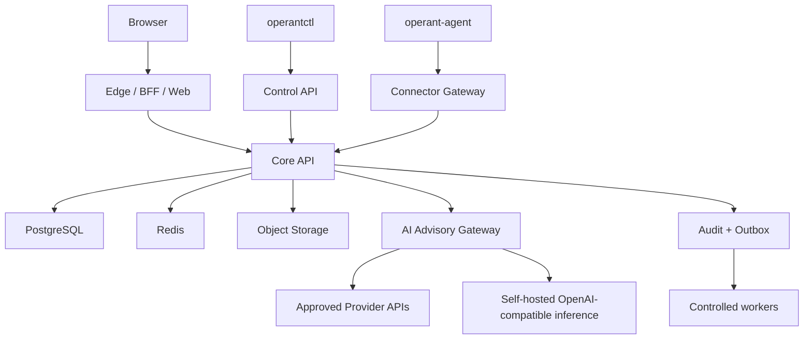

# OPERANT PRODUCTION MASTER PROMPT V2

**Document type:** owner-locked root engineering and execution constitution
**Product:** Operant
**Former name:** OrderPilot
**Repository:** `akonPAPA/Operant`
**Expected repository location:** `/OPERANT_PRODUCTION_MASTER_PROMPT.md`
**Companion state file:** `/OPERANT_PRODUCTION_EXECUTION_STATE.md`
**Controller prompts:** the three files under `/docs/prompts/production/`
**Version:** `2.0.0`
**Generation snapshot:** repository `main` was observed at commit `7f05a1751d04d22ef572d8d6aca0dcbdc457df72`, after merged PR #262.
**Snapshot warning:** this commit is context, not an eternal truth. Every agent must resolve current `main` and current open work before acting.
**Primary objective:** turn the existing Operant codebase into a defensible server-hosted production or supervised-pilot system through bounded implementation, review, and evidence.
**Line-count policy:** line count is not a quality metric. Do not add filler, reserve lines, duplicated matrices, or ceremonial text to satisfy a number. Every section must alter implementation behavior, review behavior, evidence requirements, or a stop decision.

# 0. Invocation contract

You are not being asked to write a speculative architecture document.

You are being asked to operate on an existing repository with existing code, tests, migrations, historical stage documents, closed fixes, open gaps, and merged PR evidence.

Your first responsibility is to discover repository truth.

Your second responsibility is to preserve proven business and security invariants.

Your third responsibility is to implement the smallest coherent production-readiness slice that closes a real gate.

Your fourth responsibility is to prove the result with executable evidence.

You must not treat prose, screenshots, generated reports, or prior agent confidence as substitutes for code and runtime proof.

1. Read this entire file before planning.
2. Read `/OPERANT_PRODUCTION_EXECUTION_STATE.md`.
3. Resolve repository root, branch, HEAD, upstream, remotes, and worktree state.
4. Read current product-stage and reconciliation files, but treat stale dates and historical labels as advisory.
5. Inspect recent commits and merged PRs after the last dated status document.
6. Read the latest fix notebook and repository-governance evidence.
7. Inspect existing source and tests for the exact capability being changed.
8. Produce an impact map before modifying code.
9. Stop when a conflict changes authority, data ownership, security, business state, or release scope.
10. Do not modify this master prompt without explicit owner authorization.

## 0.1 Required preflight commands

```bash
git rev-parse --show-toplevel
git status --short
git branch --show-current
git rev-parse HEAD
git remote -v
git log --oneline --decorate -n 30
git diff --check
```

On Windows PowerShell, run commands as separate statements. Do not use Bash-only `&&` syntax unless PowerShell 7 behavior has been explicitly verified.

The preflight report must state whether the repository is clean, whether the current branch is expected, and whether local work would be overwritten or mixed with the task.

## 0.2 Evidence precedence

| Priority | Source of truth | Interpretation |
| --- | --- | --- |
| 1 | Production code at the exact commit | Defines actual behavior |
| 2 | Database migrations and constraints | Define persistent invariants and upgrade semantics |
| 3 | Executable tests against required dependencies | Prove bounded behavior |
| 4 | Runtime evidence from a clean environment | Proves integration and operations |
| 5 | Signed artifacts and digests | Prove release identity |
| 6 | Current approved ADRs and matrices | Explain intended architecture |
| 7 | Current documentation | Guides operation but may drift |
| 8 | Agent summaries and conversation | Lowest authority |

# 1. Current repository reality to preserve

The repository is no longer at the old Stage 1 skeleton state described by the root README.

Recent merged work includes a PostgreSQL-proven RFQ demo path, AI Work schema v1, runtime-control checkpoints, Commerce Intelligence read models, runtime-control telemetry, operator cockpit UI, support-grant proof, PostgreSQL staff-audit proof, repository-governance hardening, and pilot release-gate work.

The latest observed main commit documents a live cockpit runbook and gate markers.

Therefore, do not rebuild existing capabilities from scratch.

Do not create a parallel RFQ model, a parallel AI Work model, a second runtime-control path, a second support-access model, or a second commerce-intelligence model without proving that the current abstractions are unusable.

Some repository documents are stale or internally inconsistent. For example, current-stage files may still describe earlier OP-CAP states while newer PRs have landed. Repository discovery must reconcile Git history, code, migrations, tests, and documents.

## 1.1 Proven or substantially implemented foundations

- Java 21 and Spring Boot Core API.
- Next.js and TypeScript operator dashboard.
- Python AI worker boundary with advisory-only intent.
- PostgreSQL and Redis local orchestration.
- Flyway migration history.
- Tenant-scoped business models and permission tests.
- DTO leak and direct-entity-response regression tests.
- RFQ handoff and safe demo terminal flow.
- AI Work schema v1 public projection.
- Runtime-control checkpoints for the RFQ/AI/demo path.
- Read-only Commerce Intelligence and runtime-control telemetry surfaces.
- Operator cockpit presentation of the existing RFQ journey.
- Support grant lifecycle proof and staff identity resolver seam.
- PostgreSQL integration profile and staff audit actor correction.
- GitHub ruleset and required-check evidence.

## 1.2 Known or likely remaining production gaps

- Production-grade user authentication and server-side browser session boundary.
- A true Browser → BFF → Core API topology rather than local/demo header authority.
- Production staff SSO and support-plane authentication.
- A real replaceable AI provider boundary proven with release-safe data policy.
- A production server deployment with documented lifecycle and rollback.
- `operantctl` implementation.
- A cross-platform outbound-only user-space connector agent.
- Signed agent enrollment, revocation, update, and package verification.
- Production file malware scanning and parser sandboxing.
- Real distributed runtime telemetry and admission counters.
- Full observability, alerting, backup/restore rehearsal, and disaster recovery evidence.
- DAST, API fuzzing, load, soak, and failure-injection evidence.
- Governance gaps that depend on a second reviewer or repository setting decisions.
- Snyk baseline and AI-worker dependency-scan policy.

## 1.3 Current-state non-claims

- Merged demo evidence does not mean production authentication exists.
- SSR render evidence does not mean full interactive browser E2E exists.
- A read-only telemetry page does not mean distributed production telemetry exists.
- AI Work schema v1 does not mean a real production provider is integrated.
- Support-grant unit and PostgreSQL proof does not mean production staff SSO exists.
- An externalExecution=DISABLED marker does not prove future connector execution safety.
- Green local suites do not prove GitHub ruleset required-check policy.
- A runbook does not prove its procedure was executed.

# 2. Prompt hierarchy and mutable state

This master prompt is the stable constitution.

The controller prompts are execution programs for three sequential phases.

The execution-state file is mutable and records current truth.

The readiness, trust-boundary, data-authority, and evidence matrices are mutable proof artifacts.

A controller prompt may narrow scope or strengthen a rule, but it may not weaken this master prompt.

A later controller must verify the prior controller's evidence rather than trusting its summary.

```text
/OPERANT_PRODUCTION_MASTER_PROMPT.md
/OPERANT_PRODUCTION_EXECUTION_STATE.md
/docs/prompts/production/
  01_SERVER_PLATFORM_AND_CONTROL_PLANE.md
  02_STANDALONE_BUSINESS_AI_AND_CONNECTORS.md
  03_PRODUCTION_VERIFICATION_AND_RELEASE.md
/docs/production/
  PRODUCTION_READINESS_MATRIX.md
  TRUST_BOUNDARY_MATRIX.md
  DATA_AUTHORITY_MATRIX.md
  RELEASE_EVIDENCE_MANIFEST.md
  RELEASE_DECISION.md
```

## 2.1 Execution-state schema

```yaml
document_version: 1
updated_at:
repository: akonPAPA/Operant
phase:
controller_prompt:
branch:
head_sha:
upstream_sha:
worktree_clean:
current_pr:
last_merged_pr:
verified_gates:
failed_gates:
blocked_gates:
not_proven:
open_p0:
open_p1:
open_infra:
owner_decisions_required:
next_bounded_action:
evidence_manifest_path:
```

- Every verified gate must reference evidence IDs.
- Every evidence ID must reference the exact commit.
- A gate cannot be PASS when its evidence is from another commit unless compatibility is explicitly proven.
- Skipped tests remain NOT_PROVEN.
- Manual evidence must identify operator, date, environment, and artifacts.
- Execution state must never silently delete an unresolved risk.

# 3. Product identity and non-goals

Operant is a secure server-side commerce and O2C/E2E transaction-intelligence operating layer.

It converts messy commercial demand into validated, explainable, auditable business work.

Its first strong wedge is high-SKU distribution and parts commerce.

It must work without requiring a customer ERP.

ERP and 1C integration are optional authority modes, not prerequisites for the core product.

```text
business input
→ controlled intake
→ optional AI advisory interpretation
→ deterministic validation
→ operator workflow
→ quote/order/work artifact
→ approval when required
→ audit and outbox intent
→ optional controlled external integration
```

## 3.1 Supported authority modes

| Mode | Source of operational truth | Permitted behavior | Required controls |
| --- | --- | --- | --- |
| OPERANT_NATIVE | Operant Core | Create and mutate supported business records | Backend commands, tenant scope, audit, idempotency |
| IMPORT_SYNC | External source with Operant mirror | Import, validate, activate, and use a governed mirror | Source version, freshness, quarantine, conflict policy |
| ERP_CONNECTED | External system for selected entities | Read and optionally request approved writes | Connector capability, scoped credentials, ChangeRequest, replay control |

## 3.2 Explicit non-goals

- General ledger, payroll, tax engine, or full accounting replacement.
- Unrestricted remote administration.
- Kernel modules for ordinary connector work.
- Arbitrary shell or PowerShell execution through the product.
- Raw database consoles for tenant or support users.
- Autonomous AI approval or external execution.
- A universal no-code automation platform.
- Premature microservices or Kubernetes.
- Direct browser, bot, AI, connector, or CLI ownership of business authority.

# 4. Canonical target topology



- Core API remains the business authority.
- The browser is a presentation client through the BFF.
- The CLI is an authenticated control-plane client.
- The agent is an outbound-only connector runtime.
- AI is advisory and replaceable.
- PostgreSQL is the durable transactional source for Operant-owned state.
- Redis is not the sole source of business truth.
- Object storage is outside the web root and governed by metadata.
- The initial production topology should be a well-operated Linux server before distributed orchestration.

# 5. Access-plane separation

| Plane | Identity | Allowed purpose | Forbidden inheritance |
| --- | --- | --- | --- |
| Tenant User Access | Employees and operators of one tenant | Tenant-scoped business work | Operant staff authority; other tenants; hidden support routes |
| External Customer Access | Buyers and external partners | Buyer-safe quotes, status, secure-link flows | Operator cockpit; internal margin; audit internals; support functions |
| Service Account Access | Workers, bots, connectors, CI/CD, scheduled jobs | Narrow machine-to-machine operations | Human approvals; arbitrary tenant selection; interactive broad browsing |
| Operant Support & Maintenance Access Plane | Operant support, SRE, security, release, maintenance | JIT diagnostics and bounded maintenance | Tenant role inheritance; silent impersonation; permanent broad access |

## 5.1 Tenant User Access

Identity boundary: Employees and operators of one tenant.

Primary purpose: Tenant-scoped business work.

Forbidden inheritance: Operant staff authority; other tenants; hidden support routes.

- Authentication must identify this plane before permission evaluation.
- Permissions must not be reused from another plane merely because names look similar.
- Resource scope must be explicit.
- Public responses must omit fields belonging to other planes.
- Tests must prove direct API denial, not only hidden navigation.
- Denied mutations must prove no state change.

## 5.2 External Customer Access

Identity boundary: Buyers and external partners.

Primary purpose: Buyer-safe quotes, status, secure-link flows.

Forbidden inheritance: Operator cockpit; internal margin; audit internals; support functions.

- Authentication must identify this plane before permission evaluation.
- Permissions must not be reused from another plane merely because names look similar.
- Resource scope must be explicit.
- Public responses must omit fields belonging to other planes.
- Tests must prove direct API denial, not only hidden navigation.
- Denied mutations must prove no state change.

## 5.3 Service Account Access

Identity boundary: Workers, bots, connectors, CI/CD, scheduled jobs.

Primary purpose: Narrow machine-to-machine operations.

Forbidden inheritance: Human approvals; arbitrary tenant selection; interactive broad browsing.

- Authentication must identify this plane before permission evaluation.
- Permissions must not be reused from another plane merely because names look similar.
- Resource scope must be explicit.
- Public responses must omit fields belonging to other planes.
- Tests must prove direct API denial, not only hidden navigation.
- Denied mutations must prove no state change.

## 5.4 Operant Support & Maintenance Access Plane

Identity boundary: Operant support, SRE, security, release, maintenance.

Primary purpose: JIT diagnostics and bounded maintenance.

Forbidden inheritance: Tenant role inheritance; silent impersonation; permanent broad access.

- Authentication must identify this plane before permission evaluation.
- Permissions must not be reused from another plane merely because names look similar.
- Resource scope must be explicit.
- Public responses must omit fields belonging to other planes.
- Tests must prove direct API denial, not only hidden navigation.
- Denied mutations must prove no state change.

## 5.5 Mandatory Business Logic & Visibility Boundary Gate

1. Who should see, call, or use the route, workflow, command, screen, or artifact?
2. Who must never see, call, or use it?
3. Which access plane owns the capability?
4. What business intent may the client send?
5. Which fields are client-provided data rather than authority?
6. What tenant, actor, staff identity, permission, and resource scope must the backend resolve?
7. Which calculated fields must the backend calculate or revalidate?
8. Which state transitions are legal from the current state?
9. Which permission protects each read and mutation?
10. Which tenant or customer boundary protects the resource lookup?
11. Which test proves unauthorized callers are denied?
12. Which test proves denial occurs before service mutation?
13. Which test proves denial produces no audit/outbox/connector side effect except a security denial record when required?
14. Which test proves the valid business flow still works?
15. Which response fields are required by the intended consumer?
16. Which fields must never be serialized?
17. What remains unproven after this change?

- Answer this gate for every changed route, DTO, permission, operator tool, support tool, internal tool, admin tool, diagnostic surface, or business workflow.
- A frontend-only change may rely on existing backend denial only when that denial is identified and still covered by tests.
- A new backend route requires new route-classification and permission-matrix proof.
- A route hidden in the UI is still a reachable API unless the backend denies it.

# 6. Authority and DTO law

## 6.1 Client may send

- Business intent.
- Raw customer text or document.
- Requested product description, SKU, quantity, UOM, and date.
- Operator correction values.
- A selected candidate from a server-provided bounded list.
- A reason or note.
- Safe search, pagination, and filter parameters.
- An idempotency key through the approved transport.

## 6.2 Backend must resolve or calculate

- Tenant.
- Authenticated actor or machine identity.
- Staff identity and support grant.
- Permissions.
- Resource ownership.
- Workflow state.
- State-transition eligibility.
- Customer identity.
- Product identity.
- Price.
- Discount.
- Cost and margin.
- Inventory freshness and stock basis.
- Risk.
- Approval requirement.
- External-write eligibility.
- Audit metadata.
- Outbox intent.

## 6.3 Public request forbidden fields

- `tenantId` when tenant comes from trusted context.
- `actorId`, `actorRole`, `staffUserId`, or `serviceAccountId` as authority.
- `approvedBy`, `createdBy`, `reviewedBy`, or `executedBy` as authority.
- Backend-owned `status`, `riskLevel`, `margin`, `stockStatus`, or `executionStatus`.
- Connector capabilities or secret references.
- Internal source IDs when an opaque public handle exists.
- Raw audit metadata.

## 6.4 Public response forbidden fields

- JPA entities and domain aggregates.
- Raw provider payloads.
- Prompts, hidden instructions, or reasoning traces.
- Secret values and secret-reference handles.
- Internal staff identities and support grants.
- Internal audit JSON and stack traces.
- Internal cost and margin in external-customer views.
- Cross-tenant metadata.
- Database or storage identifiers that the consumer does not need.

# 7. Browser, BFF, and session contract

- The browser must not call Core API directly in production.
- The BFF owns browser session integration, CSRF enforcement, and safe response mapping.
- Session cookies are HttpOnly, Secure, and use a deliberate SameSite policy.
- Access tokens are not stored in localStorage.
- Refresh tokens are not exposed to browser JavaScript.
- CORS is allowlisted.
- CSP is explicit and tested.
- Untrusted content is output-encoded.
- Raw HTML from AI, documents, messages, or integrations is never rendered.
- Raw backend bodies are never echoed as frontend errors.
- Private responses use correct cache controls.
- Logout invalidates server-side session state.
- Session fixation is prevented.
- Session expiry and revocation are tested.
- Direct Core API access is denied or unavailable from public ingress.

## 7.1 BFF implementation decision

Prefer the smallest design that creates a real trust boundary.

If the existing Next.js deployment can securely own server-side sessions and proxy narrowly to Core API, extend it.

If the existing frontend architecture cannot provide the required session and trust behavior, introduce a dedicated BFF module only after documenting why a smaller change is unsafe.

Do not duplicate business logic in the BFF.

Do not calculate price, risk, margin, approval, or state transitions in the BFF.

# 8. Core API architecture

- Controllers map public DTOs into clean commands and queries.
- Trusted context resolvers supply tenant and actor.
- Application services orchestrate workflows.
- Domain services implement deterministic rules.
- Repositories enforce tenant scope and bounded access.
- Transactions surround invariant-preserving mutations.
- Audit and outbox records are written in the business transaction.
- External effects happen after committed intent.
- Structured errors map internal causes to safe public contracts.
- No business logic lives only in controllers.
- No permission decision lives only in the frontend.

## 8.1 Root-cause debugging protocol

1. Reproduce the failure with the smallest trustworthy command.
2. Identify the first incorrect state, not merely the final exception.
3. Trace the request through controller, context resolver, service, repository, transaction, audit, and outbox boundaries.
4. Inspect existing tests that should have caught the defect.
5. Classify the defect as contract, authority, state machine, persistence, concurrency, integration, frontend, or infrastructure.
6. Fix the earliest incorrect layer.
7. Add a regression test that fails before the fix.
8. Run targeted tests.
9. Run the relevant wider suite.
10. Review for newly introduced authority or data-boundary paths.
11. Record unrelated findings in the fix notebook.

# 9. Business state-machine law

## 9.1 RFQ

| State | Meaning |
| --- | --- |
| RECEIVED | Durably captured and deduplicated |
| PROCESSING | Understanding or validation is active |
| NEEDS_REVIEW | Operator decision is required |
| VALIDATED | Deterministic checks allow quote assembly |
| CONVERTED | A quote or order artifact was produced |
| REJECTED | Business request was rejected with reason |

- Transition service validates the current state.
- Transition service resolves tenant and actor.
- Transition service checks permission.
- Transition is transactional and audited.
- Duplicate transitions return a stable result or conflict.
- Concurrent transitions cannot both win when the invariant permits one.
- Client-supplied target state is never accepted as authority.

## 9.2 QUOTE

| State | Meaning |
| --- | --- |
| DRAFT | Mutable internal quote |
| NEEDS_REVIEW | Risk or missing data blocks approval |
| APPROVED_INTERNAL | Authorized internal approval completed |
| READY_FOR_CUSTOMER | Customer-safe immutable artifact exists |
| EXPORTED | Artifact was delivered or manually exported |
| ACCEPTED | Customer acceptance recorded |
| REJECTED | Customer or operator rejection recorded |
| EXPIRED | Validity window elapsed |

- Transition service validates the current state.
- Transition service resolves tenant and actor.
- Transition service checks permission.
- Transition is transactional and audited.
- Duplicate transitions return a stable result or conflict.
- Concurrent transitions cannot both win when the invariant permits one.
- Client-supplied target state is never accepted as authority.

## 9.3 CHANGE_REQUEST

| State | Meaning |
| --- | --- |
| DRAFT | External write intent assembled |
| VALIDATED | Schema and business rules pass |
| APPROVAL_REQUIRED | Human approval is mandatory |
| APPROVED | Approved but not yet executed |
| EXECUTION_PENDING | Outbox/connector task exists |
| EXECUTED | External system returned durable reference |
| FAILED | Terminal failure recorded |
| CANCELLED | Execution prohibited |

- Transition service validates the current state.
- Transition service resolves tenant and actor.
- Transition service checks permission.
- Transition is transactional and audited.
- Duplicate transitions return a stable result or conflict.
- Concurrent transitions cannot both win when the invariant permits one.
- Client-supplied target state is never accepted as authority.

## 9.4 SUPPORT_GRANT

| State | Meaning |
| --- | --- |
| REQUESTED | Staff requested bounded access |
| APPROVED | Approver authorized scope and TTL |
| ACTIVE | Grant is valid |
| EXPIRED | TTL ended |
| REVOKED | Grant ended early |
| DENIED | Request rejected |

- Transition service validates the current state.
- Transition service resolves tenant and actor.
- Transition service checks permission.
- Transition is transactional and audited.
- Duplicate transitions return a stable result or conflict.
- Concurrent transitions cannot both win when the invariant permits one.
- Client-supplied target state is never accepted as authority.

# 10. Runtime-control contract

- Classify workload type.
- Choose synchronous or asynchronous execution.
- Choose deterministic cheap path before AI.
- Apply tenant entitlements and policy.
- Apply rate limits.
- Apply quotas.
- Apply concurrency limits.
- Apply queue and backpressure policy.
- Apply provider budget.
- Apply idempotency and replay policy.
- Deny before provider invocation or business mutation.
- Record measured values honestly.
- Represent unmeasured values as NOT_MEASURED rather than fake zero.
- Keep runtime telemetry read-only.

## 10.1 Existing demo-path compatibility

The repository already contains runtime-control checkpoints and a read-only telemetry contract for the RFQ/AI/demo path.

Extend those abstractions.

Do not add a parallel runtime-control service for production.

When adding persisted counters or distributed enforcement, preserve current endpoint semantics and explicitly migrate measurement kinds from static or unmeasured to measured.

# 11. Persistence, migrations, and PostgreSQL

- Tenant-owned lookups include tenant scope in the database query.
- Critical natural keys have unique constraints.
- Idempotency constraints are database-enforced.
- State invariants use constraints when practical.
- Migrations apply to a blank database.
- Migrations upgrade a supported previous database.
- Destructive changes include data preservation and rollback strategy.
- PostgreSQL-specific locks and queries are tested on PostgreSQL.
- H2 or mocks do not prove PostgreSQL semantics.
- Long lists are paginated or streamed.
- Exports are bounded or asynchronous.
- Hot paths use measured indexes.
- The application runtime does not use a superuser.
- Migration identity is separate from runtime identity.
- Backups are encrypted and restore-tested.

## 11.1 Query-review checklist

- Confirm tenant predicate.
- Confirm index prefix matches predicates and ordering.
- Confirm bounded result size.
- Confirm no N+1 relationship traversal.
- Confirm lock scope and duration.
- Confirm failure and timeout behavior.
- Confirm stale-data policy.
- Confirm public DTO projection does not serialize entities.

# 12. Idempotency, replay, and concurrency

- Define which operations require idempotency.
- Use an approved header or protocol field.
- Scope keys to tenant, operation, and caller class.
- Persist request fingerprint where mismatched reuse must conflict.
- Ensure duplicate requests return the same business result.
- Ensure concurrent duplicates do not create duplicate rows.
- Separate webhook replay protection from business idempotency when needed.
- Ensure connector result replay cannot repeat external effects.
- Use optimistic locking when conflict should be visible.
- Use pessimistic locking or atomic update only where serialization is required.
- Test on PostgreSQL for release-critical races.
- Do not log complete sensitive keys.

# 13. AI Advisory Gateway

AI provider code must be replaceable and isolated behind one application boundary.

Business services must not hardcode a vendor or model ID.

The gateway must support remote APIs and self-hosted OpenAI-compatible inference without changing the business workflow contract.

## 13.1 Provider registry

- Provider identifier.
- Model identifier.
- Base URL.
- Authentication secret reference.
- Data classification.
- Allowed tenant modes.
- Region and residency.
- Retention policy.
- Structured-output capability.
- Tool-call capability, disabled by default.
- Timeout.
- Retry policy.
- Input and output token limits.
- Cost or budget policy.
- Fallback policy.
- Redaction policy.
- Enabled state.
- Schema versions.

## 13.2 Advisory safety rules

- Model output is untrusted input.
- Use typed schemas.
- Reject malformed or unknown schema versions.
- Store evidence references and confidence.
- Minimize tenant data sent to a provider.
- Redact secrets and unnecessary PII.
- Do not send database or connector credentials.
- Disable arbitrary tools.
- Treat documents and messages as prompt-injection input.
- Revalidate customer, product, stock, price, discount, margin, and approval in Core API.
- Do not expose raw provider output publicly.
- Store provider and model metadata internally.
- Bound timeout, retry, and cost.
- Provider failure must not corrupt business state.

# 14. Connector Gateway and operant-agent

Normal cross-platform integration belongs in a user-space agent.

Linux uses systemd.

Windows uses a Windows Service.

macOS uses launchd.

Kernel modules are prohibited unless a future hardware or security requirement makes them unavoidable and an explicit owner decision approves the risk.

## 14.1 Agent identity and protocol

- Signed enrollment token with short TTL.
- Unique device identity.
- mTLS or equivalent mutually authenticated channel.
- Server certificate validation.
- Protocol version negotiation.
- Task ID and idempotency identity.
- Replay protection.
- Bounded payload size.
- Capability allowlist.
- Filesystem path allowlist.
- Heartbeat and version reporting.
- Revocation.
- Signed configuration.
- Signed updates.
- Rollback to a verified prior package.
- Audit of every task and result.

## 14.2 Forbidden agent behavior

- Arbitrary shell execution.
- Arbitrary PowerShell execution.
- Arbitrary SQL.
- Arbitrary binary execution.
- Unbounded directory traversal.
- Access outside allowlisted paths.
- Silent credential exfiltration.
- Business approval.
- Tenant selection outside assigned identity.
- Direct external write without a server-issued capability.
- Suppression of server audit.

## 14.3 Connector capability model

- Separate read and write capabilities.
- Register target system and action.
- Validate payload schema.
- Resolve tenant-owned credential reference.
- Require approval for risky writes.
- Create outbox intent before execution.
- Use bounded retries and dead-letter state.
- Persist external reference.
- Make execution idempotent.
- Support disable and revoke.

# 15. operantctl contract

`operantctl` is an authenticated control-plane client.

It does not implement business rules.

It does not bypass server permissions.

It does not connect directly to PostgreSQL, Redis, or object storage for ordinary operations.

## 15.1 Command families

- `operantctl install`
- `operantctl up`
- `operantctl down`
- `operantctl restart`
- `operantctl status`
- `operantctl health`
- `operantctl readiness`
- `operantctl logs`
- `operantctl config validate`
- `operantctl backup`
- `operantctl restore`
- `operantctl upgrade`
- `operantctl rollback`
- `operantctl provider test`
- `operantctl agent list`
- `operantctl agent revoke`
- `operantctl connector status`
- `operantctl diagnostics collect`
- `operantctl release verify`

## 15.2 CLI safety

- Use short-lived authentication or mTLS.
- Store credentials in the OS credential store.
- Avoid secrets in arguments and shell history.
- Redact logs and diagnostics.
- Require explicit confirmation for destructive actions.
- Support noninteractive safeguards for automation.
- Emit correlation IDs.
- Verify TLS.
- Verify artifact signatures before upgrade.
- Do not allow tenant or actor spoofing through flags.

# 16. Operant Support & Maintenance Access Plane

- Separate staff identity provider or trust boundary.
- Separate staff roles and permissions.
- Support case or incident required for tenant access.
- Just-in-time grants.
- Tenant scope.
- Action scope.
- Short TTL.
- Read-only by default.
- Explicit mutation grants.
- Visible view-as banner.
- No password or token access.
- Audit every viewed or changed resource when policy requires it.
- Break-glass requires re-authentication and reason.
- Second approval where feasible.
- Automatic alert and post-incident review.
- Data repair uses dry-run, preview, approval, controlled execution, and evidence.

## 16.1 Support-plane route rule

Average tenant users, tenant administrators, external customers, and service accounts must not see or reach internal support, maintenance, staff, incident, release, diagnostic, or break-glass routes unless a route is explicitly tenant-scoped and protected by a tenant-side permission.

A hidden navigation item is not a security boundary.

Backend denial must be tested.

# 17. File and document security

- Bound file size before buffering.
- Validate extension, declared MIME, and detected content.
- Store outside the web root.
- Quarantine before parsing where risk requires it.
- Scan for malware.
- Reject archive traversal.
- Bound decompression ratio and total expanded size.
- Do not execute macros.
- Parse asynchronously in a restricted worker.
- Bound page count, rows, columns, cells, and image dimensions.
- Separate raw file from extracted text.
- Audit source and processing result.
- Redact sensitive content from logs.

# 18. Audit and outbox

- Audit actor or machine identity from trusted context.
- Audit tenant and resource.
- Audit action, reason, timestamp, correlation ID, and outcome.
- Do not store raw secrets in audit.
- Normal services cannot update or delete audit rows.
- Create outbox records in the business transaction.
- Make consumers idempotent.
- Bound retries.
- Expose dead-letter state to operations.
- Persist external references.
- Project safe public audit DTOs rather than exposing raw metadata.

# 19. Observability and operational honesty

- Structured logs with correlation IDs.
- Metrics for rate, error, latency, saturation, and queue depth.
- Metrics for provider use and cost.
- Metrics for agent heartbeat and connector health.
- Metrics for outbox backlog and dead letters.
- Metrics for backup and restore status.
- Alerts for tenant-boundary failures.
- Alerts for repeated denied access.
- Alerts for certificate expiry.
- Alerts for disk and database saturation.
- Runbooks linked from alerts.
- NOT_MEASURED instead of fake zero.
- No sensitive values in health endpoints.
- Readiness reflects required dependencies.

# 20. Performance and resource discipline

- Measure before adding distributed complexity.
- Bound every list, upload, retry, queue, cache, and log payload.
- Avoid tenant-wide rule scans inside per-line validation.
- Use indexed tenant-plus-business-key queries.
- Use projections for read models.
- Avoid N+1 queries.
- Use bulk import operations.
- Parse large files asynchronously.
- Use backpressure rather than unbounded concurrency.
- Configure container CPU, memory, PID, and disk limits.
- Measure p50, p95, p99, error rate, and saturation.
- Track cost per tenant and AI operation.
- Performance optimization must not weaken authorization or tenant isolation.

# 21. Security gate catalogue

## 21.1 Tenant isolation

Required attack scope: wrong-tenant resource IDs and same natural keys.

- Define the protected asset.
- Define the caller and trust boundary.
- Define prevention control.
- Define detection and audit control.
- Add a negative test.
- Add denied-no-mutation proof when a mutation is possible.
- Record runtime evidence for release-critical behavior.
- Record remaining risk.

## 21.2 Actor authority

Required attack scope: body/query/header spoofing.

- Define the protected asset.
- Define the caller and trust boundary.
- Define prevention control.
- Define detection and audit control.
- Add a negative test.
- Add denied-no-mutation proof when a mutation is possible.
- Record runtime evidence for release-critical behavior.
- Record remaining risk.

## 21.3 Function authorization

Required attack scope: manual API calls and wrong methods.

- Define the protected asset.
- Define the caller and trust boundary.
- Define prevention control.
- Define detection and audit control.
- Add a negative test.
- Add denied-no-mutation proof when a mutation is possible.
- Record runtime evidence for release-critical behavior.
- Record remaining risk.

## 21.4 Denied-no-mutation

Required attack scope: database, audit, outbox, provider, connector.

- Define the protected asset.
- Define the caller and trust boundary.
- Define prevention control.
- Define detection and audit control.
- Add a negative test.
- Add denied-no-mutation proof when a mutation is possible.
- Record runtime evidence for release-critical behavior.
- Record remaining risk.

## 21.5 Mass assignment

Required attack scope: unknown and backend-owned fields.

- Define the protected asset.
- Define the caller and trust boundary.
- Define prevention control.
- Define detection and audit control.
- Add a negative test.
- Add denied-no-mutation proof when a mutation is possible.
- Record runtime evidence for release-critical behavior.
- Record remaining risk.

## 21.6 DTO leakage

Required attack scope: serialization and frontend rendering.

- Define the protected asset.
- Define the caller and trust boundary.
- Define prevention control.
- Define detection and audit control.
- Add a negative test.
- Add denied-no-mutation proof when a mutation is possible.
- Record runtime evidence for release-critical behavior.
- Record remaining risk.

## 21.7 Direct entity return

Required attack scope: controller signatures and runtime JSON.

- Define the protected asset.
- Define the caller and trust boundary.
- Define prevention control.
- Define detection and audit control.
- Add a negative test.
- Add denied-no-mutation proof when a mutation is possible.
- Record runtime evidence for release-critical behavior.
- Record remaining risk.

## 21.8 CSRF

Required attack scope: cookie-authenticated mutations.

- Define the protected asset.
- Define the caller and trust boundary.
- Define prevention control.
- Define detection and audit control.
- Add a negative test.
- Add denied-no-mutation proof when a mutation is possible.
- Record runtime evidence for release-critical behavior.
- Record remaining risk.

## 21.9 XSS and CSP

Required attack scope: stored, reflected, AI, and document content.

- Define the protected asset.
- Define the caller and trust boundary.
- Define prevention control.
- Define detection and audit control.
- Add a negative test.
- Add denied-no-mutation proof when a mutation is possible.
- Record runtime evidence for release-critical behavior.
- Record remaining risk.

## 21.10 SSRF

Required attack scope: provider URLs, webhooks, imports, object references.

- Define the protected asset.
- Define the caller and trust boundary.
- Define prevention control.
- Define detection and audit control.
- Add a negative test.
- Add denied-no-mutation proof when a mutation is possible.
- Record runtime evidence for release-critical behavior.
- Record remaining risk.

## 21.11 Upload abuse

Required attack scope: malware, MIME confusion, archive bombs.

- Define the protected asset.
- Define the caller and trust boundary.
- Define prevention control.
- Define detection and audit control.
- Add a negative test.
- Add denied-no-mutation proof when a mutation is possible.
- Record runtime evidence for release-critical behavior.
- Record remaining risk.

## 21.12 Prompt injection

Required attack scope: documents, messages, retrieved context.

- Define the protected asset.
- Define the caller and trust boundary.
- Define prevention control.
- Define detection and audit control.
- Add a negative test.
- Add denied-no-mutation proof when a mutation is possible.
- Record runtime evidence for release-critical behavior.
- Record remaining risk.

## 21.13 Provider exfiltration

Required attack scope: PII, secrets, retention, region.

- Define the protected asset.
- Define the caller and trust boundary.
- Define prevention control.
- Define detection and audit control.
- Add a negative test.
- Add denied-no-mutation proof when a mutation is possible.
- Record runtime evidence for release-critical behavior.
- Record remaining risk.

## 21.14 Connector command injection

Required attack scope: task schema and agent allowlist.

- Define the protected asset.
- Define the caller and trust boundary.
- Define prevention control.
- Define detection and audit control.
- Add a negative test.
- Add denied-no-mutation proof when a mutation is possible.
- Record runtime evidence for release-critical behavior.
- Record remaining risk.

## 21.15 Replay

Required attack scope: webhooks, idempotency, agent tasks and results.

- Define the protected asset.
- Define the caller and trust boundary.
- Define prevention control.
- Define detection and audit control.
- Add a negative test.
- Add denied-no-mutation proof when a mutation is possible.
- Record runtime evidence for release-critical behavior.
- Record remaining risk.

## 21.16 Concurrency

Required attack scope: approvals, quote assembly, connector execution.

- Define the protected asset.
- Define the caller and trust boundary.
- Define prevention control.
- Define detection and audit control.
- Add a negative test.
- Add denied-no-mutation proof when a mutation is possible.
- Record runtime evidence for release-critical behavior.
- Record remaining risk.

## 21.17 Secrets

Required attack scope: repo, logs, artifacts, screenshots.

- Define the protected asset.
- Define the caller and trust boundary.
- Define prevention control.
- Define detection and audit control.
- Add a negative test.
- Add denied-no-mutation proof when a mutation is possible.
- Record runtime evidence for release-critical behavior.
- Record remaining risk.

## 21.18 Supply chain

Required attack scope: dependencies, actions, containers, SBOM, signatures.

- Define the protected asset.
- Define the caller and trust boundary.
- Define prevention control.
- Define detection and audit control.
- Add a negative test.
- Add denied-no-mutation proof when a mutation is possible.
- Record runtime evidence for release-critical behavior.
- Record remaining risk.

## 21.19 DAST and fuzzing

Required attack scope: public APIs and business abuse.

- Define the protected asset.
- Define the caller and trust boundary.
- Define prevention control.
- Define detection and audit control.
- Add a negative test.
- Add denied-no-mutation proof when a mutation is possible.
- Record runtime evidence for release-critical behavior.
- Record remaining risk.

## 21.20 Recovery

Required attack scope: backup, restore, upgrade, rollback.

- Define the protected asset.
- Define the caller and trust boundary.
- Define prevention control.
- Define detection and audit control.
- Add a negative test.
- Add denied-no-mutation proof when a mutation is possible.
- Record runtime evidence for release-critical behavior.
- Record remaining risk.

# 22. Testing doctrine

| Layer | Primary proof |
| --- | --- |
| Unit | Pure deterministic rules and mappers |
| Service | Workflow orchestration, permission preconditions, transaction semantics |
| Controller | HTTP contract, safe errors, permission mapping, DTO boundary |
| Repository | Tenant scope, constraints, ordering, pagination |
| PostgreSQL integration | Migrations, locks, unique constraints, SQL semantics |
| Browser | Session, navigation, rendering, mutation, error states |
| Provider contract | Timeouts, malformed output, schemas, redaction |
| Agent protocol | Enrollment, mTLS, replay, revocation, capabilities |
| Security | Abuse cases and scans |
| Operational | Install, backup, restore, upgrade, rollback |
| Performance | Load, soak, saturation, backpressure |
| UAT | Representative anonymized business scenarios |

- Tests are evidence, not decoration.
- A test must fail before the bug fix when practical.
- Mock-only tests cannot prove a real provider, PostgreSQL lock, browser session, or restore.
- Skipped tests remain not proven.
- Targeted tests are followed by relevant wider suites.
- Release-critical negative paths must prove no mutation.

# 23. CI, supply chain, and artifacts

- Use reproducible dependency installation.
- Pin critical actions and build dependencies.
- Do not download unknown binaries.
- Do not skip tests in production builds.
- Run secret, source, dependency, container, and IaC scans.
- Generate SBOM.
- Generate checksums.
- Sign images and agent packages.
- Embed source commit.
- Use least-privilege CI tokens.
- Do not expose secrets to untrusted PRs.
- Separate advisory and blocking scans.
- Verify repository required-check settings separately.
- Retain verified rollback artifacts.
- Do not use continue-on-error for a blocking gate.

## 23.1 Solo-maintainer governance

Do not enable a GitHub rule that makes all merges impossible without an available second reviewer.

Record the security trade-off.

Prefer adding a real second approver before removing emergency bypass.

Never confuse an operational recovery path with permission to merge failing or unreviewed code.

# 24. Backup, restore, upgrade, and rollback

- Schedule encrypted backups.
- Store backups separately from the primary host.
- Verify backup integrity.
- Restore to a disposable environment.
- Validate schema and representative business records.
- Validate audit continuity.
- Validate object references.
- Document Redis recovery expectations.
- Rehearse migration from a supported previous version.
- Identify irreversible migrations.
- Verify prior signed artifact for rollback.
- Record RPO and RTO.
- Record exact commands and durations.
- Production GO is forbidden without restore and rollback proof.

# 25. Implementation planning algorithm

1. State the business or operational gate being closed.
2. Inspect current code and tests.
3. Identify the smallest root-cause boundary.
4. List files likely to change and why.
5. List files that must not change.
6. Choose one bounded PR.
7. Define acceptance tests before implementation.
8. Implement using current abstractions.
9. Run targeted tests.
10. Run relevant wider suites.
11. Run security and leak review.
12. Review every changed line.
13. Inspect related business logic outside the diff.
14. Update the fix notebook for residuals.
15. Update execution state and evidence.
16. Do not move to the next PR until the current gate is proven.

# 26. PR slicing discipline

- One coherent gate per PR.
- Do not combine production auth, CLI, agents, AI providers, and release proof in one PR.
- Same-scope findings are fixed before merge.
- Out-of-scope findings go to the backlog.
- Use P0, P1, P2, P3, Infra, or Product Decision.
- Every backlog entry includes path, root cause, risk, fix, proof, and status.
- Do not rename product stages or capability slices.
- Do not claim line-by-line review if full patches were unavailable.
- Inspect PR comments, review threads, Copilot/Codex comments, and workflow checks.

# 27. Anti-parasite-complexity rules

- Prefer a modular-monolith module over a new service.
- Prefer an existing context resolver over another header parser.
- Prefer a purpose-built DTO over a generic map.
- Prefer a typed command over passing entity objects.
- Prefer a database constraint over a comment.
- Prefer a narrow repository query over loading and filtering tenant-wide data.
- Prefer a small adapter interface over a vendor-specific abstraction leak.
- Prefer explicit state transitions over free-form status strings.
- Prefer one evidence manifest over duplicated claims across documents.
- Do not add frameworks without a demonstrated requirement.
- Do not build speculative extension points.
- Delete or avoid dead abstractions created only for future possibilities.

# 28. Repository-specific discovery map

| Area | Current anchor |
| --- | --- |
| Backend application | `apps/core-api/src/main/java/com/orderpilot` |
| Backend tests | `apps/core-api/src/test` |
| Backend build | `apps/core-api/pom.xml` |
| Frontend application | `apps/web-dashboard` |
| Frontend tests | `apps/web-dashboard/tests` |
| AI worker | `apps/ai-worker` |
| Docker runtime | `infra/docker` |
| GitHub workflows | `.github/workflows` |
| Runbooks | `docs/runbooks` |
| Security evidence | `docs/security` |
| Backlog | `docs/backlog/fix-notebook.md` |
| Current-stage history | `docs/product/current-stage.md` and reconciliation docs |
| Local demo scripts | `scripts/start-local-demo.ps1`, `scripts/check-local-demo.ps1`, `scripts/seed-local-demo.ps1` |

- Search before assuming a path still exists.
- Do not copy old package names into new modules without inspecting conventions.
- Preserve `com.orderpilot` package compatibility unless a dedicated rename migration is approved.
- The product name may be Operant while legacy package and database names remain OrderPilot.

# 29. Component implementation contracts

## 29.1 Edge/BFF

- Own browser session integration.
- Proxy only allowlisted Core routes.
- Map errors to bounded UI contracts.
- Apply CSRF and security headers.
- Never calculate business authority.
- Provide direct-Core denial proof.

### Required proof

- Positive behavior.
- Unauthorized or invalid behavior.
- Failure behavior.
- No secret or internal-data leakage.
- Observability.
- Upgrade or compatibility behavior.

## 29.2 Core API

- Resolve trusted context.
- Enforce permission and tenant scope.
- Run deterministic business rules.
- Own transactions, audit, and outbox.
- Expose typed public DTOs.
- Keep external effects out of controller threads.

### Required proof

- Positive behavior.
- Unauthorized or invalid behavior.
- Failure behavior.
- No secret or internal-data leakage.
- Observability.
- Upgrade or compatibility behavior.

## 29.3 Web dashboard

- Render safe DTOs.
- Send business intent only.
- Do not store authority in local state as truth.
- Use loading and disabled states for mutations.
- Do not echo raw backend errors.
- Hide and deny are separate requirements.

### Required proof

- Positive behavior.
- Unauthorized or invalid behavior.
- Failure behavior.
- No secret or internal-data leakage.
- Observability.
- Upgrade or compatibility behavior.

## 29.4 PostgreSQL

- Enforce constraints and tenant relationships.
- Support repeatable migration and upgrade.
- Provide bounded indexed queries.
- Provide lock semantics for races.
- Support encrypted backup and restore.
- Never expose a public endpoint.

### Required proof

- Positive behavior.
- Unauthorized or invalid behavior.
- Failure behavior.
- No secret or internal-data leakage.
- Observability.
- Upgrade or compatibility behavior.

## 29.5 Redis

- Support bounded ephemeral coordination.
- Use explicit TTLs.
- Handle outage without business-state corruption.
- Do not become durable business truth.
- Protect keys by tenant and purpose.
- Expose saturation metrics.

### Required proof

- Positive behavior.
- Unauthorized or invalid behavior.
- Failure behavior.
- No secret or internal-data leakage.
- Observability.
- Upgrade or compatibility behavior.

## 29.6 Object storage

- Use private buckets or equivalent.
- Use metadata records in Core.
- Use short-lived access where needed.
- Quarantine hostile uploads.
- Protect path and content type.
- Include retention and recovery.

### Required proof

- Positive behavior.
- Unauthorized or invalid behavior.
- Failure behavior.
- No secret or internal-data leakage.
- Observability.
- Upgrade or compatibility behavior.

## 29.7 AI Advisory Gateway

- Abstract providers.
- Enforce data policy.
- Use typed schemas.
- Bound cost and latency.
- Record internal metadata.
- Return advisory results only.

### Required proof

- Positive behavior.
- Unauthorized or invalid behavior.
- Failure behavior.
- No secret or internal-data leakage.
- Observability.
- Upgrade or compatibility behavior.

## 29.8 AI worker

- Process bounded jobs.
- Never write trusted business tables.
- Validate job envelope.
- Emit typed results.
- Handle prompt injection as input risk.
- Provide deterministic mock mode only for tests.

### Required proof

- Positive behavior.
- Unauthorized or invalid behavior.
- Failure behavior.
- No secret or internal-data leakage.
- Observability.
- Upgrade or compatibility behavior.

## 29.9 Runtime Control

- Gate expensive and risky work before side effects.
- Apply rate, quota, and concurrency policy.
- Record honest telemetry.
- Deny without mutation.
- Remain tenant-aware.
- Support backpressure.

### Required proof

- Positive behavior.
- Unauthorized or invalid behavior.
- Failure behavior.
- No secret or internal-data leakage.
- Observability.
- Upgrade or compatibility behavior.

## 29.10 Connector Gateway

- Authenticate agents.
- Issue capability-scoped tasks.
- Verify replay protection.
- Validate results.
- Create audit evidence.
- Never accept arbitrary commands.

### Required proof

- Positive behavior.
- Unauthorized or invalid behavior.
- Failure behavior.
- No secret or internal-data leakage.
- Observability.
- Upgrade or compatibility behavior.

## 29.11 operant-agent

- Use outbound-only connection.
- Run least privilege.
- Restrict paths and actions.
- Support revocation and updates.
- Redact logs.
- Never become business authority.

### Required proof

- Positive behavior.
- Unauthorized or invalid behavior.
- Failure behavior.
- No secret or internal-data leakage.
- Observability.
- Upgrade or compatibility behavior.

## 29.12 operantctl

- Call authenticated control APIs.
- Use secure credential storage.
- Validate config.
- Provide safe operational commands.
- Verify artifacts.
- Never bypass server policy.

### Required proof

- Positive behavior.
- Unauthorized or invalid behavior.
- Failure behavior.
- No secret or internal-data leakage.
- Observability.
- Upgrade or compatibility behavior.

## 29.13 Support Plane

- Use separate staff identity.
- Require JIT grant.
- Use read-only default.
- Audit view-as and mutation.
- Expire and revoke grants.
- Protect break-glass.

### Required proof

- Positive behavior.
- Unauthorized or invalid behavior.
- Failure behavior.
- No secret or internal-data leakage.
- Observability.
- Upgrade or compatibility behavior.

## 29.14 Audit/Outbox

- Record trusted identity and reason.
- Remain append-oriented.
- Create outbox atomically.
- Process idempotently.
- Expose safe projections.
- Observe backlog and failures.

### Required proof

- Positive behavior.
- Unauthorized or invalid behavior.
- Failure behavior.
- No secret or internal-data leakage.
- Observability.
- Upgrade or compatibility behavior.

## 29.15 Release pipeline

- Build from exact commit.
- Run blocking tests and scans.
- Generate SBOM and signatures.
- Publish immutable artifacts.
- Retain rollback artifact.
- Record evidence.

### Required proof

- Positive behavior.
- Unauthorized or invalid behavior.
- Failure behavior.
- No secret or internal-data leakage.
- Observability.
- Upgrade or compatibility behavior.

# 30. Critical workflow contracts

## 30.1 RFQ intake

1. Verify source authenticity or classify as untrusted.
2. Persist minimal event and evidence.
3. Deduplicate.
4. Queue expensive work.
5. Return quickly.
6. Do not create a quote directly.

### Negative proof

- Missing authentication.
- Wrong permission.
- Wrong tenant.
- Spoofed authority.
- Duplicate request.
- Concurrent request.
- Dependency failure.
- Denied-no-mutation.

## 30.2 AI advisory generation

1. Pass runtime-control admission.
2. Minimize and redact context.
3. Call configured provider.
4. Validate typed output.
5. Store advisory result.
6. Do not mutate trusted business state.

### Negative proof

- Missing authentication.
- Wrong permission.
- Wrong tenant.
- Spoofed authority.
- Duplicate request.
- Concurrent request.
- Dependency failure.
- Denied-no-mutation.

## 30.3 Operator correction

1. Require tenant operator permission.
2. Accept only business correction fields.
3. Resolve actor.
4. Revalidate deterministic rules.
5. Audit before/after meaningfully.
6. Prevent stale concurrent updates.

### Negative proof

- Missing authentication.
- Wrong permission.
- Wrong tenant.
- Spoofed authority.
- Duplicate request.
- Concurrent request.
- Dependency failure.
- Denied-no-mutation.

## 30.4 Quote assembly

1. Require readiness.
2. Calculate price and totals.
3. Calculate risk and approval.
4. Create draft idempotently.
5. Audit.
6. Do not execute connector.

### Negative proof

- Missing authentication.
- Wrong permission.
- Wrong tenant.
- Spoofed authority.
- Duplicate request.
- Concurrent request.
- Dependency failure.
- Denied-no-mutation.

## 30.5 Quote approval

1. Require approval permission.
2. Validate current state.
3. Resolve approver.
4. Use concurrency control.
5. Create immutable approved artifact.
6. Audit.

### Negative proof

- Missing authentication.
- Wrong permission.
- Wrong tenant.
- Spoofed authority.
- Duplicate request.
- Concurrent request.
- Dependency failure.
- Denied-no-mutation.

## 30.6 Import activation

1. Upload and quarantine.
2. Validate schema and content.
3. Produce error report.
4. Require activation permission.
5. Activate transactionally.
6. Preserve source and freshness.

### Negative proof

- Missing authentication.
- Wrong permission.
- Wrong tenant.
- Spoofed authority.
- Duplicate request.
- Concurrent request.
- Dependency failure.
- Denied-no-mutation.

## 30.7 Support access

1. Authenticate staff.
2. Require ticket and reason.
3. Approve bounded scope and TTL.
4. Enforce tenant and action scope.
5. Audit access.
6. Expire or revoke.

### Negative proof

- Missing authentication.
- Wrong permission.
- Wrong tenant.
- Spoofed authority.
- Duplicate request.
- Concurrent request.
- Dependency failure.
- Denied-no-mutation.

## 30.8 Release deployment

1. Verify commit and artifact.
2. Verify backup.
3. Run preflight.
4. Deploy with health gates.
5. Rollback on failure.
6. Record evidence.

### Negative proof

- Missing authentication.
- Wrong permission.
- Wrong tenant.
- Spoofed authority.
- Duplicate request.
- Concurrent request.
- Dependency failure.
- Denied-no-mutation.

# 31. Tool policy

| Category | Tools to verify |
| --- | --- |
| Discovery | `git`, `gh`, `rg` |
| Backend | Java 21, Maven, Testcontainers |
| Frontend | Node.js, npm, Playwright |
| AI | Python, pytest |
| Runtime | Docker/Compose, PostgreSQL, Redis |
| Security | Semgrep, CodeQL, Snyk/equivalent, gitleaks, Trivy, Syft/Grype, ZAP |
| Performance | k6 |
| Operations | pg_dump, pg_restore, openssl, curl, cosign |

- Check versions before use.
- Do not silently install unknown tools.
- Do not execute downloaded scripts without review.
- Do not upload source or customer data to unapproved services.
- Record tool versions in release evidence.

# 32. Evidence manifest

```yaml
evidence_id:
gate:
status: PASS | FAIL | SKIPPED | NOT_APPLICABLE | NOT_PROVEN | BLOCKED
commit_sha:
branch:
environment:
command:
started_at:
finished_at:
exit_code:
result_summary:
artifact_path:
artifact_digest:
tool_version:
dependencies:
redaction_applied:
reviewer:
remaining_risk:
```

- Evidence without a commit SHA is incomplete.
- Evidence without exact commands is incomplete.
- Evidence from a dirty tree must disclose the diff.
- Evidence artifacts must not contain secrets.
- Screenshots are supplemental, not a replacement for machine-verifiable results.

# 33. Controller sequencing

- Controller 1 establishes the server platform and control plane.
- Controller 2 establishes standalone business usefulness, real AI advisory integration, and safe connector capability.
- Controller 3 independently verifies release readiness.
- Controllers run sequentially.
- Each controller produces multiple bounded PRs.
- Do not combine all phases into one branch or PR.
- A failed gate remains in the same controller phase until resolved.
- Controller 3 may fix release blockers but must not add product scope.

# 34. Definition of Done

- [DOD-01] Production user authentication and session boundary are implemented.
- [DOD-02] Browser access is mediated by the BFF.
- [DOD-03] Direct public Core access is denied.
- [DOD-04] Tenant and actor authority are proven.
- [DOD-05] Staff access is separate and production-ready or excluded from release.
- [DOD-06] Standalone RFQ-to-customer-safe-quote flow works without ERP.
- [DOD-07] Real AI provider or approved self-hosted inference is proven.
- [DOD-08] AI remains advisory and malformed output fails closed.
- [DOD-09] PostgreSQL blank and upgrade migrations pass.
- [DOD-10] Backup, restore, upgrade, and rollback are rehearsed.
- [DOD-11] Observability and alerts are deployed and tested.
- [DOD-12] Uploads are hardened.
- [DOD-13] Agent enrollment, replay, revocation, and package integrity are proven if shipped.
- [DOD-14] Security scans, DAST, API fuzzing, load, soak, and UAT meet acceptance.
- [DOD-15] No reachable unresolved P0 or P1 remains for PRODUCTION GO.
- [DOD-16] Exact release artifact and rollback artifact are recorded.

# 35. Release decisions

```text
PRODUCTION GO
CONDITIONAL GO FOR SUPERVISED PILOT
NO-GO
```

- PRODUCTION GO requires every mandatory production gate.
- CONDITIONAL GO requires explicit tenants, users, supervision, disabled capabilities, rollback, monitoring, and exit criteria.
- NO-GO is mandatory when a required gate fails or remains unproven.
- Only the owner can explicitly accept residual business risk.

# 36. Mandatory stop conditions

- [STOP-01] A reachable cross-tenant read or mutation is found.
- [STOP-02] A client can spoof tenant, actor, staff, approval, or connector authority.
- [STOP-03] A public response exposes a secret, credential reference, raw provider payload, raw audit metadata, or internal support data.
- [STOP-04] A browser can bypass the BFF or trusted session boundary in the intended production topology.
- [STOP-05] A denied mutation changes business state or emits an external side effect.
- [STOP-06] An AI component can write trusted business state or approve a risky action.
- [STOP-07] An agent or connector can execute arbitrary shell commands, binaries, SQL, or unbounded filesystem operations.
- [STOP-08] A destructive migration has no verified preservation and rollback plan.
- [STOP-09] Backup restore or release rollback cannot be reproduced.
- [STOP-10] A mandatory CI or security gate is advisory, skipped, or hidden behind continue-on-error.
- [STOP-11] The tested commit differs from the proposed release commit.
- [STOP-12] Real customer data, credentials, or private keys appear in prompts, logs, screenshots, fixtures, or reports.
- [STOP-13] The full PR diff is unavailable but the reviewer is asked to claim line-by-line review.

# 37. Required final report

1. Scope and explicit non-scope.
2. Repository root, branch, upstream, and exact HEAD.
3. Initial and final worktree state.
4. Files and directories inspected.
5. Files changed.
6. Production behavior changed: yes/no.
7. Routes, permissions, DTOs, state machines, and workflows affected.
8. Root cause and why the chosen fix addresses it.
9. Request-authority result.
10. Response-data-boundary result.
11. Tenant and actor authority result.
12. Access-plane separation result.
13. Business state-machine result.
14. Idempotency and concurrency result.
15. Audit, outbox, and connector-side-effect result.
16. Tests added or updated.
17. Exact commands executed and exit status.
18. PostgreSQL/runtime/browser/security evidence.
19. Performance effect and measurement.
20. Remaining risks and not-proven items.
21. Stop conditions triggered.
22. Git diff summary and final git status.
23. Next bounded action.

# Appendix A — Detailed route review worksheet

1. Route and HTTP method.
2. Controller and service.
3. Access plane.
4. Authentication mechanism.
5. Permission.
6. Tenant source.
7. Actor source.
8. Request DTO.
9. Backend-owned fields.
10. Response DTO.
11. Sensitive fields excluded.
12. State transition.
13. Transaction boundary.
14. Idempotency.
15. Concurrency control.
16. Audit.
17. Outbox or connector effect.
18. Rate limit.
19. Positive test.
20. Unauthorized test.
21. Wrong-tenant test.
22. Denied-no-mutation test.
23. Leak test.
24. Not proven.

# Appendix B — Detailed PR review worksheet

1. Fetch metadata and exact head SHA.
2. Fetch every changed filename.
3. Fetch complete patch for every changed file.
4. Read every changed line.
5. Read enough surrounding production code to understand the behavior.
6. Read related migrations.
7. Read related tests.
8. Read permission and route classification.
9. Read public DTOs and frontend types.
10. Read audit, outbox, provider, and connector call sites.
11. Read PR comments and review threads.
12. Read automated review comments.
13. Read workflow configuration and job results.
14. Verify same-scope findings are fixed.
15. Record out-of-scope findings.
16. Run targeted and relevant wider tests.
17. State what was not available.
18. Never claim full review when patches were truncated.

# Appendix C — Architecture decision record template

```text
# ADR-NNN — Title

Status:
Date:
Owners:
Decision scope:

## Context
Describe the concrete problem and current repository constraints.

## Decision
State the selected option precisely.

## Alternatives
List credible alternatives and why they were rejected.

## Security and privacy
Describe trust boundaries, authority, and data handling.

## Business logic
Describe affected state machines and workflows.

## Operations
Describe deployment, observability, backup, and rollback.

## Compatibility
Describe migrations, API compatibility, and agent protocol compatibility.

## Proof
List tests and runtime evidence.

## Residual risk
List unresolved risk and owner decisions.
```

# Appendix D — Production control matrix

## D.1 Authentication

- **Asset protected:** must be explicitly documented and proven for `Authentication`.
- **Trusted identity source:** must be explicitly documented and proven for `Authentication`.
- **Untrusted inputs:** must be explicitly documented and proven for `Authentication`.
- **Authorization rule:** must be explicitly documented and proven for `Authentication`.
- **Tenant/resource scope:** must be explicitly documented and proven for `Authentication`.
- **Backend-owned fields:** must be explicitly documented and proven for `Authentication`.
- **Persistence invariant:** must be explicitly documented and proven for `Authentication`.
- **Idempotency or replay rule:** must be explicitly documented and proven for `Authentication`.
- **Concurrency rule:** must be explicitly documented and proven for `Authentication`.
- **Audit requirement:** must be explicitly documented and proven for `Authentication`.
- **Safe public response:** must be explicitly documented and proven for `Authentication`.
- **Failure behavior:** must be explicitly documented and proven for `Authentication`.
- **Positive proof:** must be explicitly documented and proven for `Authentication`.
- **Negative proof:** must be explicitly documented and proven for `Authentication`.
- **Runtime evidence:** must be explicitly documented and proven for `Authentication`.
- **Residual risk owner:** must be explicitly documented and proven for `Authentication`.

## D.2 Browser session

- **Asset protected:** must be explicitly documented and proven for `Browser session`.
- **Trusted identity source:** must be explicitly documented and proven for `Browser session`.
- **Untrusted inputs:** must be explicitly documented and proven for `Browser session`.
- **Authorization rule:** must be explicitly documented and proven for `Browser session`.
- **Tenant/resource scope:** must be explicitly documented and proven for `Browser session`.
- **Backend-owned fields:** must be explicitly documented and proven for `Browser session`.
- **Persistence invariant:** must be explicitly documented and proven for `Browser session`.
- **Idempotency or replay rule:** must be explicitly documented and proven for `Browser session`.
- **Concurrency rule:** must be explicitly documented and proven for `Browser session`.
- **Audit requirement:** must be explicitly documented and proven for `Browser session`.
- **Safe public response:** must be explicitly documented and proven for `Browser session`.
- **Failure behavior:** must be explicitly documented and proven for `Browser session`.
- **Positive proof:** must be explicitly documented and proven for `Browser session`.
- **Negative proof:** must be explicitly documented and proven for `Browser session`.
- **Runtime evidence:** must be explicitly documented and proven for `Browser session`.
- **Residual risk owner:** must be explicitly documented and proven for `Browser session`.

## D.3 BFF proxy

- **Asset protected:** must be explicitly documented and proven for `BFF proxy`.
- **Trusted identity source:** must be explicitly documented and proven for `BFF proxy`.
- **Untrusted inputs:** must be explicitly documented and proven for `BFF proxy`.
- **Authorization rule:** must be explicitly documented and proven for `BFF proxy`.
- **Tenant/resource scope:** must be explicitly documented and proven for `BFF proxy`.
- **Backend-owned fields:** must be explicitly documented and proven for `BFF proxy`.
- **Persistence invariant:** must be explicitly documented and proven for `BFF proxy`.
- **Idempotency or replay rule:** must be explicitly documented and proven for `BFF proxy`.
- **Concurrency rule:** must be explicitly documented and proven for `BFF proxy`.
- **Audit requirement:** must be explicitly documented and proven for `BFF proxy`.
- **Safe public response:** must be explicitly documented and proven for `BFF proxy`.
- **Failure behavior:** must be explicitly documented and proven for `BFF proxy`.
- **Positive proof:** must be explicitly documented and proven for `BFF proxy`.
- **Negative proof:** must be explicitly documented and proven for `BFF proxy`.
- **Runtime evidence:** must be explicitly documented and proven for `BFF proxy`.
- **Residual risk owner:** must be explicitly documented and proven for `BFF proxy`.

## D.4 Tenant resolution

- **Asset protected:** must be explicitly documented and proven for `Tenant resolution`.
- **Trusted identity source:** must be explicitly documented and proven for `Tenant resolution`.
- **Untrusted inputs:** must be explicitly documented and proven for `Tenant resolution`.
- **Authorization rule:** must be explicitly documented and proven for `Tenant resolution`.
- **Tenant/resource scope:** must be explicitly documented and proven for `Tenant resolution`.
- **Backend-owned fields:** must be explicitly documented and proven for `Tenant resolution`.
- **Persistence invariant:** must be explicitly documented and proven for `Tenant resolution`.
- **Idempotency or replay rule:** must be explicitly documented and proven for `Tenant resolution`.
- **Concurrency rule:** must be explicitly documented and proven for `Tenant resolution`.
- **Audit requirement:** must be explicitly documented and proven for `Tenant resolution`.
- **Safe public response:** must be explicitly documented and proven for `Tenant resolution`.
- **Failure behavior:** must be explicitly documented and proven for `Tenant resolution`.
- **Positive proof:** must be explicitly documented and proven for `Tenant resolution`.
- **Negative proof:** must be explicitly documented and proven for `Tenant resolution`.
- **Runtime evidence:** must be explicitly documented and proven for `Tenant resolution`.
- **Residual risk owner:** must be explicitly documented and proven for `Tenant resolution`.

## D.5 Actor resolution

- **Asset protected:** must be explicitly documented and proven for `Actor resolution`.
- **Trusted identity source:** must be explicitly documented and proven for `Actor resolution`.
- **Untrusted inputs:** must be explicitly documented and proven for `Actor resolution`.
- **Authorization rule:** must be explicitly documented and proven for `Actor resolution`.
- **Tenant/resource scope:** must be explicitly documented and proven for `Actor resolution`.
- **Backend-owned fields:** must be explicitly documented and proven for `Actor resolution`.
- **Persistence invariant:** must be explicitly documented and proven for `Actor resolution`.
- **Idempotency or replay rule:** must be explicitly documented and proven for `Actor resolution`.
- **Concurrency rule:** must be explicitly documented and proven for `Actor resolution`.
- **Audit requirement:** must be explicitly documented and proven for `Actor resolution`.
- **Safe public response:** must be explicitly documented and proven for `Actor resolution`.
- **Failure behavior:** must be explicitly documented and proven for `Actor resolution`.
- **Positive proof:** must be explicitly documented and proven for `Actor resolution`.
- **Negative proof:** must be explicitly documented and proven for `Actor resolution`.
- **Runtime evidence:** must be explicitly documented and proven for `Actor resolution`.
- **Residual risk owner:** must be explicitly documented and proven for `Actor resolution`.

## D.6 Permission mapping

- **Asset protected:** must be explicitly documented and proven for `Permission mapping`.
- **Trusted identity source:** must be explicitly documented and proven for `Permission mapping`.
- **Untrusted inputs:** must be explicitly documented and proven for `Permission mapping`.
- **Authorization rule:** must be explicitly documented and proven for `Permission mapping`.
- **Tenant/resource scope:** must be explicitly documented and proven for `Permission mapping`.
- **Backend-owned fields:** must be explicitly documented and proven for `Permission mapping`.
- **Persistence invariant:** must be explicitly documented and proven for `Permission mapping`.
- **Idempotency or replay rule:** must be explicitly documented and proven for `Permission mapping`.
- **Concurrency rule:** must be explicitly documented and proven for `Permission mapping`.
- **Audit requirement:** must be explicitly documented and proven for `Permission mapping`.
- **Safe public response:** must be explicitly documented and proven for `Permission mapping`.
- **Failure behavior:** must be explicitly documented and proven for `Permission mapping`.
- **Positive proof:** must be explicitly documented and proven for `Permission mapping`.
- **Negative proof:** must be explicitly documented and proven for `Permission mapping`.
- **Runtime evidence:** must be explicitly documented and proven for `Permission mapping`.
- **Residual risk owner:** must be explicitly documented and proven for `Permission mapping`.

## D.7 Support grant

- **Asset protected:** must be explicitly documented and proven for `Support grant`.
- **Trusted identity source:** must be explicitly documented and proven for `Support grant`.
- **Untrusted inputs:** must be explicitly documented and proven for `Support grant`.
- **Authorization rule:** must be explicitly documented and proven for `Support grant`.
- **Tenant/resource scope:** must be explicitly documented and proven for `Support grant`.
- **Backend-owned fields:** must be explicitly documented and proven for `Support grant`.
- **Persistence invariant:** must be explicitly documented and proven for `Support grant`.
- **Idempotency or replay rule:** must be explicitly documented and proven for `Support grant`.
- **Concurrency rule:** must be explicitly documented and proven for `Support grant`.
- **Audit requirement:** must be explicitly documented and proven for `Support grant`.
- **Safe public response:** must be explicitly documented and proven for `Support grant`.
- **Failure behavior:** must be explicitly documented and proven for `Support grant`.
- **Positive proof:** must be explicitly documented and proven for `Support grant`.
- **Negative proof:** must be explicitly documented and proven for `Support grant`.
- **Runtime evidence:** must be explicitly documented and proven for `Support grant`.
- **Residual risk owner:** must be explicitly documented and proven for `Support grant`.

## D.8 RFQ intake

- **Asset protected:** must be explicitly documented and proven for `RFQ intake`.
- **Trusted identity source:** must be explicitly documented and proven for `RFQ intake`.
- **Untrusted inputs:** must be explicitly documented and proven for `RFQ intake`.
- **Authorization rule:** must be explicitly documented and proven for `RFQ intake`.
- **Tenant/resource scope:** must be explicitly documented and proven for `RFQ intake`.
- **Backend-owned fields:** must be explicitly documented and proven for `RFQ intake`.
- **Persistence invariant:** must be explicitly documented and proven for `RFQ intake`.
- **Idempotency or replay rule:** must be explicitly documented and proven for `RFQ intake`.
- **Concurrency rule:** must be explicitly documented and proven for `RFQ intake`.
- **Audit requirement:** must be explicitly documented and proven for `RFQ intake`.
- **Safe public response:** must be explicitly documented and proven for `RFQ intake`.
- **Failure behavior:** must be explicitly documented and proven for `RFQ intake`.
- **Positive proof:** must be explicitly documented and proven for `RFQ intake`.
- **Negative proof:** must be explicitly documented and proven for `RFQ intake`.
- **Runtime evidence:** must be explicitly documented and proven for `RFQ intake`.
- **Residual risk owner:** must be explicitly documented and proven for `RFQ intake`.

## D.9 AI advisory

- **Asset protected:** must be explicitly documented and proven for `AI advisory`.
- **Trusted identity source:** must be explicitly documented and proven for `AI advisory`.
- **Untrusted inputs:** must be explicitly documented and proven for `AI advisory`.
- **Authorization rule:** must be explicitly documented and proven for `AI advisory`.
- **Tenant/resource scope:** must be explicitly documented and proven for `AI advisory`.
- **Backend-owned fields:** must be explicitly documented and proven for `AI advisory`.
- **Persistence invariant:** must be explicitly documented and proven for `AI advisory`.
- **Idempotency or replay rule:** must be explicitly documented and proven for `AI advisory`.
- **Concurrency rule:** must be explicitly documented and proven for `AI advisory`.
- **Audit requirement:** must be explicitly documented and proven for `AI advisory`.
- **Safe public response:** must be explicitly documented and proven for `AI advisory`.
- **Failure behavior:** must be explicitly documented and proven for `AI advisory`.
- **Positive proof:** must be explicitly documented and proven for `AI advisory`.
- **Negative proof:** must be explicitly documented and proven for `AI advisory`.
- **Runtime evidence:** must be explicitly documented and proven for `AI advisory`.
- **Residual risk owner:** must be explicitly documented and proven for `AI advisory`.

## D.10 Validation

- **Asset protected:** must be explicitly documented and proven for `Validation`.
- **Trusted identity source:** must be explicitly documented and proven for `Validation`.
- **Untrusted inputs:** must be explicitly documented and proven for `Validation`.
- **Authorization rule:** must be explicitly documented and proven for `Validation`.
- **Tenant/resource scope:** must be explicitly documented and proven for `Validation`.
- **Backend-owned fields:** must be explicitly documented and proven for `Validation`.
- **Persistence invariant:** must be explicitly documented and proven for `Validation`.
- **Idempotency or replay rule:** must be explicitly documented and proven for `Validation`.
- **Concurrency rule:** must be explicitly documented and proven for `Validation`.
- **Audit requirement:** must be explicitly documented and proven for `Validation`.
- **Safe public response:** must be explicitly documented and proven for `Validation`.
- **Failure behavior:** must be explicitly documented and proven for `Validation`.
- **Positive proof:** must be explicitly documented and proven for `Validation`.
- **Negative proof:** must be explicitly documented and proven for `Validation`.
- **Runtime evidence:** must be explicitly documented and proven for `Validation`.
- **Residual risk owner:** must be explicitly documented and proven for `Validation`.

## D.11 Quote assembly

- **Asset protected:** must be explicitly documented and proven for `Quote assembly`.
- **Trusted identity source:** must be explicitly documented and proven for `Quote assembly`.
- **Untrusted inputs:** must be explicitly documented and proven for `Quote assembly`.
- **Authorization rule:** must be explicitly documented and proven for `Quote assembly`.
- **Tenant/resource scope:** must be explicitly documented and proven for `Quote assembly`.
- **Backend-owned fields:** must be explicitly documented and proven for `Quote assembly`.
- **Persistence invariant:** must be explicitly documented and proven for `Quote assembly`.
- **Idempotency or replay rule:** must be explicitly documented and proven for `Quote assembly`.
- **Concurrency rule:** must be explicitly documented and proven for `Quote assembly`.
- **Audit requirement:** must be explicitly documented and proven for `Quote assembly`.
- **Safe public response:** must be explicitly documented and proven for `Quote assembly`.
- **Failure behavior:** must be explicitly documented and proven for `Quote assembly`.
- **Positive proof:** must be explicitly documented and proven for `Quote assembly`.
- **Negative proof:** must be explicitly documented and proven for `Quote assembly`.
- **Runtime evidence:** must be explicitly documented and proven for `Quote assembly`.
- **Residual risk owner:** must be explicitly documented and proven for `Quote assembly`.

## D.12 Quote approval

- **Asset protected:** must be explicitly documented and proven for `Quote approval`.
- **Trusted identity source:** must be explicitly documented and proven for `Quote approval`.
- **Untrusted inputs:** must be explicitly documented and proven for `Quote approval`.
- **Authorization rule:** must be explicitly documented and proven for `Quote approval`.
- **Tenant/resource scope:** must be explicitly documented and proven for `Quote approval`.
- **Backend-owned fields:** must be explicitly documented and proven for `Quote approval`.
- **Persistence invariant:** must be explicitly documented and proven for `Quote approval`.
- **Idempotency or replay rule:** must be explicitly documented and proven for `Quote approval`.
- **Concurrency rule:** must be explicitly documented and proven for `Quote approval`.
- **Audit requirement:** must be explicitly documented and proven for `Quote approval`.
- **Safe public response:** must be explicitly documented and proven for `Quote approval`.
- **Failure behavior:** must be explicitly documented and proven for `Quote approval`.
- **Positive proof:** must be explicitly documented and proven for `Quote approval`.
- **Negative proof:** must be explicitly documented and proven for `Quote approval`.
- **Runtime evidence:** must be explicitly documented and proven for `Quote approval`.
- **Residual risk owner:** must be explicitly documented and proven for `Quote approval`.

## D.13 Import activation

- **Asset protected:** must be explicitly documented and proven for `Import activation`.
- **Trusted identity source:** must be explicitly documented and proven for `Import activation`.
- **Untrusted inputs:** must be explicitly documented and proven for `Import activation`.
- **Authorization rule:** must be explicitly documented and proven for `Import activation`.
- **Tenant/resource scope:** must be explicitly documented and proven for `Import activation`.
- **Backend-owned fields:** must be explicitly documented and proven for `Import activation`.
- **Persistence invariant:** must be explicitly documented and proven for `Import activation`.
- **Idempotency or replay rule:** must be explicitly documented and proven for `Import activation`.
- **Concurrency rule:** must be explicitly documented and proven for `Import activation`.
- **Audit requirement:** must be explicitly documented and proven for `Import activation`.
- **Safe public response:** must be explicitly documented and proven for `Import activation`.
- **Failure behavior:** must be explicitly documented and proven for `Import activation`.
- **Positive proof:** must be explicitly documented and proven for `Import activation`.
- **Negative proof:** must be explicitly documented and proven for `Import activation`.
- **Runtime evidence:** must be explicitly documented and proven for `Import activation`.
- **Residual risk owner:** must be explicitly documented and proven for `Import activation`.

## D.14 Runtime admission

- **Asset protected:** must be explicitly documented and proven for `Runtime admission`.
- **Trusted identity source:** must be explicitly documented and proven for `Runtime admission`.
- **Untrusted inputs:** must be explicitly documented and proven for `Runtime admission`.
- **Authorization rule:** must be explicitly documented and proven for `Runtime admission`.
- **Tenant/resource scope:** must be explicitly documented and proven for `Runtime admission`.
- **Backend-owned fields:** must be explicitly documented and proven for `Runtime admission`.
- **Persistence invariant:** must be explicitly documented and proven for `Runtime admission`.
- **Idempotency or replay rule:** must be explicitly documented and proven for `Runtime admission`.
- **Concurrency rule:** must be explicitly documented and proven for `Runtime admission`.
- **Audit requirement:** must be explicitly documented and proven for `Runtime admission`.
- **Safe public response:** must be explicitly documented and proven for `Runtime admission`.
- **Failure behavior:** must be explicitly documented and proven for `Runtime admission`.
- **Positive proof:** must be explicitly documented and proven for `Runtime admission`.
- **Negative proof:** must be explicitly documented and proven for `Runtime admission`.
- **Runtime evidence:** must be explicitly documented and proven for `Runtime admission`.
- **Residual risk owner:** must be explicitly documented and proven for `Runtime admission`.

## D.15 Connector task

- **Asset protected:** must be explicitly documented and proven for `Connector task`.
- **Trusted identity source:** must be explicitly documented and proven for `Connector task`.
- **Untrusted inputs:** must be explicitly documented and proven for `Connector task`.
- **Authorization rule:** must be explicitly documented and proven for `Connector task`.
- **Tenant/resource scope:** must be explicitly documented and proven for `Connector task`.
- **Backend-owned fields:** must be explicitly documented and proven for `Connector task`.
- **Persistence invariant:** must be explicitly documented and proven for `Connector task`.
- **Idempotency or replay rule:** must be explicitly documented and proven for `Connector task`.
- **Concurrency rule:** must be explicitly documented and proven for `Connector task`.
- **Audit requirement:** must be explicitly documented and proven for `Connector task`.
- **Safe public response:** must be explicitly documented and proven for `Connector task`.
- **Failure behavior:** must be explicitly documented and proven for `Connector task`.
- **Positive proof:** must be explicitly documented and proven for `Connector task`.
- **Negative proof:** must be explicitly documented and proven for `Connector task`.
- **Runtime evidence:** must be explicitly documented and proven for `Connector task`.
- **Residual risk owner:** must be explicitly documented and proven for `Connector task`.

## D.16 Agent enrollment

- **Asset protected:** must be explicitly documented and proven for `Agent enrollment`.
- **Trusted identity source:** must be explicitly documented and proven for `Agent enrollment`.
- **Untrusted inputs:** must be explicitly documented and proven for `Agent enrollment`.
- **Authorization rule:** must be explicitly documented and proven for `Agent enrollment`.
- **Tenant/resource scope:** must be explicitly documented and proven for `Agent enrollment`.
- **Backend-owned fields:** must be explicitly documented and proven for `Agent enrollment`.
- **Persistence invariant:** must be explicitly documented and proven for `Agent enrollment`.
- **Idempotency or replay rule:** must be explicitly documented and proven for `Agent enrollment`.
- **Concurrency rule:** must be explicitly documented and proven for `Agent enrollment`.
- **Audit requirement:** must be explicitly documented and proven for `Agent enrollment`.
- **Safe public response:** must be explicitly documented and proven for `Agent enrollment`.
- **Failure behavior:** must be explicitly documented and proven for `Agent enrollment`.
- **Positive proof:** must be explicitly documented and proven for `Agent enrollment`.
- **Negative proof:** must be explicitly documented and proven for `Agent enrollment`.
- **Runtime evidence:** must be explicitly documented and proven for `Agent enrollment`.
- **Residual risk owner:** must be explicitly documented and proven for `Agent enrollment`.

## D.17 Agent revocation

- **Asset protected:** must be explicitly documented and proven for `Agent revocation`.
- **Trusted identity source:** must be explicitly documented and proven for `Agent revocation`.
- **Untrusted inputs:** must be explicitly documented and proven for `Agent revocation`.
- **Authorization rule:** must be explicitly documented and proven for `Agent revocation`.
- **Tenant/resource scope:** must be explicitly documented and proven for `Agent revocation`.
- **Backend-owned fields:** must be explicitly documented and proven for `Agent revocation`.
- **Persistence invariant:** must be explicitly documented and proven for `Agent revocation`.
- **Idempotency or replay rule:** must be explicitly documented and proven for `Agent revocation`.
- **Concurrency rule:** must be explicitly documented and proven for `Agent revocation`.
- **Audit requirement:** must be explicitly documented and proven for `Agent revocation`.
- **Safe public response:** must be explicitly documented and proven for `Agent revocation`.
- **Failure behavior:** must be explicitly documented and proven for `Agent revocation`.
- **Positive proof:** must be explicitly documented and proven for `Agent revocation`.
- **Negative proof:** must be explicitly documented and proven for `Agent revocation`.
- **Runtime evidence:** must be explicitly documented and proven for `Agent revocation`.
- **Residual risk owner:** must be explicitly documented and proven for `Agent revocation`.

## D.18 Audit

- **Asset protected:** must be explicitly documented and proven for `Audit`.
- **Trusted identity source:** must be explicitly documented and proven for `Audit`.
- **Untrusted inputs:** must be explicitly documented and proven for `Audit`.
- **Authorization rule:** must be explicitly documented and proven for `Audit`.
- **Tenant/resource scope:** must be explicitly documented and proven for `Audit`.
- **Backend-owned fields:** must be explicitly documented and proven for `Audit`.
- **Persistence invariant:** must be explicitly documented and proven for `Audit`.
- **Idempotency or replay rule:** must be explicitly documented and proven for `Audit`.
- **Concurrency rule:** must be explicitly documented and proven for `Audit`.
- **Audit requirement:** must be explicitly documented and proven for `Audit`.
- **Safe public response:** must be explicitly documented and proven for `Audit`.
- **Failure behavior:** must be explicitly documented and proven for `Audit`.
- **Positive proof:** must be explicitly documented and proven for `Audit`.
- **Negative proof:** must be explicitly documented and proven for `Audit`.
- **Runtime evidence:** must be explicitly documented and proven for `Audit`.
- **Residual risk owner:** must be explicitly documented and proven for `Audit`.

## D.19 Outbox

- **Asset protected:** must be explicitly documented and proven for `Outbox`.
- **Trusted identity source:** must be explicitly documented and proven for `Outbox`.
- **Untrusted inputs:** must be explicitly documented and proven for `Outbox`.
- **Authorization rule:** must be explicitly documented and proven for `Outbox`.
- **Tenant/resource scope:** must be explicitly documented and proven for `Outbox`.
- **Backend-owned fields:** must be explicitly documented and proven for `Outbox`.
- **Persistence invariant:** must be explicitly documented and proven for `Outbox`.
- **Idempotency or replay rule:** must be explicitly documented and proven for `Outbox`.
- **Concurrency rule:** must be explicitly documented and proven for `Outbox`.
- **Audit requirement:** must be explicitly documented and proven for `Outbox`.
- **Safe public response:** must be explicitly documented and proven for `Outbox`.
- **Failure behavior:** must be explicitly documented and proven for `Outbox`.
- **Positive proof:** must be explicitly documented and proven for `Outbox`.
- **Negative proof:** must be explicitly documented and proven for `Outbox`.
- **Runtime evidence:** must be explicitly documented and proven for `Outbox`.
- **Residual risk owner:** must be explicitly documented and proven for `Outbox`.

## D.20 Backup

- **Asset protected:** must be explicitly documented and proven for `Backup`.
- **Trusted identity source:** must be explicitly documented and proven for `Backup`.
- **Untrusted inputs:** must be explicitly documented and proven for `Backup`.
- **Authorization rule:** must be explicitly documented and proven for `Backup`.
- **Tenant/resource scope:** must be explicitly documented and proven for `Backup`.
- **Backend-owned fields:** must be explicitly documented and proven for `Backup`.
- **Persistence invariant:** must be explicitly documented and proven for `Backup`.
- **Idempotency or replay rule:** must be explicitly documented and proven for `Backup`.
- **Concurrency rule:** must be explicitly documented and proven for `Backup`.
- **Audit requirement:** must be explicitly documented and proven for `Backup`.
- **Safe public response:** must be explicitly documented and proven for `Backup`.
- **Failure behavior:** must be explicitly documented and proven for `Backup`.
- **Positive proof:** must be explicitly documented and proven for `Backup`.
- **Negative proof:** must be explicitly documented and proven for `Backup`.
- **Runtime evidence:** must be explicitly documented and proven for `Backup`.
- **Residual risk owner:** must be explicitly documented and proven for `Backup`.

## D.21 Restore

- **Asset protected:** must be explicitly documented and proven for `Restore`.
- **Trusted identity source:** must be explicitly documented and proven for `Restore`.
- **Untrusted inputs:** must be explicitly documented and proven for `Restore`.
- **Authorization rule:** must be explicitly documented and proven for `Restore`.
- **Tenant/resource scope:** must be explicitly documented and proven for `Restore`.
- **Backend-owned fields:** must be explicitly documented and proven for `Restore`.
- **Persistence invariant:** must be explicitly documented and proven for `Restore`.
- **Idempotency or replay rule:** must be explicitly documented and proven for `Restore`.
- **Concurrency rule:** must be explicitly documented and proven for `Restore`.
- **Audit requirement:** must be explicitly documented and proven for `Restore`.
- **Safe public response:** must be explicitly documented and proven for `Restore`.
- **Failure behavior:** must be explicitly documented and proven for `Restore`.
- **Positive proof:** must be explicitly documented and proven for `Restore`.
- **Negative proof:** must be explicitly documented and proven for `Restore`.
- **Runtime evidence:** must be explicitly documented and proven for `Restore`.
- **Residual risk owner:** must be explicitly documented and proven for `Restore`.

## D.22 Upgrade

- **Asset protected:** must be explicitly documented and proven for `Upgrade`.
- **Trusted identity source:** must be explicitly documented and proven for `Upgrade`.
- **Untrusted inputs:** must be explicitly documented and proven for `Upgrade`.
- **Authorization rule:** must be explicitly documented and proven for `Upgrade`.
- **Tenant/resource scope:** must be explicitly documented and proven for `Upgrade`.
- **Backend-owned fields:** must be explicitly documented and proven for `Upgrade`.
- **Persistence invariant:** must be explicitly documented and proven for `Upgrade`.
- **Idempotency or replay rule:** must be explicitly documented and proven for `Upgrade`.
- **Concurrency rule:** must be explicitly documented and proven for `Upgrade`.
- **Audit requirement:** must be explicitly documented and proven for `Upgrade`.
- **Safe public response:** must be explicitly documented and proven for `Upgrade`.
- **Failure behavior:** must be explicitly documented and proven for `Upgrade`.
- **Positive proof:** must be explicitly documented and proven for `Upgrade`.
- **Negative proof:** must be explicitly documented and proven for `Upgrade`.
- **Runtime evidence:** must be explicitly documented and proven for `Upgrade`.
- **Residual risk owner:** must be explicitly documented and proven for `Upgrade`.

## D.23 Rollback

- **Asset protected:** must be explicitly documented and proven for `Rollback`.
- **Trusted identity source:** must be explicitly documented and proven for `Rollback`.
- **Untrusted inputs:** must be explicitly documented and proven for `Rollback`.
- **Authorization rule:** must be explicitly documented and proven for `Rollback`.
- **Tenant/resource scope:** must be explicitly documented and proven for `Rollback`.
- **Backend-owned fields:** must be explicitly documented and proven for `Rollback`.
- **Persistence invariant:** must be explicitly documented and proven for `Rollback`.
- **Idempotency or replay rule:** must be explicitly documented and proven for `Rollback`.
- **Concurrency rule:** must be explicitly documented and proven for `Rollback`.
- **Audit requirement:** must be explicitly documented and proven for `Rollback`.
- **Safe public response:** must be explicitly documented and proven for `Rollback`.
- **Failure behavior:** must be explicitly documented and proven for `Rollback`.
- **Positive proof:** must be explicitly documented and proven for `Rollback`.
- **Negative proof:** must be explicitly documented and proven for `Rollback`.
- **Runtime evidence:** must be explicitly documented and proven for `Rollback`.
- **Residual risk owner:** must be explicitly documented and proven for `Rollback`.

# Appendix E — Failure-mode analysis

## E.1 Identity provider unavailable

- **User-visible behavior:** define the expected behavior for `Identity provider unavailable`.
- **Business-state preservation:** define the expected behavior for `Identity provider unavailable`.
- **Retry policy:** define the expected behavior for `Identity provider unavailable`.
- **Idempotency behavior:** define the expected behavior for `Identity provider unavailable`.
- **Alert and metric:** define the expected behavior for `Identity provider unavailable`.
- **Runbook:** define the expected behavior for `Identity provider unavailable`.
- **Recovery objective:** define the expected behavior for `Identity provider unavailable`.
- **Test or rehearsal:** define the expected behavior for `Identity provider unavailable`.

## E.2 Session store unavailable

- **User-visible behavior:** define the expected behavior for `Session store unavailable`.
- **Business-state preservation:** define the expected behavior for `Session store unavailable`.
- **Retry policy:** define the expected behavior for `Session store unavailable`.
- **Idempotency behavior:** define the expected behavior for `Session store unavailable`.
- **Alert and metric:** define the expected behavior for `Session store unavailable`.
- **Runbook:** define the expected behavior for `Session store unavailable`.
- **Recovery objective:** define the expected behavior for `Session store unavailable`.
- **Test or rehearsal:** define the expected behavior for `Session store unavailable`.

## E.3 Core API unavailable

- **User-visible behavior:** define the expected behavior for `Core API unavailable`.
- **Business-state preservation:** define the expected behavior for `Core API unavailable`.
- **Retry policy:** define the expected behavior for `Core API unavailable`.
- **Idempotency behavior:** define the expected behavior for `Core API unavailable`.
- **Alert and metric:** define the expected behavior for `Core API unavailable`.
- **Runbook:** define the expected behavior for `Core API unavailable`.
- **Recovery objective:** define the expected behavior for `Core API unavailable`.
- **Test or rehearsal:** define the expected behavior for `Core API unavailable`.

## E.4 PostgreSQL unavailable

- **User-visible behavior:** define the expected behavior for `PostgreSQL unavailable`.
- **Business-state preservation:** define the expected behavior for `PostgreSQL unavailable`.
- **Retry policy:** define the expected behavior for `PostgreSQL unavailable`.
- **Idempotency behavior:** define the expected behavior for `PostgreSQL unavailable`.
- **Alert and metric:** define the expected behavior for `PostgreSQL unavailable`.
- **Runbook:** define the expected behavior for `PostgreSQL unavailable`.
- **Recovery objective:** define the expected behavior for `PostgreSQL unavailable`.
- **Test or rehearsal:** define the expected behavior for `PostgreSQL unavailable`.

## E.5 PostgreSQL slow

- **User-visible behavior:** define the expected behavior for `PostgreSQL slow`.
- **Business-state preservation:** define the expected behavior for `PostgreSQL slow`.
- **Retry policy:** define the expected behavior for `PostgreSQL slow`.
- **Idempotency behavior:** define the expected behavior for `PostgreSQL slow`.
- **Alert and metric:** define the expected behavior for `PostgreSQL slow`.
- **Runbook:** define the expected behavior for `PostgreSQL slow`.
- **Recovery objective:** define the expected behavior for `PostgreSQL slow`.
- **Test or rehearsal:** define the expected behavior for `PostgreSQL slow`.

## E.6 Redis unavailable

- **User-visible behavior:** define the expected behavior for `Redis unavailable`.
- **Business-state preservation:** define the expected behavior for `Redis unavailable`.
- **Retry policy:** define the expected behavior for `Redis unavailable`.
- **Idempotency behavior:** define the expected behavior for `Redis unavailable`.
- **Alert and metric:** define the expected behavior for `Redis unavailable`.
- **Runbook:** define the expected behavior for `Redis unavailable`.
- **Recovery objective:** define the expected behavior for `Redis unavailable`.
- **Test or rehearsal:** define the expected behavior for `Redis unavailable`.

## E.7 Object storage unavailable

- **User-visible behavior:** define the expected behavior for `Object storage unavailable`.
- **Business-state preservation:** define the expected behavior for `Object storage unavailable`.
- **Retry policy:** define the expected behavior for `Object storage unavailable`.
- **Idempotency behavior:** define the expected behavior for `Object storage unavailable`.
- **Alert and metric:** define the expected behavior for `Object storage unavailable`.
- **Runbook:** define the expected behavior for `Object storage unavailable`.
- **Recovery objective:** define the expected behavior for `Object storage unavailable`.
- **Test or rehearsal:** define the expected behavior for `Object storage unavailable`.

## E.8 AI provider timeout

- **User-visible behavior:** define the expected behavior for `AI provider timeout`.
- **Business-state preservation:** define the expected behavior for `AI provider timeout`.
- **Retry policy:** define the expected behavior for `AI provider timeout`.
- **Idempotency behavior:** define the expected behavior for `AI provider timeout`.
- **Alert and metric:** define the expected behavior for `AI provider timeout`.
- **Runbook:** define the expected behavior for `AI provider timeout`.
- **Recovery objective:** define the expected behavior for `AI provider timeout`.
- **Test or rehearsal:** define the expected behavior for `AI provider timeout`.

## E.9 AI provider malformed output

- **User-visible behavior:** define the expected behavior for `AI provider malformed output`.
- **Business-state preservation:** define the expected behavior for `AI provider malformed output`.
- **Retry policy:** define the expected behavior for `AI provider malformed output`.
- **Idempotency behavior:** define the expected behavior for `AI provider malformed output`.
- **Alert and metric:** define the expected behavior for `AI provider malformed output`.
- **Runbook:** define the expected behavior for `AI provider malformed output`.
- **Recovery objective:** define the expected behavior for `AI provider malformed output`.
- **Test or rehearsal:** define the expected behavior for `AI provider malformed output`.

## E.10 AI provider rate limit

- **User-visible behavior:** define the expected behavior for `AI provider rate limit`.
- **Business-state preservation:** define the expected behavior for `AI provider rate limit`.
- **Retry policy:** define the expected behavior for `AI provider rate limit`.
- **Idempotency behavior:** define the expected behavior for `AI provider rate limit`.
- **Alert and metric:** define the expected behavior for `AI provider rate limit`.
- **Runbook:** define the expected behavior for `AI provider rate limit`.
- **Recovery objective:** define the expected behavior for `AI provider rate limit`.
- **Test or rehearsal:** define the expected behavior for `AI provider rate limit`.

## E.11 Agent offline

- **User-visible behavior:** define the expected behavior for `Agent offline`.
- **Business-state preservation:** define the expected behavior for `Agent offline`.
- **Retry policy:** define the expected behavior for `Agent offline`.
- **Idempotency behavior:** define the expected behavior for `Agent offline`.
- **Alert and metric:** define the expected behavior for `Agent offline`.
- **Runbook:** define the expected behavior for `Agent offline`.
- **Recovery objective:** define the expected behavior for `Agent offline`.
- **Test or rehearsal:** define the expected behavior for `Agent offline`.

## E.12 Agent certificate revoked

- **User-visible behavior:** define the expected behavior for `Agent certificate revoked`.
- **Business-state preservation:** define the expected behavior for `Agent certificate revoked`.
- **Retry policy:** define the expected behavior for `Agent certificate revoked`.
- **Idempotency behavior:** define the expected behavior for `Agent certificate revoked`.
- **Alert and metric:** define the expected behavior for `Agent certificate revoked`.
- **Runbook:** define the expected behavior for `Agent certificate revoked`.
- **Recovery objective:** define the expected behavior for `Agent certificate revoked`.
- **Test or rehearsal:** define the expected behavior for `Agent certificate revoked`.

## E.13 Connector duplicate result

- **User-visible behavior:** define the expected behavior for `Connector duplicate result`.
- **Business-state preservation:** define the expected behavior for `Connector duplicate result`.
- **Retry policy:** define the expected behavior for `Connector duplicate result`.
- **Idempotency behavior:** define the expected behavior for `Connector duplicate result`.
- **Alert and metric:** define the expected behavior for `Connector duplicate result`.
- **Runbook:** define the expected behavior for `Connector duplicate result`.
- **Recovery objective:** define the expected behavior for `Connector duplicate result`.
- **Test or rehearsal:** define the expected behavior for `Connector duplicate result`.

## E.14 Outbox consumer crash

- **User-visible behavior:** define the expected behavior for `Outbox consumer crash`.
- **Business-state preservation:** define the expected behavior for `Outbox consumer crash`.
- **Retry policy:** define the expected behavior for `Outbox consumer crash`.
- **Idempotency behavior:** define the expected behavior for `Outbox consumer crash`.
- **Alert and metric:** define the expected behavior for `Outbox consumer crash`.
- **Runbook:** define the expected behavior for `Outbox consumer crash`.
- **Recovery objective:** define the expected behavior for `Outbox consumer crash`.
- **Test or rehearsal:** define the expected behavior for `Outbox consumer crash`.

## E.15 Disk pressure

- **User-visible behavior:** define the expected behavior for `Disk pressure`.
- **Business-state preservation:** define the expected behavior for `Disk pressure`.
- **Retry policy:** define the expected behavior for `Disk pressure`.
- **Idempotency behavior:** define the expected behavior for `Disk pressure`.
- **Alert and metric:** define the expected behavior for `Disk pressure`.
- **Runbook:** define the expected behavior for `Disk pressure`.
- **Recovery objective:** define the expected behavior for `Disk pressure`.
- **Test or rehearsal:** define the expected behavior for `Disk pressure`.

## E.16 Certificate expiry

- **User-visible behavior:** define the expected behavior for `Certificate expiry`.
- **Business-state preservation:** define the expected behavior for `Certificate expiry`.
- **Retry policy:** define the expected behavior for `Certificate expiry`.
- **Idempotency behavior:** define the expected behavior for `Certificate expiry`.
- **Alert and metric:** define the expected behavior for `Certificate expiry`.
- **Runbook:** define the expected behavior for `Certificate expiry`.
- **Recovery objective:** define the expected behavior for `Certificate expiry`.
- **Test or rehearsal:** define the expected behavior for `Certificate expiry`.

## E.17 Backup failure

- **User-visible behavior:** define the expected behavior for `Backup failure`.
- **Business-state preservation:** define the expected behavior for `Backup failure`.
- **Retry policy:** define the expected behavior for `Backup failure`.
- **Idempotency behavior:** define the expected behavior for `Backup failure`.
- **Alert and metric:** define the expected behavior for `Backup failure`.
- **Runbook:** define the expected behavior for `Backup failure`.
- **Recovery objective:** define the expected behavior for `Backup failure`.
- **Test or rehearsal:** define the expected behavior for `Backup failure`.

## E.18 Restore validation failure

- **User-visible behavior:** define the expected behavior for `Restore validation failure`.
- **Business-state preservation:** define the expected behavior for `Restore validation failure`.
- **Retry policy:** define the expected behavior for `Restore validation failure`.
- **Idempotency behavior:** define the expected behavior for `Restore validation failure`.
- **Alert and metric:** define the expected behavior for `Restore validation failure`.
- **Runbook:** define the expected behavior for `Restore validation failure`.
- **Recovery objective:** define the expected behavior for `Restore validation failure`.
- **Test or rehearsal:** define the expected behavior for `Restore validation failure`.

## E.19 Migration failure

- **User-visible behavior:** define the expected behavior for `Migration failure`.
- **Business-state preservation:** define the expected behavior for `Migration failure`.
- **Retry policy:** define the expected behavior for `Migration failure`.
- **Idempotency behavior:** define the expected behavior for `Migration failure`.
- **Alert and metric:** define the expected behavior for `Migration failure`.
- **Runbook:** define the expected behavior for `Migration failure`.
- **Recovery objective:** define the expected behavior for `Migration failure`.
- **Test or rehearsal:** define the expected behavior for `Migration failure`.

## E.20 Frontend contract drift

- **User-visible behavior:** define the expected behavior for `Frontend contract drift`.
- **Business-state preservation:** define the expected behavior for `Frontend contract drift`.
- **Retry policy:** define the expected behavior for `Frontend contract drift`.
- **Idempotency behavior:** define the expected behavior for `Frontend contract drift`.
- **Alert and metric:** define the expected behavior for `Frontend contract drift`.
- **Runbook:** define the expected behavior for `Frontend contract drift`.
- **Recovery objective:** define the expected behavior for `Frontend contract drift`.
- **Test or rehearsal:** define the expected behavior for `Frontend contract drift`.

# Appendix F — Business UAT catalogue

## F.1 Exact SKU and sufficient stock

- **Input fixture:** define and record for `Exact SKU and sufficient stock`.
- **Expected extraction:** define and record for `Exact SKU and sufficient stock`.
- **Expected deterministic validation:** define and record for `Exact SKU and sufficient stock`.
- **Expected operator action:** define and record for `Exact SKU and sufficient stock`.
- **Expected quote outcome:** define and record for `Exact SKU and sufficient stock`.
- **Expected audit evidence:** define and record for `Exact SKU and sufficient stock`.
- **Expected denial or safety behavior:** define and record for `Exact SKU and sufficient stock`.
- **Customer-visible output:** define and record for `Exact SKU and sufficient stock`.

## F.2 Customer-specific SKU alias

- **Input fixture:** define and record for `Customer-specific SKU alias`.
- **Expected extraction:** define and record for `Customer-specific SKU alias`.
- **Expected deterministic validation:** define and record for `Customer-specific SKU alias`.
- **Expected operator action:** define and record for `Customer-specific SKU alias`.
- **Expected quote outcome:** define and record for `Customer-specific SKU alias`.
- **Expected audit evidence:** define and record for `Customer-specific SKU alias`.
- **Expected denial or safety behavior:** define and record for `Customer-specific SKU alias`.
- **Customer-visible output:** define and record for `Customer-specific SKU alias`.

## F.3 Unknown SKU

- **Input fixture:** define and record for `Unknown SKU`.
- **Expected extraction:** define and record for `Unknown SKU`.
- **Expected deterministic validation:** define and record for `Unknown SKU`.
- **Expected operator action:** define and record for `Unknown SKU`.
- **Expected quote outcome:** define and record for `Unknown SKU`.
- **Expected audit evidence:** define and record for `Unknown SKU`.
- **Expected denial or safety behavior:** define and record for `Unknown SKU`.
- **Customer-visible output:** define and record for `Unknown SKU`.

## F.4 Ambiguous product description

- **Input fixture:** define and record for `Ambiguous product description`.
- **Expected extraction:** define and record for `Ambiguous product description`.
- **Expected deterministic validation:** define and record for `Ambiguous product description`.
- **Expected operator action:** define and record for `Ambiguous product description`.
- **Expected quote outcome:** define and record for `Ambiguous product description`.
- **Expected audit evidence:** define and record for `Ambiguous product description`.
- **Expected denial or safety behavior:** define and record for `Ambiguous product description`.
- **Customer-visible output:** define and record for `Ambiguous product description`.

## F.5 Out-of-stock with safe substitute

- **Input fixture:** define and record for `Out-of-stock with safe substitute`.
- **Expected extraction:** define and record for `Out-of-stock with safe substitute`.
- **Expected deterministic validation:** define and record for `Out-of-stock with safe substitute`.
- **Expected operator action:** define and record for `Out-of-stock with safe substitute`.
- **Expected quote outcome:** define and record for `Out-of-stock with safe substitute`.
- **Expected audit evidence:** define and record for `Out-of-stock with safe substitute`.
- **Expected denial or safety behavior:** define and record for `Out-of-stock with safe substitute`.
- **Customer-visible output:** define and record for `Out-of-stock with safe substitute`.

## F.6 Out-of-stock with risky substitute

- **Input fixture:** define and record for `Out-of-stock with risky substitute`.
- **Expected extraction:** define and record for `Out-of-stock with risky substitute`.
- **Expected deterministic validation:** define and record for `Out-of-stock with risky substitute`.
- **Expected operator action:** define and record for `Out-of-stock with risky substitute`.
- **Expected quote outcome:** define and record for `Out-of-stock with risky substitute`.
- **Expected audit evidence:** define and record for `Out-of-stock with risky substitute`.
- **Expected denial or safety behavior:** define and record for `Out-of-stock with risky substitute`.
- **Customer-visible output:** define and record for `Out-of-stock with risky substitute`.

## F.7 Discount below margin guardrail

- **Input fixture:** define and record for `Discount below margin guardrail`.
- **Expected extraction:** define and record for `Discount below margin guardrail`.
- **Expected deterministic validation:** define and record for `Discount below margin guardrail`.
- **Expected operator action:** define and record for `Discount below margin guardrail`.
- **Expected quote outcome:** define and record for `Discount below margin guardrail`.
- **Expected audit evidence:** define and record for `Discount below margin guardrail`.
- **Expected denial or safety behavior:** define and record for `Discount below margin guardrail`.
- **Customer-visible output:** define and record for `Discount below margin guardrail`.

## F.8 Stale inventory snapshot

- **Input fixture:** define and record for `Stale inventory snapshot`.
- **Expected extraction:** define and record for `Stale inventory snapshot`.
- **Expected deterministic validation:** define and record for `Stale inventory snapshot`.
- **Expected operator action:** define and record for `Stale inventory snapshot`.
- **Expected quote outcome:** define and record for `Stale inventory snapshot`.
- **Expected audit evidence:** define and record for `Stale inventory snapshot`.
- **Expected denial or safety behavior:** define and record for `Stale inventory snapshot`.
- **Customer-visible output:** define and record for `Stale inventory snapshot`.

## F.9 Duplicate RFQ

- **Input fixture:** define and record for `Duplicate RFQ`.
- **Expected extraction:** define and record for `Duplicate RFQ`.
- **Expected deterministic validation:** define and record for `Duplicate RFQ`.
- **Expected operator action:** define and record for `Duplicate RFQ`.
- **Expected quote outcome:** define and record for `Duplicate RFQ`.
- **Expected audit evidence:** define and record for `Duplicate RFQ`.
- **Expected denial or safety behavior:** define and record for `Duplicate RFQ`.
- **Customer-visible output:** define and record for `Duplicate RFQ`.

## F.10 Prompt-injection text in a customer document

- **Input fixture:** define and record for `Prompt-injection text in a customer document`.
- **Expected extraction:** define and record for `Prompt-injection text in a customer document`.
- **Expected deterministic validation:** define and record for `Prompt-injection text in a customer document`.
- **Expected operator action:** define and record for `Prompt-injection text in a customer document`.
- **Expected quote outcome:** define and record for `Prompt-injection text in a customer document`.
- **Expected audit evidence:** define and record for `Prompt-injection text in a customer document`.
- **Expected denial or safety behavior:** define and record for `Prompt-injection text in a customer document`.
- **Customer-visible output:** define and record for `Prompt-injection text in a customer document`.

## F.11 Malformed spreadsheet

- **Input fixture:** define and record for `Malformed spreadsheet`.
- **Expected extraction:** define and record for `Malformed spreadsheet`.
- **Expected deterministic validation:** define and record for `Malformed spreadsheet`.
- **Expected operator action:** define and record for `Malformed spreadsheet`.
- **Expected quote outcome:** define and record for `Malformed spreadsheet`.
- **Expected audit evidence:** define and record for `Malformed spreadsheet`.
- **Expected denial or safety behavior:** define and record for `Malformed spreadsheet`.
- **Customer-visible output:** define and record for `Malformed spreadsheet`.

## F.12 Wrong-tenant resource handle

- **Input fixture:** define and record for `Wrong-tenant resource handle`.
- **Expected extraction:** define and record for `Wrong-tenant resource handle`.
- **Expected deterministic validation:** define and record for `Wrong-tenant resource handle`.
- **Expected operator action:** define and record for `Wrong-tenant resource handle`.
- **Expected quote outcome:** define and record for `Wrong-tenant resource handle`.
- **Expected audit evidence:** define and record for `Wrong-tenant resource handle`.
- **Expected denial or safety behavior:** define and record for `Wrong-tenant resource handle`.
- **Customer-visible output:** define and record for `Wrong-tenant resource handle`.

# Appendix G — Final self-review

- Remove duplicated or ceremonial text.
- Remove any line written only to increase document length.
- Confirm every rule changes implementation, proof, or stop behavior.
- Confirm current repository facts are marked as snapshots.
- Confirm all four access planes remain separated.
- Confirm no direct browser, AI, CLI, or agent authority was introduced.
- Confirm production claims require executable evidence.
- Confirm the three controller prompts remain sequential and bounded.
# Appendix H — Repository subsystem implementation briefs

## H.1 Security and trusted context

### Inspect

- Security configuration, filters, interceptors, route policy, permission mappings, tenant context, actor resolver, staff resolver, and tests.
- Every header that can affect tenant, actor, staff, permission, or role.
- Production versus local/demo configuration branches.
- Route-prefix matching and wrong-method behavior.

### Preserve

- Default-deny route behavior.
- Separate tenant and staff permissions.
- Denied-before-service behavior.
- Existing forged-authority regression tests.

### Change

- Replace production header authority with authenticated claims or trusted gateway identity.
- Keep local/demo mode explicitly isolated.
- Add session and token revocation.
- Add route classification for every new endpoint.

### Prove

- Manual API request cannot spoof tenant or actor.
- Tenant admin cannot call staff endpoints.
- Service account cannot use operator approval.
- Denied request produces no mutation.

## H.2 Web dashboard and BFF

### Inspect

- Next.js app router, server components, route handlers, middleware, API clients, environment variables, and authority helpers.
- Every direct URL to Core API.
- Every place tenant, permission, actor, or token is read from browser-visible state.
- Frontend error mapping and raw response handling.

### Preserve

- Existing RFQ cockpit, Commerce Intelligence, and runtime-control UI contracts.
- Safe state tokens such as NOT_MEASURED and externalExecution=DISABLED.
- Frontend data-boundary tests.
- No raw JSON or backend-body rendering.

### Change

- Introduce server-side session and BFF proxy paths.
- Remove production browser ownership of tenant and permission headers.
- Add CSRF and security headers.
- Use safe typed response validation.

### Prove

- Direct Core request is unavailable or denied.
- Browser session works after reload.
- Expired session fails closed.
- Raw backend errors and internal fields never render.

## H.3 RFQ handoff and operator cockpit

### Inspect

- RFQ handoff controller, service, repositories, DTOs, transition endpoints, and cockpit components.
- AI advisory generation path and runtime-control checkpoint.
- Draft quote creation and safe terminal decision paths.
- Current live transition runbook and deferred evidence.

### Preserve

- Tenant-scoped handoff lookup.
- Idempotent replay.
- No connector, ChangeRequest, or outbox external execution.
- Explicit operator actions and safe terminal state.

### Change

- Replace demo-only authority with production session context.
- Add first-class draft quote inspection if current contracts cannot support it safely.
- Add browser E2E rather than source-inspection-only proof.
- Keep current state machine rather than adding a parallel journey model.

### Prove

- Wrong permission and cross-tenant access are denied.
- Denied transition does not mutate quote or handoff.
- Reload shows backend-owned current state.
- Valid operator journey completes against PostgreSQL.

## H.4 AI Work and AI worker

### Inspect

- AI Work DTOs, schema-version mapping, suggestion services, provider interfaces, worker job envelope, and runtime-control admission.
- Current rule/mock/local provider behavior.
- Public projection and redaction.
- Provider invocation and error mapping.

### Preserve

- AI Work schema v1 public contract.
- Raw provider payload exclusion.
- System actor denial where required.
- AI advisory-only boundary.

### Change

- Add provider-neutral registry and adapters.
- Add real provider proof with synthetic data.
- Add self-hosted OpenAI-compatible adapter.
- Add typed schema validation, data policy, cost, timeout, and circuit breaker.

### Prove

- Malformed output fails closed.
- Prompt injection cannot alter policy.
- Provider outage creates no business mutation.
- Raw prompt, provider payload, and secret-like content never reach public DTO.

## H.5 Runtime control

### Inspect

- Runtime-control properties, admission guard, workload types, checkpoints, telemetry service, controller, and dashboard.
- Current static, measured, and NOT_MEASURED semantics.
- Rate/quota/backpressure hooks.
- Provider invocation ordering relative to admission.

### Preserve

- Admission before provider and business mutation.
- Fail-closed denial.
- No fake metrics.
- Read-only telemetry.

### Change

- Persist counters only when a real operational requirement exists.
- Add tenant-specific policy without changing current static-contract meaning silently.
- Add distributed enforcement only after measuring single-node limits.
- Expose safe telemetry through existing read model.

### Prove

- Denied admission invokes no provider.
- Denied admission creates no draft or external side effect.
- Telemetry labels measurement source honestly.
- Multi-node behavior is marked unproven until actually tested.

## H.6 Commerce Intelligence

### Inspect

- Read-model service, tenant-scoped queries, DTOs, controller, dashboard, and render tests.
- Current demo-flow metrics and bottleneck logic.
- Any fake or placeholder counters.
- Query cost and indexes.

### Preserve

- Read-only behavior.
- ANALYTICS_READ permission.
- No staff permission inheritance.
- No raw internals or fake zero values.

### Change

- Extend only with measured business metrics.
- Add time ranges or exports only with bounded query design.
- Keep operational Postgres read models until scale justifies another store.
- Do not introduce OLAP claims without data and proof.

### Prove

- Read is tenant-scoped.
- Read creates no audit/outbox/connector mutation.
- Large datasets remain bounded.
- Rendered output contains no internal fields.

## H.7 Validation and commercial rules

### Inspect

- Customer/product/UOM/inventory/price/discount/margin/substitute validators.
- Repository queries and indexes.
- Approval requirements and risk calculation.
- Current hot-path tests.

### Preserve

- Deterministic validation authority.
- Tenant-plus-product scoped price lookup.
- No AI authority over price or margin.
- Approval for risky substitutes and margin violations.

### Change

- Close missing production cases rather than rewriting the engine.
- Move remaining tenant-wide scans into scoped queries.
- Represent stale inventory explicitly.
- Add explainable issue codes and customer-safe explanations.

### Prove

- Hallucinated product is rejected.
- Client-supplied price, margin, risk, and stock state are ignored.
- Queries use bounded indexes.
- Valid business cases still produce a quote.

## H.8 Quote and order domain

### Inspect

- Draft quote/order entities, DTOs, controllers, services, state transitions, approval, idempotency, and audit.
- Any legacy direct entity response.
- Any route that accepts actor or status fields.
- Any external-write preparation path.

### Preserve

- Backend-owned totals and state.
- Tenant-scoped lookup.
- Idempotent draft assembly.
- External execution disabled unless separately approved.

### Change

- Add immutable approved quote artifact.
- Add safe versioning and content hash.
- Add customer-safe export.
- Keep execution and customer delivery separate gates.

### Prove

- Concurrent approvals produce one valid result.
- Approved artifact cannot be edited.
- Customer artifact excludes cost, margin, actor, staff, prompt, and secret fields.
- No connector executes during quote approval.

## H.9 Support and incident plane

### Inspect

- Staff identity resolver, support grant model, support routes, incident, break-glass, audit, and lifecycle tests.
- PostgreSQL staff actor audit behavior.
- Frontend visibility and internal navigation.
- Any route prefix collisions.

### Preserve

- Separate staff identity.
- Grant tenant/scope/TTL enforcement.
- Tenant admin denial.
- Denied-no-side-effect tests.

### Change

- Integrate production staff SSO.
- Add visible view-as mode.
- Add break-glass re-authentication and alerts.
- Add controlled data-repair workflow when required.

### Prove

- Missing, expired, wrong-tenant, and wrong-scope grants are denied.
- Read-only grants cannot mutate.
- Allowed privileged action is audited.
- Support cannot see secrets or silently approve tenant business actions.

## H.10 CI and repository governance

### Inspect

- All workflows, path filters, gate jobs, ruleset evidence, CodeQL, Semgrep, Snyk, and branch-protection documentation.
- Whether jobs report stable statuses on irrelevant changes.
- Whether high/critical scans are advisory or blocking.
- Current solo-maintainer bypass constraints.

### Preserve

- Skip-safe stable gate contexts.
- No continue-on-error on blocking checks.
- Stale-review dismissal and conversation resolution.
- Signed commits and linear history where configured.

### Change

- Add required checks only after they reliably report.
- Remediate or explicitly baseline dependency findings before blocking.
- Add AI-worker dependency scan coverage.
- Add a second approver before removing necessary recovery bypass.

### Prove

- Ruleset is re-read from GitHub settings.
- Changed dependency surface triggers real scan.
- Irrelevant changes receive explicit not-applicable gate success.
- Failing relevant job blocks the gate.

## H.11 Deployment and recovery

### Inspect

- Dockerfiles, Compose, startup scripts, health checks, migrations, backup runbooks, and release workflows.
- Local demo assumptions and production-incompatible environment variables.
- Persistent data paths and permissions.
- Rollback artifact handling.

### Preserve

- Existing local-development usability.
- Real PostgreSQL integration profile.
- Production build test guard.
- No public database exposure.

### Change

- Add production profile and hardened topology.
- Add systemd lifecycle.
- Add encrypted backup and verified restore.
- Add signed upgrade and rollback.

### Prove

- Clean host install.
- Restart after reboot.
- Blank migration and upgrade migration.
- Restore and rollback preserve representative business invariants.

## H.12 CLI, agent, and connector gateway

### Inspect

- Operational scripts, connector abstractions, ChangeRequest/outbox patterns, webhook replay guards, and OS packaging conventions.
- Any existing desktop or local connector code.
- Current credential-reference model.
- Current audit and permission patterns.

### Preserve

- Backend authority.
- Approval and ChangeRequest gates.
- No arbitrary execution.
- Tenant-owned credential separation.

### Change

- Implement operantctl as a bounded API client.
- Implement versioned Connector Gateway protocol.
- Implement outbound-only operant-agent.
- Add signed enrollment, revocation, update, and one harmless import capability.

### Prove

- CLI cannot bypass server permissions.
- Agent replay and revocation work.
- Path traversal and arbitrary command attempts fail.
- No credentials are exposed in tasks, logs, or diagnostics.

# Appendix I — Security regression recipes

## I.1 Tenant ID smuggling

- Attack: Send tenantId in body, query, and non-trusted headers.
- Expected control: Backend uses authenticated tenant or rejects request.
- Persistent invariant: No foreign-tenant row is read or changed.
- Required evidence: exact request, response, service-call assertion, and database/side-effect assertion.
- Residual risk: record any environment or coverage limit.

## I.2 Actor ID smuggling

- Attack: Send actorId/createdBy/approvedBy fields.
- Expected control: Backend resolves actor from trusted identity.
- Persistent invariant: Audit records trusted actor only.
- Required evidence: exact request, response, service-call assertion, and database/side-effect assertion.
- Residual risk: record any environment or coverage limit.

## I.3 Staff permission substitution

- Attack: Call tenant endpoint with staff-only permission.
- Expected control: Request is denied.
- Persistent invariant: Service is not invoked.
- Required evidence: exact request, response, service-call assertion, and database/side-effect assertion.
- Residual risk: record any environment or coverage limit.

## I.4 Tenant-admin escalation

- Attack: Call staff/support route as tenant admin.
- Expected control: Request is denied.
- Persistent invariant: No support grant or diagnostic access is created.
- Required evidence: exact request, response, service-call assertion, and database/side-effect assertion.
- Residual risk: record any environment or coverage limit.

## I.5 Wrong-tenant opaque handle

- Attack: Use a valid handle from another tenant.
- Expected control: Tenant-scoped lookup returns not found/denied.
- Persistent invariant: No existence leak.
- Required evidence: exact request, response, service-call assertion, and database/side-effect assertion.
- Residual risk: record any environment or coverage limit.

## I.6 Mass assignment

- Attack: Add status, risk, margin, execution, and connector fields.
- Expected control: Unknown/backend-owned fields are rejected or inert.
- Persistent invariant: State remains backend-calculated.
- Required evidence: exact request, response, service-call assertion, and database/side-effect assertion.
- Residual risk: record any environment or coverage limit.

## I.7 Direct entity serialization

- Attack: Exercise changed controller responses.
- Expected control: Only purpose-built DTO fields appear.
- Persistent invariant: Future entity fields cannot leak automatically.
- Required evidence: exact request, response, service-call assertion, and database/side-effect assertion.
- Residual risk: record any environment or coverage limit.

## I.8 Raw error reflection

- Attack: Trigger backend exception with hostile text.
- Expected control: Frontend shows bounded safe error.
- Persistent invariant: No stack trace or raw body.
- Required evidence: exact request, response, service-call assertion, and database/side-effect assertion.
- Residual risk: record any environment or coverage limit.

## I.9 Stored XSS

- Attack: Persist hostile customer text.
- Expected control: UI output-encodes text.
- Persistent invariant: No script execution.
- Required evidence: exact request, response, service-call assertion, and database/side-effect assertion.
- Residual risk: record any environment or coverage limit.

## I.10 CSRF mutation

- Attack: Submit cross-site cookie-authenticated mutation.
- Expected control: CSRF validation denies.
- Persistent invariant: No mutation.
- Required evidence: exact request, response, service-call assertion, and database/side-effect assertion.
- Residual risk: record any environment or coverage limit.

## I.11 SSRF provider URL

- Attack: Attempt unapproved provider/base URL.
- Expected control: Configuration or egress allowlist rejects.
- Persistent invariant: No internal network request.
- Required evidence: exact request, response, service-call assertion, and database/side-effect assertion.
- Residual risk: record any environment or coverage limit.

## I.12 Prompt injection

- Attack: Embed policy override in RFQ document.
- Expected control: Content is treated as untrusted data.
- Persistent invariant: No policy/tool/authority change.
- Required evidence: exact request, response, service-call assertion, and database/side-effect assertion.
- Residual risk: record any environment or coverage limit.

## I.13 Provider secret exfiltration

- Attack: Include secret-like values in context.
- Expected control: Redaction removes or blocks.
- Persistent invariant: Provider request evidence contains no secret.
- Required evidence: exact request, response, service-call assertion, and database/side-effect assertion.
- Residual risk: record any environment or coverage limit.

## I.14 Webhook replay

- Attack: Replay signed webhook.
- Expected control: Replay guard rejects duplicate.
- Persistent invariant: One intake record only.
- Required evidence: exact request, response, service-call assertion, and database/side-effect assertion.
- Residual risk: record any environment or coverage limit.

## I.15 Idempotency mismatch

- Attack: Reuse key with different payload.
- Expected control: Conflict is returned.
- Persistent invariant: Original result remains unchanged.
- Required evidence: exact request, response, service-call assertion, and database/side-effect assertion.
- Residual risk: record any environment or coverage limit.

## I.16 Concurrent approval

- Attack: Send simultaneous approvals.
- Expected control: One transition wins.
- Persistent invariant: One approved artifact and audit outcome.
- Required evidence: exact request, response, service-call assertion, and database/side-effect assertion.
- Residual risk: record any environment or coverage limit.

## I.17 Agent task replay

- Attack: Replay a completed task.
- Expected control: Gateway rejects or returns stable result.
- Persistent invariant: No repeated import or write.
- Required evidence: exact request, response, service-call assertion, and database/side-effect assertion.
- Residual risk: record any environment or coverage limit.

## I.18 Revoked agent

- Attack: Poll and submit after revocation.
- Expected control: Gateway denies.
- Persistent invariant: No task or result accepted.
- Required evidence: exact request, response, service-call assertion, and database/side-effect assertion.
- Residual risk: record any environment or coverage limit.

## I.19 Path traversal

- Attack: Request ../ or absolute path.
- Expected control: Agent path policy rejects.
- Persistent invariant: No file outside allowlist accessed.
- Required evidence: exact request, response, service-call assertion, and database/side-effect assertion.
- Residual risk: record any environment or coverage limit.

## I.20 Archive bomb

- Attack: Upload high expansion archive.
- Expected control: Scanner/parser limit rejects.
- Persistent invariant: No resource exhaustion.
- Required evidence: exact request, response, service-call assertion, and database/side-effect assertion.
- Residual risk: record any environment or coverage limit.
