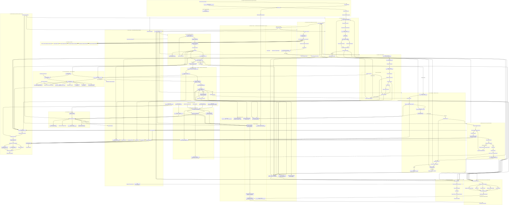

# Operant Core

Operant is intelligent o2c/e2e/intelligent e-commercesoftware

## License and proprietary notice

Operant is proprietary and confidential software.

Copyright (c) 2026 Operant / Akan Mukhametgali. All rights reserved.

No public open-source license is granted for this repository unless a specific file,
package, or directory explicitly states otherwise. See LICENSE, NOTICE,
THIRD_PARTY_NOTICES.md, and docs/legal/ for details.

Status note:currently building ST1 stage

This repository is intentionally scoped to platform foundation only:

- Java 21 Spring Boot core API
- Next.js TypeScript dashboard shell
- Python 3.12 AI/OCR worker skeleton
- PostgreSQL, Redis, Flyway migrations, Docker Compose
- Security and architecture documentation

AI, frontend, chatbot, and connector components must never directly write trusted business data. Future mutations must go through typed core-api command services, authentication, authorization, tenant policy, deterministic validation, approval gates, transactions, audit events, and outbox events.

# The Architecture
### The Full Architecture was so big to implement for one person in 2 months so I just paused full project because of my assessments at University and preparing for certificates which I wanted to pass
### P.S: I passed sc-200 and still preparing for OSAI certificate. Right now Im leearning about AI Red Teaming and I think I will improve and end this project as soon as possible after work and study hours.

### So first of all here is not full but part of the architecture because full detailed architecture was too big

### Here is also architecture of Source-to-Pay Engine

.svg)

### Here is Order-to-Cash Architecture flow

.svg)

### Here is value validation engines flow

.svg)

### Here is flow why customers paying as it is the Enterprise platform like Esker but with imlemented tools and more convinient Order-Controling flow 

.svg)
