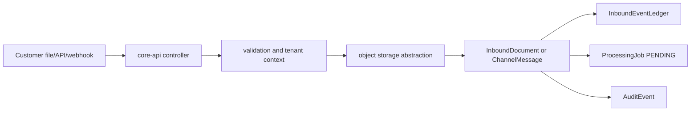

# Channel Gateway Foundation

Stage 13 keeps channels as customer communication inputs: Email, file upload, API upload, Telegram, WhatsApp, Meta Messenger, Viber, WeChat, and future adapters.

Core rules:
- Every channel connection is tenant-scoped.
- Connections default to `DRAFT` and `READ_ONLY`.
- Webhook payloads are untrusted input and must pass connection status and verification checks before normalization.
- Accepted payloads are stored as `inbound_channel_event` records only.
- Replayed events are idempotent when an external event id or payload hash already exists.
- Channel adapters do not create quotes, orders, ERP records, replies, commands, AI authority paths, or trusted business mutations directly.
- Raw provider payloads are stored for audit/debugging only. Raw secrets are never returned by API responses.

Webhook verification is routed through `ChannelWebhookVerifier` with provider stubs for Telegram, WhatsApp, Meta Messenger, Viber, and WeChat. `DISABLED_FOR_LOCAL_DEV` is allowed only as an explicit local/test mode and is surfaced in diagnostics.

Health checks return structured diagnostics such as `SECRET_MISSING`, `WEBHOOK_NOT_CONFIGURED`, `WEBHOOK_VERIFICATION_DISABLED`, and `READ_ONLY_MODE`.

Stage 13 status: provider adapters are adapter-ready for secure onboarding. They are not production-certified messaging integrations yet.

## Stage 3 Intake Stabilization

Stage 3 uses the same channel boundary for file uploads, API uploads, email webhook stubs, Telegram webhook stubs, and WhatsApp-ready stubs.

Local Stage 3 tenant resolution uses `X-Tenant-Id`. Production channel mapping should later resolve tenant from a verified `ChannelConnection` or provider-specific routing rule. Unsigned webhook acceptance is dev-only and must not be treated as production provider verification.
