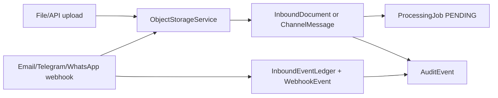

# Intake Architecture

The Phase 3 intake layer is a controlled mirror for untrusted inbound customer inputs. It accepts documents and channel messages, records enough metadata for later processing, and preserves raw payloads without allowing channel systems to write operational business data.

## Core Records

- `InboundDocument`: tenant-scoped file/API document metadata, content type, size, object storage key, SHA-256 fingerprint, status, and receipt metadata.
- `ChannelMessage`: tenant-scoped normalized message envelope for API, email, Telegram, and WhatsApp-ready inputs.
- `InboundAttachment`: metadata for document or message attachments. Email webhook attachments are metadata-only in this phase.
- `InboundEventLedger`: tenant-scoped provider event ledger with source, external event id, event type, fingerprint, status, raw payload key, and timestamps.
- `WebhookEvent`: compatibility event record for webhook receipt, replay detection, and verification status.
- `ProcessingJob`: tenant-scoped pending work item. Phase 3 creates jobs but does not execute AI/OCR processing.
- `ChannelConnection`: tenant-scoped channel configuration shell with status, config JSON, and secret reference placeholder.

## Flow

## Object Storage Boundary

`ObjectStorageService` owns file and raw-payload storage. The local development implementation stores objects under the application target directory and records metadata in `object_storage_record`. Frontend code never writes files directly to the database or object storage.

## Mutation Boundary

All mutations enter through core-api controllers and services:

- `/api/v1/intake/documents`
- `/api/v1/intake/documents/upload`
- `/api/v1/intake/messages`
- `/api/v1/webhooks/email`
- `/api/v1/webhooks/telegram`
- `/api/v1/webhooks/whatsapp`

No Phase 3 controller or service mutates product, customer, inventory, pricing, discount, margin, quote, order, ERP, accounting, or warehouse records.

## Status Model

Documents and messages are accepted as `QUEUED` after successful persistence. Duplicate documents are marked `DUPLICATE`. Processing jobs are created as `PENDING` and wait for later worker phases.

## Tenant Isolation

Controllers rely on `X-Tenant-Id` via `TenantContextFilter`. Repository reads and writes use tenant-scoped methods. Duplicate checks are tenant-scoped so two tenants can submit identical files or external message ids without colliding.
