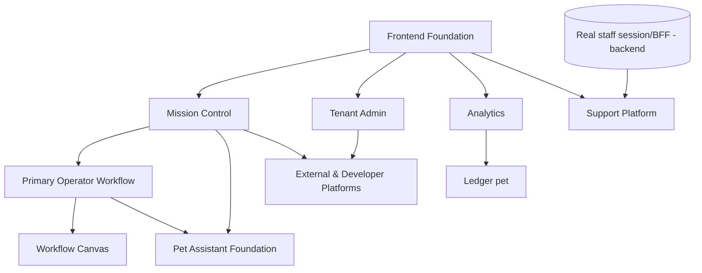
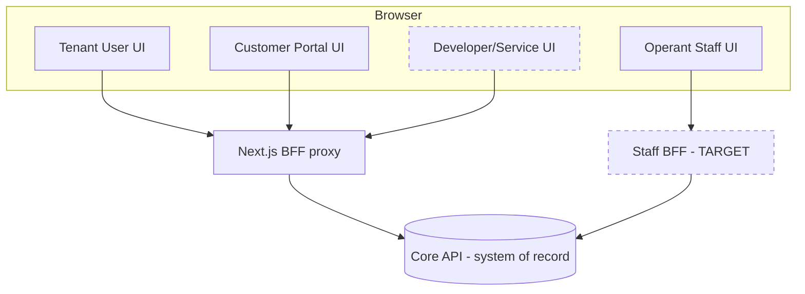
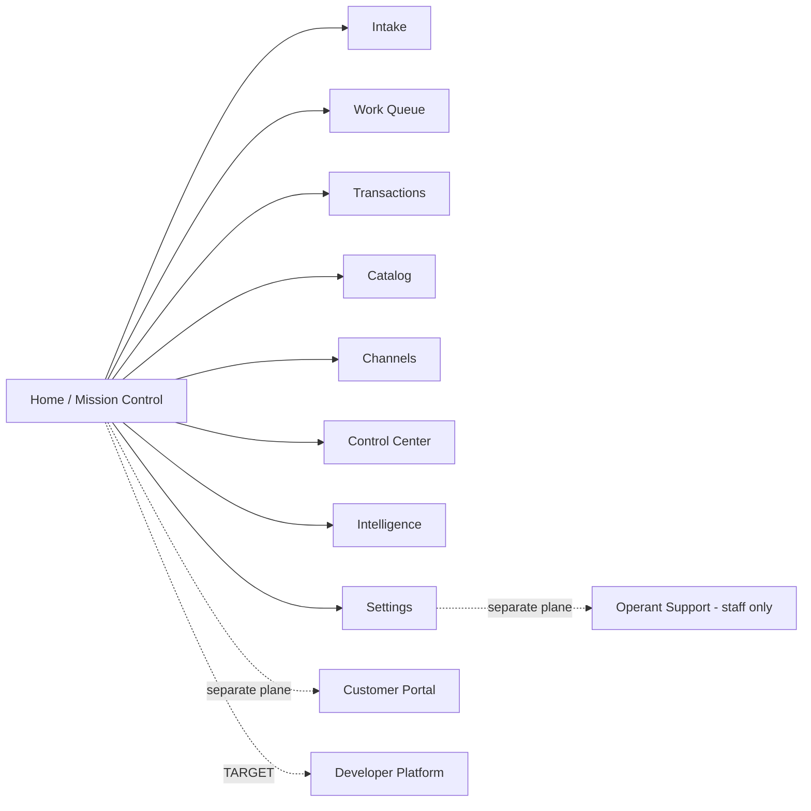
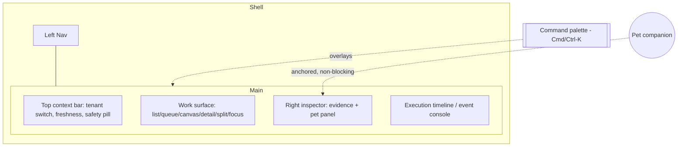
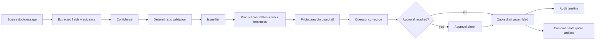
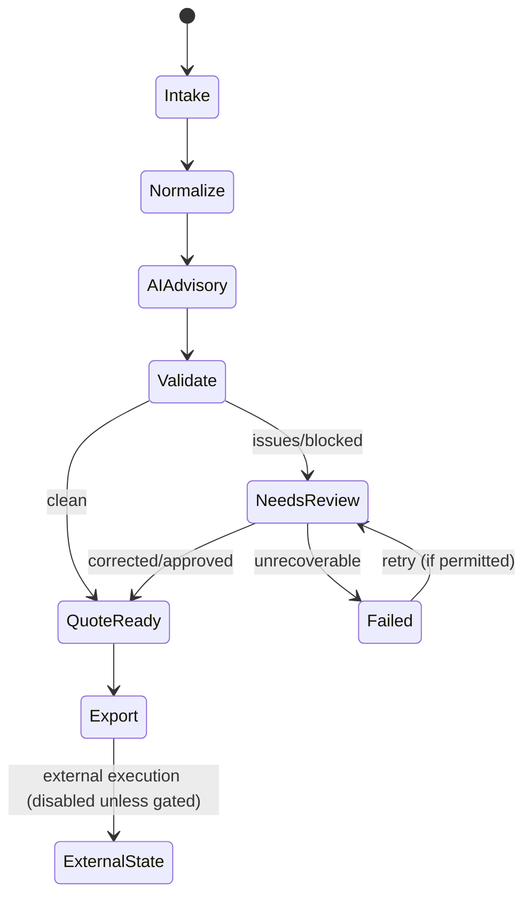
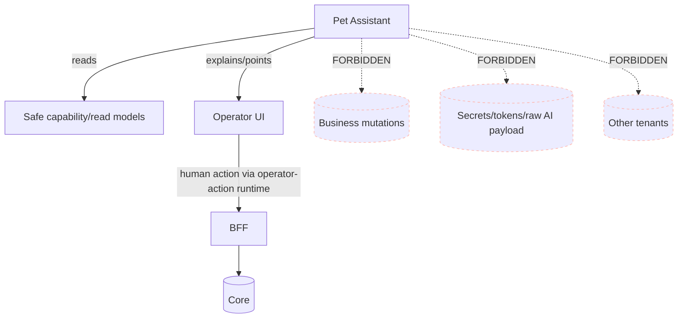
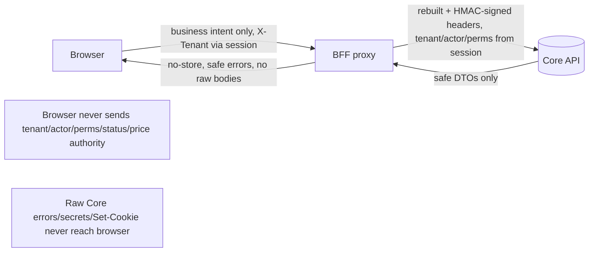
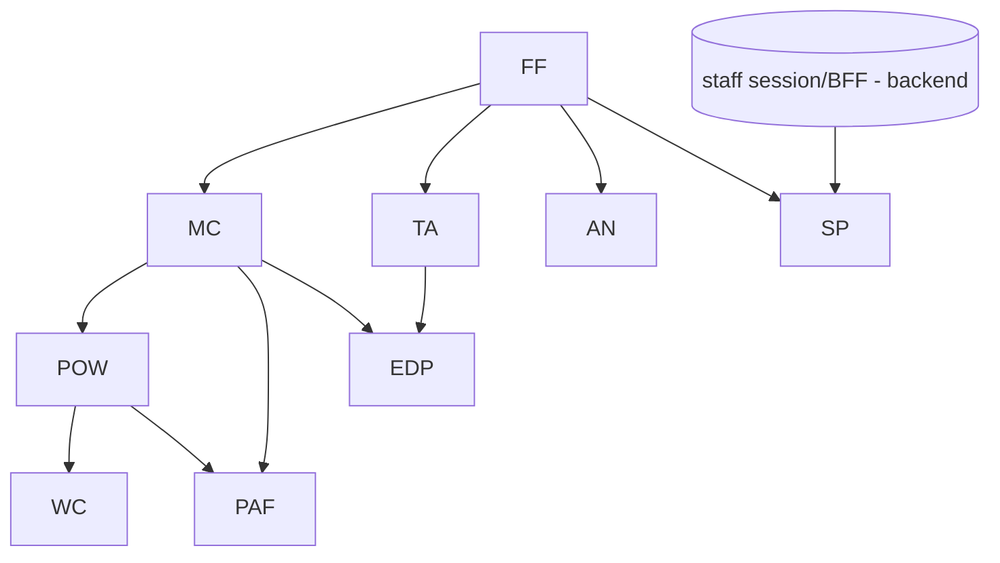

# OPERANT — World-Class Frontend Master Plan V1

## Document classification (mandatory)

- **Document status:** OWNER-REVIEWED PRODUCT AND FRONTEND TARGET PLAN
- **Implementation status:** NOT IMPLEMENTED
- **Repository proof status:** PARTIAL DISCOVERY ONLY
- **Execution permission:** NO IMPLEMENTATION AUTHORIZED BY THIS DOCUMENT ALONE

Clarifications:
- This document defines **target behavior**, not runtime evidence.
- It does **not** prove that routes, DTOs, permissions, or backend capabilities exist today; every such claim must be re-verified at implementation time.
- It must be implemented only through the active P-stage governance, one bounded slice at a time.
- The current P1-E bounded control-plane work on `feature/p1e-bounded-control-api` is **unrelated** to this plan and is untouched by it.

> **Document type:** Owner-grade frontend product architecture and execution plan (planning only).
> **Status:** Owner-reviewed target plan (see Document classification above). No production code changed by this document.
> **Author role:** Principal product designer / frontend architect / UX systems engineer / frontend security reviewer.
> **Scope guard:** This is a plan, not an implementation. It does not modify backend routes, DTOs, permissions, migrations, CI, deployment, or the current P1 control-plane work. It must not be treated as proof that any described feature exists today.
>
> **Source priority used throughout:** current code → current tests → runtime contracts → current routes/permissions → current execution state → governance docs → historical plans → screenshots/agent summaries.

---

## 0. Reading guide and provenance

Repository root: `C:/OrderPilot/OrderPilot-Core`
Remote: `github.com/akonPAPA/Operant`
Branch at planning time: `feature/p1e-bounded-control-api`
HEAD: `ff40c637a8c817ec016a772a7e81950f016504d6`
Worktree: **dirty** (uncommitted P1-E bounded control-plane / operantctl backend work — left untouched by this planning task).

Governing documents requested by the task and their actual availability in-repo:

| Requested governing document | Found in repo | Substitute source used |
|---|---|---|
| Root `AGENTS.md` + area `AGENTS.md` | ✅ `AGENTS.md`, `apps/web-dashboard/AGENTS.md`, `apps/core-api/AGENTS.md` | Read directly |
| `OPERANT_PROMPT_ENGINEERING_BUSINESS_LOGIC_ARCHITECTURE_STANDARD_V1.md` | ❌ not present | Covered by root `AGENTS.md` §21 "Secure Business Contract Law" + web AGENTS overlay |
| `OPERANT_TOP_TIER_SECURITY_ARCHITECTURE_CONSTITUTION_V1.md` | ❌ not present | Covered by `SECURITY.md`, BFF proxy code, `ORDERPILOT_ACTIVE_CHECKPOINT.md` safety invariants |
| `OPERANT_PRODUCTION_MASTER_PROMPT.md` | ✅ present | Read |
| `OPERANT_INTEGRATED_PRODUCT_DEVELOPMENT_EXECUTION_PLAN_V3.md` | ❌ not present | Covered by `docs/product/current-stage.md`, `STAGE_STATUS_RECONCILIATION.md`, checkpoint |
| `OPERANT_PRODUCTION_EXECUTION_STATE.md` | ✅ present (modified in worktree) | Read at HEAD; not modified |
| Active checkpoint | ✅ `docs/ai/ORDERPILOT_ACTIVE_CHECKPOINT.md` | Read (primary product-truth source) |

**Provenance note:** three of the named constitution/standard documents do not exist under those exact filenames. Their intent is carried by the tracked `AGENTS.md` guardrail files and the checkpoint. This is recorded again in §34 NOT_PROVEN so the owner can decide whether to author the missing canonical documents.

---

## Table of contents

1. Executive decision
2. Current frontend truth
3. Review coverage
4. Current-state inventory
5. Product experience principles
6. n8n and Claude Code inspiration mapping
7. Operant original design identity
8. Access-plane information architecture
9. Navigation model
10. Mission Control workspace
11. Primary workflows
12. Workflow canvas
13. Command palette
14. Pet Assistant System
15. Pet archetypes and final recommendation
16. Design system
17. Frontend technical architecture
18. Data and state ownership
19. Security and privacy
20. Accessibility
21. Performance budgets
22. Responsive strategy
23. Localization
24. Error / loading / empty / stale / partial-state system
25. Test strategy
26. Analytics and instrumentation
27. Roadmap and PR sequence
28. Dependency matrix
29. Feature priority matrix
30. Business Logic & Visibility Boundary Gate
31. Risks
32. Rejected ideas
33. Owner decisions required
34. NOT_PROVEN
35. Final recommendation
36. Required diagrams
37. Required wireframes

---

## 1. Executive decision

**Operant's frontend should be evolved, not rewritten.** The existing `apps/web-dashboard` already embodies the hardest and most valuable parts of a world-class enterprise product: a fail-closed browser→BFF→Core trust boundary, a business-intent-only contract discipline, honest empty/partial/unavailable states, a shared operator-action runtime with idempotency, and a hand-authored dark design-token system. These are exactly the foundations that are expensive to retrofit and cheap to build on.

What is missing is **coherence and workspace-grade interaction**: the surface has grown into ~40 routes across 9 navigation groups with visible overlap and duplication; there is no command palette, no unified Mission Control, no workflow canvas, no cross-surface context/inspector discipline, single-theme-only styling, partial accessibility, and no assistant layer.

The recommended direction is a **calm, evidence-oriented operational workspace** — "Operant Mission Control" — that (a) unifies the existing surfaces under one role-aware shell, (b) adds a command palette and a bounded, read-mostly workflow canvas as *views onto existing backend truth*, (c) introduces a small, strictly non-authoritative **Pet Assistant** family that guides and explains without ever deciding, and (d) formalizes the design system, accessibility, performance, and localization that the app currently approximates by hand.

**Decision:** Evolve. Consolidate the information architecture, add Mission Control + palette + bounded canvas + pets on top of the existing BFF-safe foundation, and hold the line that all business truth stays backend-owned.

---

## 2. Current frontend truth

Grounded in code actually read (see §3 for coverage).

**Stack (from `apps/web-dashboard/package.json`):** Next.js `16.2.10` (App Router, `output: "standalone"`), React `18.3.1`, `openid-client` `6.8.4`, `redis` `^4.7.0`, `server-only`. Dev/test: Playwright, ESLint 9 + `eslint-config-next`, TypeScript `5.6.3`, `node --test`. **No Tailwind, no component library, no charting library, no animation library, no client state-management library.** This is a deliberately lean, audit-friendly stack.

**Design system (from `app/globals.css`, ~987 lines):** a single hand-rolled dark theme built on CSS custom properties (`--bg:#0b0f0e`, `--surface`, `--panel*`, `--accent:#57f1db` teal, semantic `--warning/--info/--danger` + `*-bg` tints). `Inter` with system fallback. Shell is a CSS grid: 260px sticky sidebar + main column, `<details>/<summary>` collapsible nav groups, a topbar with an "External execution disabled" system pill, and an optional right inspector column. No theme switching; no light/high-contrast variants.

**App shell (`components/dashboard-shell.tsx`):** already implements left nav + topbar + content + optional `inspector` slot — a genuine workspace skeleton, not a bare page list.

**Trust boundary (`lib/bff/bff-proxy.ts` + registry):** a hardened Node-runtime proxy. Tenant, actor, and permissions come **only** from the server-side session; outbound headers are rebuilt from scratch and HMAC-signed (`signGatewayHeaders`); browser authority/credential/hop-by-hop headers are never forwarded; path hardening rejects encoded slashes, dot segments, control chars; per-route query allowlists with typed grammars; JSON body canonicalization; CSRF + same-origin on mutations; bounded request/response sizes; raw Core 4xx/5xx bodies are never surfaced (mapped to safe messages); authenticated responses are `Cache-Control: no-store`. This is best-in-class and is the spine the rest of the plan protects.

**Auth (`lib/frontend-authority.mjs`, `lib/bff/bff-oidc-*`):** production runs in `bff-session` mode (tenant from session, empty client tenant); development may run a `demo` mode gated on `NEXT_PUBLIC_ORDERPILOT_DEMO_MODE` + a configured demo tenant; demo mode is **forbidden in production** (fail-closed). Full OIDC login/callback/session-store/redis machinery exists.

**Operator-action runtime (`lib/operator-action-runtime.ts`, per web `AGENTS.md`):** shared `useOperatorAction` hook enforcing duplicate-click guard, loading/disabled state, `createOperatorIdempotencyKey`, and `mapOperatorActionError` (status → safe operator message). Cockpits (e.g. `quote-review-cockpit.tsx`) already migrated onto it.

**Support plane (`app/(dashboard)/internal-support/layout.tsx`):** explicitly a **staff** plane that **fails closed** — there is no real server-side staff session yet, so every direct route currently `notFound()`s rather than deriving staff authority from the browser. Honest.

**Public/customer plane:** `app/public/order-tracking/[token]` exists as a token-scoped customer-safe surface, separate from the authenticated dashboard.

**Surface breadth (grep-verified):** ~65 route files (`page.tsx` under `(dashboard)`) and 46 components covering intake/upload, documents, extractions, validation review, exception cockpit, conversion review, quote review, draft workspace, order journey, catalog (customers/products/inventory/pricing/imports), channels/bots, integrations/sync/audit, analytics/commerce-intelligence, pilot-readiness, and an investor `demo`.

**Confirmed gaps (grep-verified):** no command palette / keyboard-shortcut system (no `keydown`/`dialog`/cmdk), no workflow canvas (no `<svg>`/canvas/reactflow in components), **no Next `middleware.ts`** (route gating is via layouts + BFF), only 15 of 46 components use any `aria-*`, single theme only, and navigation contains duplicate/overlapping destinations.

---

## 3. Review coverage

**Coverage claim: PARTIAL-BUT-REPRESENTATIVE. A full file-by-file review of every production frontend file was NOT performed.** This planning task read a deliberately chosen representative spine.

Actually read in full or in substantial part:
- `apps/web-dashboard/package.json`, `next.config.mjs`, `app/globals.css` (head + structure), `app/layout.tsx` (referenced), `app/(dashboard)/layout.tsx` (referenced), `app/(dashboard)/internal-support/layout.tsx`.
- `components/dashboard-shell.tsx`, `components/navigation.ts`, `components/operant-command-center.tsx` (head).
- `lib/frontend-authority.mjs`, `lib/brand.ts`, `lib/bff/bff-proxy.ts` (full).
- `apps/web-dashboard/AGENTS.md`, root `AGENTS.md` (head), `docs/ai/ORDERPILOT_ACTIVE_CHECKPOINT.md` (full).

Enumerated (directory/name-level) but **not** read line-by-line:
- The other ~43 components, the `lib/*` clients (49 top-level files, 27 `*-api.ts`) + `lib/bff/*` (33 files) + `lib/server/*` (20 files), all `app/(dashboard)/*` route `page.tsx` files, the 75 `tests/*.test.mjs`, the Playwright `e2e/*`, and backend contract sources.

Exact omissions (owner should assume these are UNVERIFIED unless separately reviewed): per-route rendering logic; every runtime response validator's completeness; the full route registry allowlist; visual baselines/screenshots (none confirmed present under `public/`, which is empty); the true accessibility state of each cockpit; localization strings; and the demo surfaces' data honesty beyond the command-center pattern.

**Any statement in this plan about a surface not in the "read in full" list is inferred from naming, the checkpoint, and the shared patterns — not from direct inspection.** Treat those as hypotheses to verify in Frontend Foundation §27.

---

## 4. Current-state inventory

Statuses: `CURRENT_PROVEN` (read/tested), `CURRENT_PARTIAL`, `CURRENT_UNVERIFIED` (exists, not directly inspected here), `MISLEADING`, `LEGACY`, `TARGET`, `NOT_SUPPORTED`.

| Surface | Current route | Intended user | Current status | Contract source | UX quality | Security concern | Missing behavior | Recommended future state |
|---|---|---|---|---|---|---|---|---|
| App shell / nav | `(dashboard)/layout` + `dashboard-shell` | Tenant operators | CURRENT_PROVEN | `navigation.ts`, layout | Good skeleton, no palette/breadcrumb | None material | Palette, breadcrumbs, task center, role-awareness | Mission Control shell (§10) |
| BFF proxy boundary | `app/api/bff/[...segments]` | System | CURRENT_PROVEN | `bff-proxy.ts`, route registry | N/A (infra) | Strong; keep invariants | Per-contract response schema validation | Keep; add runtime schema guards (§17.1) |
| OIDC/session auth | `app/api/auth/*`, `lib/bff/bff-oidc-*` | All authed users | CURRENT_UNVERIFIED (mature) | `bff-oidc-*` | N/A | Session-derived authority (good) | Session-expiry UX polish | Keep; formal session-expiry pattern (§24) |
| Command Center | `/command-center` | Managers/operators | CURRENT_PARTIAL (head + honesty strings read) | `command-center-api` | Honest empty/partial | None | Not yet a true Mission Control | Fold into Mission Control home (§10) |
| Analytics | `/analytics` | Managers | CURRENT_UNVERIFIED | `stage8-analytics-api` | Unknown | Metric provenance must be explicit | Source/formula/freshness labels | Governed analytics (§9.8) |
| Business Value | `/analytics` (dup label) | Managers/execs | CURRENT_PARTIAL / duplicate | `stage8-value-api` | Duplicate nav entry | Duplicate destination confusion | Distinct route or merge | Consolidate (§9) |
| Pilot Readiness / Evidence / Demo Scenarios | `/pilot-readiness/*` | Internal/pilot | CURRENT_UNVERIFIED | `pilot-metrics-api` | Unknown | Must not present demo as live | Capability badges | Keep, badge honestly |
| Investor Demo | `/demo` | Internal/sales | CURRENT_UNVERIFIED → potential MISLEADING | `demo-api` | Unknown | **High**: demo data must never read as live tenant truth | Explicit "SANDBOX" framing | Sandbox mode (§10, §33) |
| Inbox / Upload / Documents / Messages / Extractions / Processing Jobs | `/inbox`, `/upload`, `/documents`, `/messages`, `/extractions`, `/processing-jobs` | Operators | CURRENT_UNVERIFIED | intake/stage2 APIs | Unknown | Document/preview rendering must be sandboxed | Unified intake view | Intake plane (§11.2) |
| Validation Review | `/validation-review/[reviewCaseId]` | Operators | CURRENT_UNVERIFIED (core flow) | `validation-review-*` | Central flagship | Evidence/no-raw-payload discipline | Evidence spotlight, canvas link | Flagship RFQ review (§11.2) |
| Exception Cockpit | `/exception-cockpit/[id]` | Operators | CURRENT_UNVERIFIED | validation APIs | Cockpit pattern | Same | Aging, queue mode | Queue + detail (§10) |
| Conversion Review | `/conversion-review/[attemptId]` | Operators | CURRENT_UNVERIFIED | `quote-transaction-api` | Cockpit | Response-leak discipline (proven pattern) | — | Keep |
| Quote Review | `/quote-review/[quoteId]` | Operators | CURRENT_PROVEN (runtime-integrated) | `quote-review-api` | Strong (OP-CAP-34/35/36) | Business-intent payloads (good) | Draft canvas linkage | Flagship quote flow (§11.2) |
| Review-origin drafts / Draft Quote & Order Review | `/workspace/review-drafts`, `/workspace/draft-quotes`, `/workspace/draft-orders` | Operators | CURRENT_PROVEN (per checkpoint) | `draft-review-api` | Bounded DTOs, honest | None | Overlaps `/quotes` `/orders` labels | Consolidate naming (§9) |
| Draft Quotes / Orders (legacy list) | `/quotes`, `/orders`, `/quotes/[id]`, `/orders/[id]` | Operators | CURRENT_UNVERIFIED / overlaps | quote/order APIs | Duplicate vs workspace review | Naming collision with review queues | Disambiguate or merge | Consolidate |
| Order Journey | `/order-journey/[id]` | Operators | CURRENT_PROVEN (47C render-proof) | `order-journey-api` | Timeline, honest states | Read-only (good) | — | Keep as timeline exemplar |
| Catalog: Customers/Products/Inventory/Pricing/Imports | `/customers` `/products` `/inventory` `/pricing` `/imports` | Ops/finance | CURRENT_UNVERIFIED | stage2 APIs | Unknown | Margin/cost must be permission-gated | Freshness/lineage badges | Catalog plane (§8) |
| Channels / Bots (multiple) | `/channels`, `/bot-conversations`, `/bot/conversations`, `/messenger-bridge`, `/channel-identities`, `/inbound-events`, `/webhook-events`, `/bot-runtime`, `/bot-settings` | Ops/admin | CURRENT_PARTIAL / **overlapping** | channel/bot APIs | Fragmented; `/bot-conversations` vs `/bot/conversations` duplicate | Bot must never hold approval authority (enforced backend) | IA consolidation | Channels plane (§8, §9) |
| Integrations / Sync Events / Audit / Audit-Security | `/integrations`, `/sync-events`, `/audit`, `/audit-log` | Admin | CURRENT_PARTIAL / `/audit` vs `/audit-log` duplicate | stage9 integration API | Duplicate audit destinations | Connector controls must stay bounded | Merge audit surfaces | Control Center plane (§8) |
| Runtime Control Telemetry | `/runtime-control` | Admin | CURRENT_UNVERIFIED | `runtime-control-telemetry-api` | Unknown | Read-only telemetry only | — | Keep, badge |
| Commerce Intelligence | `/commerce-intelligence` | Managers | CURRENT_UNVERIFIED | `commerce-intelligence-api` | Has a "demo-flow" component | Demo vs real separation | Provenance | Governed analytics |
| AI Work Assistant | `/ai-work` | Operators | CURRENT_UNVERIFIED | `ai-work-api` | Unknown | **Must not** render raw AI payload/CoT | Evidence framing | AI evidence experience (§11.4) |
| Reconciliation | `/reconciliation` | Finance/ops | CURRENT_UNVERIFIED | reconciliation APIs | Unknown | — | — | Keep |
| Settings | `/settings` | Tenant admin | CURRENT_UNVERIFIED (thin) | — | Single item | — | Tenant admin depth | Tenant Admin plane (§8) |
| Internal Support (+ data-repair, operations) | `/internal-support/*` | **Operant staff** | CURRENT_PROVEN (fails closed) | `internal-support-access.mjs` | Correctly stubbed | Must never be tenant-reachable (enforced) | Real staff session/JIT | Support plane (§8, §9.9) |
| Public Order Tracking | `app/public/order-tracking/[token]` | External customer | CURRENT_UNVERIFIED (exists) | `public-order-tracking-api` | Token-scoped | Must never expose internal fields | Buyer portal depth | External plane (§8) |
| Command palette | — | All | NOT_SUPPORTED | — | — | Must be capability-filtered | Everything | Build (§13) |
| Workflow canvas | — | Operators | NOT_SUPPORTED | — | — | Must stay bounded/read-mostly | Everything | Build (§12) |
| Pet assistant | — | All | NOT_SUPPORTED | — | — | Must be non-authoritative | Everything | Build (§14–15) |
| Light / high-contrast / reduced-motion themes | — | All | NOT_SUPPORTED | — | — | Contrast compliance | Everything | Build (§16.2) |
| Developer/API platform | — | Service accounts | NOT_SUPPORTED | — | — | Scoped credentials | Everything | LATER (§8.3) |

---

## 5. Product experience principles

1. **Backend owns truth; the frontend reveals it.** The UI never computes trusted price, margin, stock, risk, approval, tenant, or actor authority. It renders what safe read models return and sends business intent only.
2. **Always answer the operator's ten questions.** Where am I? What needs attention? Why? What evidence supports it? What can I safely do next? What is blocked? What requires approval? What happened after my action? Is this fresh? Is this real / partial / demo / unavailable?
3. **Evidence before action.** Every AI-derived value is shown with its source, confidence, and deterministic-validation result. Suggestions are visibly advisory until a human approves.
4. **Honesty over polish.** Empty/partial/unavailable/stale states are first-class and labeled; no fabricated metrics; capability badges tell the truth about what is real vs demo vs not-yet-built.
5. **Calm density.** High information density with strong hierarchy and minimal ornamental chrome. Motion serves comprehension, never delays work.
6. **Keyboard-first, command-driven.** Anything you can click, you can reach by keyboard and by the command palette; the palette is filtered by real server capabilities.
7. **Safety is visible.** Permission requirements, approval gates, and "external execution disabled" are shown, not hidden. Navigation hiding is never treated as authorization.
8. **One workspace, many modes.** List, queue, canvas, detail, split, focus, and full-screen review are modes of one Mission Control, not separate apps.
9. **Assistants guide, humans decide.** Pets explain, point, and teach; they never approve, mutate, or invent authority.
10. **Plane separation is physical.** Tenant, customer, service-account, and Operant-staff experiences are distinct surfaces with distinct identity — never mixed.

---

## 6. n8n and Claude Code inspiration mapping

Used **only** as interaction-quality references. No copying of assets, wording, layouts, or branding.

| Reference strength | What we borrow (interaction quality) | Operant expression | What we explicitly do NOT copy |
|---|---|---|---|
| n8n — node canvas | Spatial view of a pipeline's stages and their execution states | Bounded, **read-mostly** RFQ→Quote workflow canvas that visualizes existing backend stages | n8n's arbitrary-node editor, code/HTTP/function nodes, self-hosted branding, exact layout |
| n8n — execution inspector | Click a node → see its run detail, timing, evidence | Node inspector drawer bound to safe read models | n8n's raw JSON dump aesthetic |
| n8n — run history / states | Success/warning/blocked/retry/failure vocabulary | Operant execution states tied to backend capability, not cosmetic guesses | n8n data pinning / editing of run data |
| n8n — config drawers | Right-side configuration without leaving context | Right inspector for evidence + bounded config | n8n unrestricted expression editor |
| Claude Code — command palette | Command-first navigation and action | Capability-filtered Operant palette (§13) | Executing arbitrary shell/SQL/commands |
| Claude Code — visible plan/progress | Show the plan and the current step | Workflow plan + "current step" in Mission Control and canvas | Terminal look that hurts business readability |
| Claude Code — explicit permission moments | Approval/confirmation surfaces before risky actions | Approval sheet + safe confirmation dialog (§16.3) | — |
| Claude Code — calm dark, low chrome | Minimal noise, strong hierarchy, keyboard-first | Operant dark identity (already present) refined | Anthropic palette/typography/marks |
| Claude Code — context side panels | Progressive disclosure via context drawers | Right inspector + pet panel | — |

**Net:** we take *interaction discipline and clarity* from both, and reject *arbitrary execution* (n8n's power-user escape hatches) and *raw-terminal aesthetics* (readability risk for business operators).

---

## 7. Operant original design identity

**Name / mark:** "Operant — Enterprise transaction cockpit" (already in `lib/brand.ts`). Keep the square teal `O` brand-mark and the "External execution disabled" system pill as identity signatures.

**Identity pillars:**
- **Operational intelligence** — dense, legible, evidence-forward. The interface looks like a control room, not a marketing dashboard.
- **Trust & evidence** — every derived number is traceable; provenance is a visual primitive (badges, source links).
- **Controlled automation** — automation is visible and bounded; the "disabled / advisory / human-required / external" state of each step is always legible.
- **Human authority** — approval and correction are prominent, first-class, and calm.

**Signature elements:**
- Deep near-black green-tinted canvas (`--bg #0b0f0e`) with a single confident teal accent (`--accent #57f1db`) reserved for *actionable/attention* meaning — never decoration.
- Semantic state tints (danger/warning/success/info backgrounds already tokenized) used consistently for capability and freshness.
- Monospaced numerics for IDs/quantities/money to aid scanning (new token, §16.1).
- Restraint: no purple AI gradients, no glassmorphism, no crypto-dashboard neon, no childish illustration (except the pet family, which is deliberately restrained and functional — §14).

**Anti-identity (banned):** generic purple AI gradients; heavy glass; meaningless charts; huge empty whitespace; hover-only critical controls; fake command execution; animation that delays work; a visual clone of n8n or Claude Code.

---

## 8. Access-plane information architecture

Four **physically and logically separate** planes. Separation is enforced by distinct route roots, distinct identity/session resolution, and backend permission families — never by nav hiding alone.

### 8.1 Tenant User Platform (`/(dashboard)/*`)
Operators, sales, managers, finance viewers, inventory users, tenant admins. Areas: **Home / Mission Control**, Inbox, RFQs & Exceptions (Work Queue), Quotes, Orders, Customers, Products, Inventory, Pricing & Rules, Documents, Integrations status, Analytics, Tasks & Approvals, Audit-visible activity, Tenant Settings. Authority is `bff-session`-derived; tenant from session; permissions enforced by Core.

### 8.2 External Customer Platform (`/public/*` today; future `/portal/*`)
Buyer-safe experience: secure quote view; accept / reject / comment; customer documents; order status; delivery status; invoice/payment mirror (when later supported). **Never shows** internal margin, staff notes, internal risk, internal audit, support tools, tenant configuration, or raw AI output. Token- or customer-identity-scoped, separate session model.

### 8.3 Service Account & Developer Platform (`/developer/*`, TARGET/LATER)
API credentials; scopes; webhooks; sandbox; test events; **redacted** request logs; SDK docs; rate/quota usage. **Service accounts must not perform human approvals** (backend already segregates STAFF_* / actor resolution). Not built today — planned surface only.

### 8.4 Operant Support & Maintenance Platform (`/internal-support/*`, staff-only)
Tenant health; deployment version; job failures; **safe** retry; connector disable; **redacted** diagnostics; JIT access grants; read-only "view-as"; incident timeline; controlled data-repair **preview**; release/rollback evidence. Backed by the OP-CAP-51/52/53/54 incident/break-glass/data-repair backend foundation. Currently **fails closed** in the frontend (no real staff session). **Tenant users must never see or reach this plane, and its tools must never be mixed into tenant admin.**

```
Plane isolation rules (invariant):
- No shared navigation between tenant and staff planes.
- No client-selectable tenant on the staff plane; scope comes from a staff session + JIT grant.
- Support "view-as" is read-only and audited; no silent impersonation.
- Customer plane renders only customer-safe DTO fields.
```

---

## 9. Navigation model

**Problem (observed):** the current `navigation.ts` has 9 groups and ~40 items with real overlap: `/bot-conversations` vs `/bot/conversations`; `/audit` vs `/audit-log`; `/quotes` "Draft Quotes" vs `/workspace/draft-quotes` "Draft Quote Review"; `/analytics` listed twice (Analytics + Business Value). This dilutes "where am I / what can I do."

**Target model:** a role-aware, two-level navigation with a stable top-level spine and consolidated destinations.

Proposed consolidated tenant spine (each maps to existing routes; **no route deletion in this plan** — consolidation is a Frontend Foundation task with redirects):

1. **Home** (Mission Control) → `/command-center` folded into `/` home.
2. **Intake** → Inbox, Upload, Documents, Messages, Extractions, Processing Jobs.
3. **Work Queue** → Validation Review, Exceptions, Conversion Review, Quote Review, Review-origin Drafts, RFQ Handoffs.
4. **Transactions** → Quotes, Orders, Order Journey (draft "review" queues merged into their entity with a status filter, not separate nav items).
5. **Catalog** → Customers, Products, Inventory, Pricing, Imports.
6. **Channels** → one consolidated Channels home with Conversations, Identities, Messenger Bridge, Inbound/Webhook Events, Bot Runtime, Bot Settings (dedupe `/bot-conversations` vs `/bot/conversations`).
7. **Control Center** → Integrations, Sync Events, Audit & Security (dedupe `/audit` + `/audit-log` into one destination with tabs).
8. **Intelligence** → Analytics (governed), Commerce Intelligence, Runtime Telemetry, Reconciliation, AI Work.
9. **Settings** → Tenant admin.

Navigation rules:
- Nav is **capability-aware**: items the session cannot use are shown disabled with a reason or omitted per policy — but **omission is never the authorization** (Core still enforces).
- The active group auto-expands (already implemented via `open={...}` in `dashboard-shell.tsx`).
- Breadcrumbs + a **quick switcher** (palette) supplement, never replace, the spine.
- The pet **Workflow Guide** can answer "where am I / what's next" but does not change nav authority.

---

## 10. Mission Control workspace

A single unified workspace ("Operant Mission Control") that the existing shell already 70% implements.

**Layout regions:**
- **Left global navigation** (existing 260px sidebar; add role-awareness + quick-switch entry).
- **Top workspace context bar** (existing topbar; add tenant/workspace switcher, freshness clock, session/identity, and the "External execution disabled" system pill).
- **Center operational canvas / work surface** — the mode-switching region.
- **Right context/evidence/assistant inspector** (existing `inspector` slot; formalize as evidence + pet panel).
- **Bottom collapsible execution timeline / event console** (new; a restrained, virtualized activity feed).
- **Command palette** (new, §13), **notification & task center** (new), **pet companion anchor** (new, non-blocking).

**Work-surface modes and when each is appropriate:**

| Mode | Use when | Example surfaces |
|---|---|---|
| List | Scanning/filtering many homogeneous records | Documents, Customers, Products |
| Board / Queue | Prioritizing work that has state and ownership | Validation Review, Exceptions |
| Workflow canvas | Relationships/execution flow add real understanding | RFQ→Quote pipeline (§12) — **only** here |
| Detail | Deep single-record work | Quote Review, Order Journey |
| Split comparison | Before/after, candidate compare, correction vs source | Substitute compare, config diff |
| Focus | Reduce noise for one deep task (pets hidden) | Long correction / approval |
| Full-screen review | Evidence-heavy review with document + fields | RFQ evidence review |

**Rule:** never force a workflow into the canvas. Tables, timelines, queues, and forms are the default; the canvas is one specialized mode.

Home (role-aware): a personalized work queue + attention list + freshness + "start here" for new users (§11.1), built on the existing honest command-center projection pattern — no fabricated metrics.

---

## 11. Primary workflows

### 11.1 First five minutes
On first authenticated load, the user must understand: what Operant does; current tenant/workspace; what data is connected vs not; what needs attention; how to process the first request; what the pet can/can't do; how to open the palette (`Ctrl/Cmd-K`); where help is; and which features are unavailable.
- **No fabricated live data.** Unconnected sources render as "Not connected" with a connect CTA; empty queues render honest empty states.
- A dismissible **guided tour** (pet "Workflow Guide" first-use mode) highlights nav spine, palette, work queue, and the "External execution disabled" safety pill.
- A **readiness checklist** shows connected data sources, pending setup, and first recommended action.

### 11.2 RFQ intake and review (flagship)
Source preview → extracted fields → **evidence links** (document line references) → confidence → deterministic validation → issue list → product-candidate comparison → stock freshness → pricing/margin guardrail → substitute decision → operator correction → approval (where required) → audit timeline → final quote artifact.
- Built on existing `validation-review-*`, `quote-review-*`, `draft-review-*` surfaces and their bounded DTOs.
- Left: source/document; center: extracted fields + issues; right: evidence inspector + pet **Evidence Scout**.
- Every AI value shows source + confidence + validation verdict; corrections send business intent only; approval uses the approval sheet; results append to the audit timeline.

### 11.3 Workflow canvas (bounded) — see §12.

### 11.4 AI evidence experience
Show: what AI suggested; source evidence; confidence; deterministic-validation result; contradictions; operator correction; model/provider metadata **only where permitted**; why human approval is required. **Never** render hidden chain-of-thought, raw provider payloads, stack traces, tokens, or secrets. This governs `/ai-work` and every evidence panel.

### 11.5 Command palette — see §13.

### 11.6 Tenant onboarding
Organization setup → invitations → roles → locations → data-source selection → import **dry-run** → configuration preview → validation report → activation → readiness checklist → first workflow. Import is preview-first; nothing mutates trusted data without backend command + validation.

### 11.7 Configuration workspace
Inspired by node inspectors but restricted to **safe** configuration: version history; draft; preview; validation; diff; dry-run; approval where needed; promote; rollback; audit. **Never** arbitrary scripts, raw SQL, shell, unrestricted URLs, security-control disabling, client-owned entitlements, or secrets in user-authored text.

### 11.8 Analytics & value realization — see §9.8 governance below.

### 11.9 Support console — see §9.9 / §8.4.

**§9.8 Governed analytics:** every metric must display **source, formula, scope, freshness, limitation, drill-down, permission**. Metrics without a production data source render "unavailable" (the existing command-center honesty pattern), never a fabricated number.

**§9.9 Support console:** separate staff plane with a persistent "support session active" banner; ticket/reason; tenant scope; expiry; read-only state; allowed actions; audit; revoke session; emergency step-up. No silent impersonation. Backed by incident/break-glass/data-repair backend; frontend stays fail-closed until a real staff session exists.

---

## 12. Workflow canvas

A **bounded, read-mostly** visualization of the existing pipeline — not an editor.

Canonical flow (nodes are *views* onto backend truth):

```
Intake → Normalize → AI Advisory → Validate → Needs Review → Quote Ready → Export → External execution state
```

Each node shows: **state**; duration; owner; evidence link; retry eligibility; failure; current limitation; and **node kind** (advisory / deterministic / human / external). Node kind is a first-class visual so operators always know whether a step is AI-suggested, rule-validated, human-decided, or an external intent.

**Hard boundaries (invariant):** the canvas must **not** allow arbitrary code, SQL, shell, unrestricted HTTP, or user-defined hidden tools. It has no free-form node creation. Interactions are: inspect a node, jump to the underlying record, retry where the backend permits, and (where permitted) advance a bounded state — always through the operator-action runtime.

**Accessibility:** the canvas must ship with a **non-visual structured list/timeline equivalent** (§20) that conveys the same state, order, and evidence.

**Performance:** lazy-loaded route chunk; no canvas/animation library loaded on non-canvas routes (§14, §21).

---

## 13. Command palette

Primary navigation + action mechanism (`Ctrl/Cmd-K`).

Commands (examples): navigate to…; open recent RFQ; search customer/product; assign item; open pending approvals; toggle focus mode; **ask pet to explain current screen**; open keyboard shortcuts; create a safe draft action where permission permits.

**The palette must:**
- Filter commands by **safe server capabilities** (session permissions) — capability, not cosmetics.
- **Never** become a generic arbitrary-command executor (no shell/SQL/HTTP).
- Show the **required permission** on each command.
- Require confirmation for mutations (approval sheet / confirm dialog).
- Prevent duplicate submission (operator-action runtime idempotency + duplicate-click guard).
- Respect current tenant/resource context.
- Provide full keyboard and screen-reader support (combobox + listbox ARIA, focus trap, escape).

Implementation note: build in-house (no `cmdk` dependency needed) to keep the lean stack; it is a filtered command registry + accessible combobox.

---

## 14. Pet Assistant System

Pets are **virtual assistant companions**: functional guides, not decorative mascots and **never** autonomous business actors. They do not own authority, bypass permissions, or mutate quotes/orders/inventory/prices/approvals/connectors/payments/tenant config.

### 14.1 Product role
Pets **may**: guide through workflows; explain current state in plain language; surface the next *safe* action; point to evidence; explain why an action is blocked; summarize validation issues; help navigate; highlight stale/incomplete info; teach new users; celebrate meaningful completion (restrained); and communicate system health through restrained visual behavior.

Pets **must never**: approve a business decision; invent pricing/stock/margin/permission/tenant authority; expose hidden data; silently execute; present an AI suggestion as deterministic truth; reveal internal prompts, chain-of-thought, raw provider payloads, stack traces, tokens, or secrets; access another tenant; impersonate a human; or manipulate users into unsafe approval.

### 14.2 Interaction modes
Compact corner companion; context-panel mode (in the right inspector); command-palette integration ("ask pet to explain this screen"); inline workflow hint; first-use tutorial mode; alert/blocked-state mode; **focus mode where pets disappear**; reduced-motion mode; screen-reader mode; and an **enterprise policy to disable pets completely**. Pets must never obscure business data or action controls.

### 14.3 Deterministic pet state model
`IDLE, OBSERVING, GUIDING, WAITING_FOR_USER, EXPLAINING, SUCCESS, WARNING, BLOCKED, OFFLINE, DEGRADED, HIDDEN`.
- **Operational** state (WARNING/BLOCKED/DEGRADED/OFFLINE) is derived **only** from safe backend capability/read models — never inferred from cosmetics.
- **Cosmetic** preferences (chosen pet, animation intensity) are local/profile preferences only.
- Do not store sensitive business context in pet-local memory.

### 14.4 Memory & privacy
No hidden global memory; tenant-scoped context only; user-visible memory controls; clear/reset action; explicit retention rules; **no cross-tenant learning**; no customer data used for global training without an approved policy; minimal context transmission; **no raw full-document forwarding** merely to animate/personalize; no business secret in local storage; no pet analytics containing raw customer content.

### 14.5 Customization (safe)
Choose pet; name pet; visual skin; animation intensity; voice/text style; enable/disable; work-hours behavior; notification level. **Customization never affects permissions, business logic, evidence, or backend authority.**

---

## 15. Pet archetypes and final recommendation

A small, coherent family — not dozens of shallow mascots. For each: role, visual form, personality boundary, responsibility, allowed/forbidden data, allowed actions, required permission, and state behaviors.

| Pet | Responsibility | Allowed data | Forbidden data | Allowed actions | Required permission |
|---|---|---|---|---|---|
| **Wren** (Workflow Guide) | Navigation + "where am I / what's next" + visible plan | Route/context, capability flags, workflow step names | Business secrets, other tenants | Navigate, open palette, start tour | Any authenticated session |
| **Scout** (Evidence Scout) | Point to document lines, extracted fields, confidence, validation results | Safe evidence read models, confidence, validation verdicts | Raw AI payload, CoT, provider secrets | Scroll-to evidence, open source | REVIEW_READ |
| **Gate** (Integration Guardian) | Explain connector/import/sync/freshness/retry/availability | Connector status read models, freshness | Credentials, secrets, raw failure bodies | Explain state; suggest safe retry (via runtime) | ADMIN_SETTINGS_READ |
| **Ledger** (Business Analyst) | Explain approved metrics/trends/SLA/margin via safe read models | Governed analytics read models | Ungoverned/raw numbers | Drill-down navigation | analytics read permission |
| **Warden** (Security Guardian) | Explain why an action is denied / needs approval / unavailable | Permission + capability state | Security internals useful for bypass | Explain denial; open approval sheet | Any authenticated session |

**Recommended final family: all five, phased.** Ship **Wren** + **Scout** first (Pet Assistant Foundation, §27) because they carry the most first-run and review value; add **Warden** with the approval work; add **Gate** and **Ledger** with Control Center and Analytics. Rationale: this family maps one-to-one onto Operant's real planes (workflow, evidence, integrations, analytics, security) so each pet has a genuine job and a clean data boundary — no mascot exists without a responsibility. Visual form: a single restrained geometric "companion" silhouette (an owl-like glyph reading as *observant/operational*) re-skinned per role via accent + a small role badge, so the family is visually unified and cheap to render (SVG, no heavy animation).

**Empty/offline/degraded/accessibility/motion/mobile behavior (all pets):** empty → IDLE hint only; offline → OFFLINE badge, no fabricated guidance; degraded → DEGRADED, explains partial data; reduced-motion → static; screen-reader → pets are `aria-hidden` when decorative, and their *guidance text* is exposed as normal, dismissible content (never trapped in animation); mobile → collapses to a single tap-to-open helper; enterprise-disabled → fully removed and ignored by AT.

---

## 16. Design system

Formalize the existing hand-rolled tokens into a documented system. **Keep the CSS-custom-property approach** (no CSS framework dependency) — it already works and matches the lean stack.

### 16.1 Tokens
Semantic categories (extend what exists in `globals.css`):
- **Color:** `--bg, --surface, --panel, --panel-muted, --panel-high, --field, --border, --border-strong, --text, --muted, --accent, --accent-strong, --accent-ink` (present) + add `--focus-ring`, data-viz categorical ramp (`--dv-1..--dv-8`), and sequential ramp.
- **State:** `--warning/--info/--danger/--success` + `*-bg` tints (present) — reserve accent teal for actionable/attention only.
- **Surfaces/elevation:** panel tiers (present) + `--elevation-1..3` shadow tokens.
- **Typography:** `--font-sans` (Inter/system), `--font-mono` (numerics/IDs), size scale (`--fs-11..--fs-24`), weight tokens, line-height tokens.
- **Spacing/radius/density:** 4px base scale; `--radius-sm/md`; a **density** switch (`comfortable` / `compact`).
- **Motion:** `--motion-fast/base/slow` + `--ease-standard`; all gated by `prefers-reduced-motion`.
- **Focus:** visible `--focus-ring` token used on every interactive element.
- **Icon sizing:** `--icon-sm/md/lg`.

Rule: **semantic tokens only** in components — no hardcoded page colors.

### 16.2 Themes
- **Dark (default, recommended)** — refine current theme for contrast compliance (see §20).
- **Light** — full parity token set.
- **System** — follow OS.
- **High contrast** — dedicated token overrides meeting WCAG 2.2 AA (and AAA where feasible for text).
- **Reduced motion** — motion tokens collapse to 0.
Dark mode must remain readable — not a low-contrast gray blur; verify all text/background pairs against AA.

### 16.3 Components (spec per component: purpose, variants, states, keyboard, screen-reader, responsive, loading, error, misuse-to-avoid)
App shell; navigation; workspace switcher; command palette; data table; queue list; workflow canvas; node; timeline; evidence viewer; document preview (sandboxed); issue panel; approval sheet; safe confirmation dialog; structured error; **capability badge**; **freshness badge**; **confidence display**; audit event; pet companion; pet panel; toast; banner; empty state; skeleton; loading state; retry state; access-denied; unavailable-capability; stale-data; partial-data; offline/degraded. Several already exist (`empty-state.tsx`, `timeline.tsx`, badges via CSS pills) and should be lifted into a documented component index.

### 16.4 Typography
Production-safe hierarchy on **Inter with system fallback** (already used) + a monospace stack for numerics/IDs. **Do not distribute or bundle unlicensed font files**; use system-available or properly licensed self-hosted Inter with an explicit license note (owner decision, §33).

### 16.5 Icons & visual language
One coherent icon set (recommend an inline-SVG sprite, no icon-font, no external CDN). Operational icons stay conventional and unambiguous. **A pet expression is never the sole signal of an error or risk** — status is always carried by icon + label + color, redundantly.

---

## 17. Frontend technical architecture

Grounded in the existing Next.js codebase. **Do not rewrite for fashion.**

- **Routing:** keep App Router + route groups (`(dashboard)`, `public`, `internal-support`). Server components for reads; client components for interaction (current pattern). No new router.
- **Server/client boundary:** keep server components fetching bounded DTOs via `lib/server/*`; client components for cockpits/mutations via `lib/*` clients + operator-action runtime.
- **BFF ownership:** keep the single hardened proxy (`app/api/bff/[...segments]` → `bff-proxy.ts`) as the only browser→Core path. No direct Core calls from the browser.
- **Data fetching / caching:** server reads with `no-store` for authenticated data (already enforced at the proxy). Introduce a **light** client cache only where interaction needs it — prefer server refetch over a heavy client cache library.
- **State management:** **no new global state library.** Server state = server components + revalidation; local UI state = React state; URL state = search params; form state = native forms + minimal controlled inputs; mutations = operator-action runtime. Add a tiny context for shell-level UI (palette open, focus mode, pet cosmetic prefs) — not a Redux/Zustand adoption.
- **Runtime validation (§17.1):** every critical BFF response is passed through an explicit **runtime response validator** (hand-written type guards — the pattern already exists across `lib/*-api.ts`) that rejects contract mismatch and strips unexpected fields. No `zod` dependency required unless the owner prefers it (§33).
- **Forms / mutations / idempotency / optimistic updates:** all mutations via operator-action runtime; idempotency keys via `createOperatorIdempotencyKey`; **no optimistic updates for high-risk authoritative state** (approvals, conversions, external intents) unless the backend contract explicitly supports reconciliation. Low-risk cosmetic toggles may be optimistic.
- **Workflow canvas library:** prefer an **in-house lightweight SVG renderer** for the bounded, read-mostly canvas over adopting a heavy graph library; re-evaluate only if node counts demand it. Lazy-loaded.
- **Charts:** introduce the **smallest** viable charting approach (inline SVG primitives or one lightweight, tree-shakeable library) — one solution, not several. Owner decision §33.
- **Tests / visual / a11y / perf:** keep `node --test` source/render tests + Playwright; add component tests, contract tests, visual regression, automated + manual a11y, and CI performance budgets (§25, §21).

**Smallest maintainable stack:** resist adding libraries that duplicate existing capability. Any new dependency needs a justification and a single-owner rationale.

### 17.1 BFF and data-contract rules (invariant)
Browser → Next.js BFF → Core API. The browser must **not**: call Core directly in production; choose tenant authority; send actor authority; choose permissions; choose plan/entitlement; set backend workflow status; calculate trusted price/margin/stock/risk/approval; render raw backend error bodies; or receive internal staff/secret data. Add runtime response validation for critical contracts and distinguish: network error; timeout; auth error; authorization error; not-found; conflict; validation/business error; parse error; contract mismatch; stale data; partial dependency failure (§24).

### 17.2 Mutation UX (invariant checklist per mutation)
Business intent; permission; confirmation level; idempotency behavior; duplicate-click behavior; loading state; cancel behavior; retry policy; conflict handling; reload behavior; success evidence; audit visibility; rollback/compensation where applicable. The operator-action runtime already encodes most of this — the plan makes it mandatory and documented.

---

## 18. Data and state ownership

| State kind | Owner | Store | Persisted? | Notes |
|---|---|---|---|---|
| Server/business state | Backend (Core) | Server components / server reads | No client persistence of authoritative data | Tenant from session; `no-store` |
| Local UI state | Component | React state | No | Panel open, tab, selection |
| URL state | Route | `searchParams` | Shareable | Filters, ids, mode |
| Form state | Form | Native + controlled | No | Business intent only |
| Mutation state | Operator-action runtime | Hook state | No | Idempotency + duplicate guard |
| Pet cosmetic state | User pref | Local/profile pref | Local ok (non-sensitive) | Chosen pet, motion intensity |
| Pet assistant context | Derived | Ephemeral, tenant-scoped | **No sensitive persistence** | No raw documents; no secrets |
| Persisted preferences | User pref | Profile (server) or bounded local | Local only if non-sensitive | Theme, density |
| **Never persisted in browser** | — | — | — | Tokens, secrets, tenant authority, actor authority, margin/cost/risk authority, raw AI payloads, staff data |

---

## 19. Security and privacy

Frontend threat model and required controls. The BFF already implements most controls; the plan preserves and extends them.

| Threat | Control (required) | Current state |
|---|---|---|
| XSS / raw HTML | No `dangerouslySetInnerHTML` for AI/document content; encode + sandbox | Enforce; audit all render paths |
| Prompt-injection display | Treat AI/document text as untrusted data, never as instructions or markup | Governs evidence panels/pets |
| Document content rendering | Sandboxed preview (isolated iframe / safe renderer), never inline HTML | Verify intake/documents surfaces |
| URL injection / open redirect | Allowlist internal paths (`safe-internal-path.ts` exists); no external redirect from untrusted input | Present pattern; extend |
| CSRF | Double-submit + same-origin on mutations | Enforced in `bff-proxy.ts` |
| Clickjacking | Frame-ancestors / X-Frame-Options via response headers | Confirm at edge (§33) |
| Session exposure | Session cookie httpOnly/secure; opaque Redis id; never in JS | Enforced (session store) |
| localStorage leakage | No secrets/tokens/authority/raw payloads in storage | Policy + lint rule |
| Cross-tenant cache leakage | `no-store` on authenticated responses; no shared client cache keyed without tenant | Enforced at proxy |
| Stale authorization UI | Nav hiding ≠ authz; Core re-checks; capability from session | Enforced |
| Mass assignment | Business-intent-only payloads; strip authority fields | Enforced (contract law) |
| Unsafe file preview | Sandbox + content-type checks | Verify |
| Command-palette abuse | Capability-filtered; no arbitrary execution; confirm mutations | Build with these constraints |
| Pet context leakage | Tenant-scoped, minimal context; no secrets/raw docs | Build with these constraints |
| Support-plane visibility | Physically separate; fail-closed | Enforced (layout `notFound`) |
| Analytics leakage | No raw customer content in telemetry (§26) | Policy |
| Clipboard leakage | Deliberate copy/reveal for sensitive fields | Add pattern |
| Screenshot/shoulder-surfing | Reveal-on-demand for sensitive fields; focus mode | Add pattern |

**Non-negotiables:** raw AI/document HTML is never rendered; content is encoded/sandboxed; secrets/tokens never reach pet context; no raw backend response rendering; navigation hiding is not authorization; backend denial is final; sensitive routes are `no-store`; sensitive fields use deliberate copy/reveal; support UI is separated; feature availability is capability-driven and fail-closed.

---

## 20. Accessibility

Target **WCAG 2.2 AA** for critical flows. (Current baseline is partial — only 15/46 components use any `aria-*`.)

Plan: keyboard-only operation; visible focus (token `--focus-ring` on every interactive element); logical focus order; skip links; screen-reader labels; live-region **restraint** (announce state changes, not chatter); high contrast theme; **non-color status indicators** (icon + label always accompany color); reduced motion; zoom to 200% + text reflow; adequate touch targets; **accessible canvas alternative** (structured list/timeline equivalent — §12); accessible pet controls (and pets `aria-hidden` when decorative); accessible data tables (proper headers/scope); accessible document evidence; accessible command palette (combobox/listbox pattern, focus trap); accessible dialogs (focus management, escape, labelling); error summaries; and explicit form-field associations.

**Gates:** automated axe checks are necessary but **not sufficient** — every flagship flow has a **manual keyboard pass** and a **manual screen-reader pass** as an acceptance gate before it ships.

---

## 21. Performance budgets

Representative targets (to be validated against the real repo/deployment — see NOT_PROVEN):

| Metric | Budget (target) | Notes |
|---|---|---|
| Initial JS (shell) | ≤ 170 KB gzip | Lean stack helps; measure real baseline |
| Route-level JS (per cockpit) | ≤ 120 KB gzip added | Code-split per route |
| LCP (Mission Control home) | ≤ 2.5 s (p75) | Server-render honest home |
| INP | ≤ 200 ms (p75) | Keyboard/palette responsiveness |
| CLS | ≤ 0.1 | Skeletons reserve space |
| API requests / initial view | ≤ 5 | Prefer bounded server reads |
| Long tasks | none > 200 ms on interaction | Virtualize heavy lists |
| Canvas render | 60 fps pan/zoom at expected node counts | Lazy-loaded, SVG |
| Large tables | virtualize beyond ~100 rows | — |
| Document preview | lazy, sandboxed, bounded size | — |
| Pet assets/animation | ≤ 40 KB, lazy | SVG, no heavy lib on every route |
| Memory growth | no unbounded event-timeline retention | Virtualize/trim console |
| Network payloads | bounded (proxy already caps 2 MB response) | — |

Requirements: lazy-load canvas and pet animation; no large animation library in every route; virtualize large lists/tables where justified; no unbounded event-timeline render; no client-side recomputation of large analytics datasets; no full document body duplicated into pet context; avoid hydrating static content; preserve useful server rendering; optimize images/assets; provide reduced-data behavior. **Numbers above are targets and must be validated against the actual build and deployment before being treated as commitments.**

---

## 22. Responsive strategy

Desktop-first for complex operator workflows, but not desktop-only.

| Breakpoint | Behavior |
|---|---|
| 1440px+ | Full operations workspace: nav + canvas + right inspector + bottom console |
| Standard laptop (~1280) | Inspector collapses to toggle; console collapsible |
| Narrow laptop (~1024) | Single primary column; inspector as overlay drawer |
| Tablet | Queues, detail, approvals; canvas becomes the read-only list/timeline equivalent |
| Mobile | Alerts, approvals, task status, customer-safe views, quick comments, analytics summary, pet guidance |

**Do not force full node-canvas editing onto a phone** — mobile shows the accessible list/timeline equivalent and approval actions.

---

## 23. Localization

Prepare for English, Russian, Kazakh, and future locales.
Plan: no hardcoded layout assumptions; accommodate long labels (Russian/Kazakh expansion); pluralization; locale-safe date/time/currency/number; RTL **readiness assessment** (not required for the three launch locales but architected for); user timezone vs tenant timezone vs server-event timezone (display all three where audit clarity matters). **Pets must not rely on untranslatable wordplay** — pet copy is plain, translatable, and free of puns. Introduce a message catalog abstraction (keys, not inline strings) as a Frontend Foundation task; no hardcoded English in components.

---

## 24. Error / loading / empty / stale / partial-state system

A single, reusable state system (extends existing `empty-state.tsx`, honest command-center pattern, and `safeErrorMessage`).

State taxonomy the UI must distinguish and render distinctly: **loading / skeleton**; **empty** (honest, with next action); **partial** (some dependencies failed — show what's available + what's missing); **stale** (data older than freshness threshold — freshness badge + refresh); **retry** (recoverable failure + safe retry); **access-denied** (permission, not existence); **not-found**; **conflict** (409 — reload/merge guidance); **validation/business error** (safe operator message); **network/timeout** (safe, retryable); **contract mismatch / parse error** (safe generic + telemetry); **offline/degraded** (system-level banner).

Rules: never render raw backend bodies, stack traces, or JSON; every mutation surfaces success **evidence** and audit visibility; freshness is a visible primitive; unavailable capability is labeled, never faked.

---

## 25. Test strategy (full pyramid)

Builds on the existing 75 `node --test` files + Playwright.

- **25.1 Unit:** formatters; state reducers; runtime validators; presentation logic; **pet state machine**; error classification; command filtering.
- **25.2 Component:** keyboard behavior; focus; loading/error/empty/blocked/stale/partial; pet modes; workflow nodes; approval dialogs; evidence viewer.
- **25.3 Contract:** BFF request payload (no forbidden authority fields); safe response shape; raw backend fields rejected; capability mapping; error mapping. (This is the existing source-inspection style — keep and expand.)
- **25.4 Integration:** authenticated shell; route capability; session expiry; data refresh; duplicate mutations; conflict; retry; reload; role-aware navigation.
- **25.5 Browser E2E (Playwright):** first-five-minutes; RFQ review; operator correction; approval requirement; quote artifact; unavailable feature; access denied; session expiration; command palette; keyboard-only primary flow; reduced motion; pet enabled; pet disabled; **wrong-plane route denial**; **denied mutation produces no state change**. (The existing `p1b-bff-boundary.spec.ts` is the model.)
- **25.6 Visual regression:** major breakpoints; dark/light/high-contrast; critical pages; empty/error/loading; canvas; pets; long translations; large data; browser zoom.
- **25.7 Accessibility:** automated axe **plus mandatory manual keyboard + screen-reader acceptance gates**.
- **25.8 Performance:** CI budgets (§21) + representative data-volume tests.

---

## 26. Analytics and instrumentation

Product telemetry must be **privacy-safe**: no raw customer content, no document bodies, no secrets, no cross-tenant identifiers in events. Instrument: navigation/route usage, palette usage, workflow completion funnels (RFQ→quote), error-state frequency by taxonomy (§24), a11y-mode adoption (reduced motion, high contrast, pet-disabled), and performance RUM (LCP/INP/CLS) — all with tenant-scoped, de-identified aggregation and an enterprise opt-out. Instrumentation is capability-gated and must never leak business truth.

---

## 27. Roadmap and PR sequence

Dependency-driven. **Not implemented in this task.** No single giant rewrite PR. Every slice inherits the global a11y gate (§20), performance budgets (§21), test pyramid (§25), and boundary gate (§30) and applies them at exit; the per-slice entries below give outcome, scope, non-scope, deps, planes, security focus, exit criteria, complexity, and PR decomposition. Guessed file paths are avoided where the route does not yet exist (see §34 NOT_PROVEN).

### 27.0 Release layer structure (Layer A / B / C)

The roadmap is organized into three product layers. **Production-critical (Layer A) flows must never be blocked on Layer C (delight/identity).** Layer C is always additive, independently disableable, and never a Layer A exit dependency.

- **Layer A — Production-critical frontend** (required for a safe, usable operator product): app shell; navigation; authentication/session UX; error/loading/empty/stale/partial states; Mission Control home; RFQ review; evidence and validation; correction; approval; quote artifact; accessibility foundation; security and contract validation. Maps to slices **FF → MC (home/shell) → POW**.
- **Layer B — Competitive frontend** (differentiation): command palette; context/evidence inspector; execution timeline console; bounded workflow visualization; role-aware task center; governed analytics; configuration lifecycle. Maps to **MC (palette/task center/console) → WC → AN → TA (config lifecycle)**.
- **Layer C — Delight and identity** (useful but subordinate): pets; refined animations; spatial transitions; saved layouts; ambient health; optional sound; cosmetic customization. Maps to **PAF** and the DELIGHT rows of §29. No Layer A exit criterion may depend on any Layer C item.

The dependency order in §28/§35 preserves this: the flagship RFQ→quote path (Layer A) ships on FF+MC+POW and does not wait for pets, canvas polish, or ambient effects.

**FF — Frontend Foundation**
- Outcome: coherent base. Scope: audit (verify §3 omissions), IA consolidation + redirects, design tokens formalized (light/high-contrast/reduced-motion), documented shell, error/loading/empty/stale/partial system, a11y foundation, runtime validation hardening, perf instrumentation, i18n catalog scaffold. Non-scope: pets, canvas, new business flows. Planes: tenant. Exit: token doc + state system + a11y gate live; nav deduped. Complexity: **M**. PRs: (1) tokens+themes, (2) state-system components, (3) nav consolidation+redirects, (4) i18n scaffold, (5) perf/a11y CI gates.

**MC — Mission Control**
- Outcome: unified role-aware workspace. Scope: home/work-queue, command palette (§13), task/notification center, formal right inspector, bottom execution console. Deps: FF. Planes: tenant. Security: palette capability-filtering; console no-raw-data. Exit: palette keyboard+SR pass; home honest states. Complexity: **L**. PRs: (1) palette, (2) role-aware home, (3) task center, (4) execution console.

**POW — Primary Operator Workflow**
- Outcome: flagship RFQ→quote. Scope: intake, RFQ, evidence, validation, correction, approval sheet, quote artifact. Deps: MC. Backend: existing validation/quote/draft DTOs. Planes: tenant. Exit: end-to-end E2E + denied-mutation-no-change. Complexity: **L**. PRs by sub-flow.

**WC — Workflow Canvas**
- Outcome: bounded visualization + node inspector + accessible list equivalent. Deps: POW. Security: no arbitrary execution. Exit: canvas + non-visual equivalent parity. Complexity: **M**. PRs: (1) read-only canvas+list equiv, (2) node inspector, (3) bounded retry/advance.

**PAF — Pet Assistant Foundation**
- Outcome: Wren + Scout, state machine, safe context, controls, privacy, a11y. Deps: MC (palette), POW (evidence). Exit: pet enabled/disabled E2E; no secret in context; SR behavior. Complexity: **M**. PRs: (1) state machine+visual, (2) Wren, (3) Scout, (4) controls+privacy.

**TA — Tenant Administration**
- Onboarding, users, roles, data, policies, entitlements, configuration lifecycle (draft/preview/validate/diff/dry-run/promote/rollback/audit). Deps: FF. Backend contracts required (some TARGET). Complexity: **L**.

**AN — Analytics**
- Governed metrics (source/formula/scope/freshness/limitation/drill-down/permission), ROI. Deps: FF. Add Ledger pet. Complexity: **M**.

**SP — Support Platform**
- JIT, read-only view-as, diagnostics, safe retry, incident + repair UX, support-session banner. Deps: **real staff session/BFF** (backend). Currently fail-closed. Complexity: **L**.

**EDP — External & Developer Platforms**
- Buyer portal depth, developer portal, sandbox, webhooks, API docs. Mostly TARGET/LATER. Complexity: **L**.

---

## 28. Dependency matrix



| Slice | Hard deps | Backend dep | Blocking? |
|---|---|---|---|
| FF | — | none new | No |
| MC | FF | capability/session reads | No |
| POW | MC | existing validation/quote DTOs | No |
| WC | POW | pipeline read models | Partial |
| PAF | MC, POW | safe capability reads | No |
| TA | FF | admin/config contracts (some TARGET) | Partial |
| AN | FF | governed metric sources (some absent) | Partial |
| SP | FF | **real staff session/BFF (absent)** | **Yes** |
| EDP | TA, MC | service-account/API contracts (absent) | **Yes** |

---

## 29. Feature priority matrix

Scoring dimensions: business value, user frequency, risk reduction, differentiation, implementation cost, dependency risk, performance cost, accessibility cost, security risk. Classes: MUST_HAVE / SHOULD_HAVE / DELIGHT / LATER / REJECT.

| Feature | Class | Business | User freq | Differentiation | Cost | Security risk | Backend dep | Stage |
|---|---|---|---|---|---|---|---|---|
| IA consolidation + redirects | MUST_HAVE | High | High | Low | M | Low | none | FF |
| Design tokens + light/high-contrast/reduced-motion | MUST_HAVE | High | High | Med | M | Low | none | FF |
| Error/loading/empty/stale/partial system | MUST_HAVE | High | High | Med | M | Low | none | FF |
| A11y foundation + gates | MUST_HAVE | High | High | Med | M | Low | none | FF |
| Command palette | MUST_HAVE | High | High | High | L | Med | capability | MC |
| Role-aware Mission Control home | MUST_HAVE | High | High | High | L | Low | reads | MC |
| RFQ→quote flagship refinement | MUST_HAVE | High | High | High | L | Med | existing | POW |
| Approval sheet + safe confirm | MUST_HAVE | High | High | Med | M | Med | existing | POW |
| Runtime response validation hardening | MUST_HAVE | High | Med | Low | M | High(reduces) | none | FF |
| Bounded workflow canvas + list equivalent | SHOULD_HAVE | High | Med | High | M | Med | pipeline reads | WC |
| Pet: Wren + Scout | SHOULD_HAVE/DELIGHT | Med | Med | **High** | M | Med | capability | PAF |
| Execution timeline console | SHOULD_HAVE | Med | Med | Med | M | Low | reads | MC |
| Governed analytics provenance | SHOULD_HAVE | High | Med | Med | M | Med | metric sources | AN |
| Focus mode / density modes / theme toggle | SHOULD_HAVE | Med | High | Med | S | Low | none | FF/MC |
| Evidence spotlight animation | DELIGHT | Med | Med | Med | S | Low | none | POW |
| Pet: Warden/Gate/Ledger | DELIGHT | Med | Low | High | M | Med | capability | AN/CC |
| Saved workspace layouts / quick switcher | DELIGHT | Med | Med | Med | M | Low | pref | MC |
| Ambient system-health indicator | DELIGHT | Low | Med | Med | S | Low | health reads | MC |
| Support view-as / JIT UX | LATER | High | Low | Med | L | **High** | staff BFF | SP |
| Developer portal / sandbox / webhooks | LATER | Med | Low | Med | L | High | API contracts | EDP |
| Live collaborative cursors | REJECT (now) | Low | Low | Low | L | Med | realtime infra | — |
| Opt-in sound cues | LATER | Low | Low | Low | S | Low | none | — |

Rejected-if-proposed: visually impressive but operationally useless charts; decorative-only pets; one giant canvas for every task; fake command execution.

---

## 30. Business Logic & Visibility Boundary Gate

For each plane/flagship: who sees/calls it, who never, what the client may send, what the backend resolves, protecting permission, and the tests that prove denial-no-mutation and valid-flow-works.

| Surface | Who may | Who must NEVER | Client may send | Backend resolves | Permission | Denial-no-mutation test | Valid-flow test | Not proven |
|---|---|---|---|---|---|---|---|---|
| Mission Control home | Tenant users | Other tenants, staff plane | filters, nav intent | tenant, capability, metrics | session perms | palette/nav denied → no call | home renders honest states | per-metric provenance |
| RFQ/Quote review | REVIEW_* holders | Read-only viewers on mutations, other tenants | reason/note/correction/selection, idempotency key | tenant, actor, status, price, margin, approval | REVIEW_READ / REVIEW_ACTION | denied action → 403, no state change (existing pattern) | correction+approve E2E | full per-cockpit a11y |
| Workflow canvas | REVIEW_READ | Anyone w/o read; other tenants | inspect/jump/bounded retry | pipeline state, evidence | REVIEW_READ (+ACTION for retry) | retry w/o perm → denied, no change | canvas parity w/ list | node-level perms |
| Command palette | Any authed | Unauthed; cross-tenant | command intent + params | capability filter, mutation authority | per-command | mutation w/o perm hidden+denied | palette action E2E | capability source completeness |
| Pet assistant | Any authed | Cross-tenant; secret access | ask/explain intent | safe capability/read context | per-pet (table §15) | pet cannot trigger unauthorized action | pet explains blocked state | pet context minimization audit |
| Tenant admin / config | Tenant admins | Non-admins, other tenants, staff | draft/preview/promote intent | validation, approval, versioning | ADMIN_* | non-admin promote → denied, no change | dry-run→promote E2E | admin contracts (some TARGET) |
| Analytics | Analytics-permitted | Unpermitted; other tenants | scope/filter | governed metric computation | analytics read | unpermitted metric → denied | drill-down E2E | metric sources partly absent |
| **Support plane** | **Operant staff (JIT)** | **All tenant users** | ticket/reason/scope intent | staff identity, JIT grant, tenant scope | STAFF_* + break-glass | tenant reaching route → notFound (enforced) | staff read-only view-as (when built) | **real staff session absent** |
| External customer | Scoped customer | Internal-only data viewers, other customers | accept/reject/comment | order/quote customer-safe view | token/customer identity | internal field never in DTO | buyer accept E2E | portal depth TARGET |
| Service/developer | Service accounts | Human-approval paths | API/scoped calls | scope, quota | scoped API perms | service acct cannot approve | sandbox event E2E | platform absent |

Mandatory planes (all covered above): Tenant User, External Customer, Service Account, Operant Support & Maintenance. **Tenant admin authority and Operant staff authority are never mixed.**

---

## 31. Risks

1. **IA consolidation regressions** — merging duplicate routes (`/audit` vs `/audit-log`, bot routes) risks broken links; mitigate with redirects + link audit + E2E.
2. **Scope creep into backend** — pets/canvas/analytics tempt frontend-owned truth; mitigate by hard invariant (backend owns truth) + contract tests.
3. **Pet over-reach** — a pet that appears to "do" things erodes the human-authority model; mitigate with the strict state model + no-mutation authority + tests.
4. **Demo/sandbox honesty** — `/demo` and pilot surfaces risk reading as live tenant truth; mitigate with explicit SANDBOX framing + capability badges.
5. **Accessibility debt** — only 15/46 components use aria today; retrofitting is real work; mitigate with per-flow manual gates, not just axe.
6. **Performance from new surfaces** — canvas/pets/charts can bloat bundles; mitigate with lazy-loading + CI budgets + one-charting-solution rule.
7. **Support plane premature exposure** — building support UX before a real staff session could leak; keep fail-closed until backend staff session/BFF exists.
8. **Single-theme assumptions baked into components** — hardcoded colors would block theming; enforce semantic-token-only lint.
9. **Localization retrofit** — hardcoded English strings across ~50 components; mitigate with an early i18n catalog scaffold.
10. **Contract drift** — safe DTO changes could silently break runtime validators; mitigate with contract tests + explicit response validation.

---

## 32. Rejected ideas

- **Full frontend rewrite / framework swap** — the BFF + contract discipline is the crown jewel; rewriting risks losing it. Rejected.
- **Adopting a heavy UI kit / Tailwind + component library now** — duplicates the working token system, bloats the lean stack. Rejected (revisit only with owner justification).
- **A universal node-canvas editor (n8n-style arbitrary nodes)** — violates the "no arbitrary execution" invariant and the human-authority model. Rejected.
- **Optimistic updates on approvals/conversions/external intents** — high-risk authoritative state without reconciliation. Rejected.
- **Global client state store (Redux/Zustand)** — unnecessary given server-component reads + operator-action runtime. Rejected for now.
- **Decorative-only pets / dozens of mascots** — no functional purpose; distraction. Rejected in favor of 5 role-bound pets.
- **Live collaborative cursors** — no current justification, realtime cost/risk. Rejected (LATER).
- **Rendering model chain-of-thought / raw provider payloads for "transparency"** — security + prompt-safety violation. Rejected permanently.
- **Client-side recomputation of large analytics** — perf + truth-ownership violation. Rejected.

---

## 33. Owner decisions required

1. **Evolve vs rewrite** — confirm the evolve decision (§1). *(Recommended: Evolve.)*
2. **Charting approach** — inline-SVG primitives vs one lightweight tree-shakeable library. *(Recommended: inline SVG first; adopt a library only if AN demands it.)*
3. **Runtime validation** — keep hand-written type guards vs adopt `zod`. *(Recommended: keep hand-written to preserve lean stack.)*
4. **Font licensing** — self-host Inter (license note) vs system-only stack. *(Recommended: self-host Inter with explicit license.)*
5. **Pet family scope & naming** — approve Wren/Scout/Warden/Gate/Ledger and the phased ship order (§15).
6. **Enterprise pet policy** — is "pets fully disabled" a per-tenant admin setting, a per-user setting, or both? *(Recommended: both, admin can hard-disable.)*
7. **Sandbox framing** — how `/demo` and pilot surfaces are labeled to guarantee no live-truth confusion.
8. **Theme default** — confirm dark as default; approve light + high-contrast as required themes.
9. **Support plane sequencing** — confirm SP waits on a real staff session/BFF (backend prerequisite).
10. **Missing canonical governance docs** — should the absent PROMPT_ENGINEERING / SECURITY_CONSTITUTION / EXECUTION_PLAN_V3 documents be authored, or is `AGENTS.md` the canonical source? (§0, §34).
11. **Localization launch order** — EN first, then RU/KK; confirm timezone display policy (user vs tenant vs event).
12. **Frame-ancestors / CSP** — confirm clickjacking headers are set at the edge/deployment (not verified in this read).

---

## 34. NOT_PROVEN

A planning-only task cannot prove implementation. The following are explicitly **not** proven here:
- **Full frontend review** — coverage is representative, not exhaustive (§3). ~47 components, ~55 lib clients, all route `page.tsx`, 75 tests, and Playwright specs were enumerated, not read line-by-line.
- **Per-surface honesty** — beyond the command-center pattern, individual surfaces (analytics, commerce-intelligence, pilot, demo, catalog) were not verified to avoid fabricated/live-looking data.
- **Runtime-validator completeness** — the existence of `lib/*-api.ts` validators is confirmed by naming/pattern, not audited for coverage of every critical contract.
- **Accessibility state** — the true a11y conformance of each cockpit is unknown; only aggregate aria usage was measured.
- **Performance baselines** — all §21 numbers are targets, not measurements; no build/bundle/RUM numbers were captured.
- **CSP / frame-ancestors / clickjacking headers** — not verified in this read (edge/deployment config).
- **Three named governance documents** (PROMPT_ENGINEERING, SECURITY_CONSTITUTION, EXECUTION_PLAN_V3) **do not exist** under those filenames; their intent is inferred from `AGENTS.md` + checkpoint.
- **Backend prerequisites** for Support (real staff session/BFF), Developer platform, and some Tenant-admin/Analytics contracts are **absent or TARGET** — those slices cannot be completed frontend-only.
- **Localization** — no i18n catalog exists today; hardcoded-string extent is unquantified.
- Nothing in this document has been implemented, built, or tested.

---

## 35. Final recommendation

Adopt this plan as the frontend north star and execute it as **evolution on top of the existing hardened foundation**, in the dependency order of §27: **Frontend Foundation → Mission Control → Primary Operator Workflow → (Workflow Canvas ∥ Pet Assistant Foundation) → Tenant Admin → Analytics → Support → External/Developer**. Hold four lines without exception: (1) backend owns all business truth and the BFF boundary is inviolable; (2) assistants guide, humans decide; (3) honesty over polish — capability, freshness, and evidence are always visible; (4) production-critical Layer-A flows never gate on Layer-C delight (§27.0). The result is a calm, powerful, evidence-oriented operational workspace with a recognizable Operant identity — command-driven speed, bounded spatial workflow visibility, safe AI guidance, memorable but strictly non-authoritative pets, strict backend authority, and excellent accessibility and performance.

---

## 36. Required diagrams

> Diagrams are architectural representations, **not** claims of current implementation.

### 36.1 Access-plane frontend architecture


### 36.2 Navigation and platform map


### 36.3 Mission Control layout


### 36.4 RFQ-to-quote interaction journey


### 36.5 Workflow canvas state flow


### 36.6 Pet assistant data and authority boundary


### 36.7 Frontend/BFF/Core trust boundary


### 36.8 Frontend roadmap dependencies


---

## 37. Required wireframes (text)

> Text-only. No image files generated. Each notes layout, hierarchy, action, visible data, hidden data, loading, empty, error, access-denied, responsive.

### 37.1 Mission Control (home)
- **Layout:** left nav (260px) · center: "Attention" queue + personalized work queue + freshness clock · right inspector (evidence/pet) · bottom collapsible event console · top bar (tenant switch, safety pill).
- **Hierarchy:** attention items first → work queue → connected-data status.
- **Action:** open item; `Cmd/Ctrl-K` palette; toggle focus mode.
- **Visible:** counts, statuses, freshness, capability badges. **Hidden:** margin/cost authority, actor ids, raw payloads.
- **Loading:** skeleton tiles. **Empty:** "No items need attention" + start-here. **Error:** safe banner + retry. **Access-denied:** section hidden with reason, not faked. **Responsive:** inspector/console collapse; mobile = attention + approvals only.

### 37.2 RFQ review
- **Layout:** left source/document (sandboxed preview) · center extracted fields + issue list · right evidence inspector + Scout pet.
- **Hierarchy:** issues/blocking first → fields → candidates.
- **Action:** correct field, select candidate/substitute, request approval — all via operator-action runtime.
- **Visible:** field values, confidence, validation verdict, evidence links, stock freshness. **Hidden:** raw AI JSON/CoT, internal ids, provider secrets.
- **Loading:** field skeletons. **Empty:** "No RFQ selected." **Error:** safe message, no raw body. **Access-denied:** read-only view, mutations disabled with permission note. **Responsive:** columns stack; document → tab.

### 37.3 Workflow canvas
- **Layout:** center canvas (Intake→…→External) · right node inspector · toggle to **list/timeline equivalent**.
- **Hierarchy:** node state + kind (advisory/deterministic/human/external) prominent.
- **Action:** inspect, jump to record, bounded retry (if permitted).
- **Visible:** state, duration, owner, evidence, retry eligibility, limitation. **Hidden:** internal ids, raw execution payloads.
- **Loading:** lazy chunk skeleton. **Empty:** "No pipeline runs." **Error:** node error badge + safe detail. **Access-denied:** read-only, no retry. **Responsive:** tablet/mobile → list equivalent only.

### 37.4 Command palette
- **Layout:** centered overlay combobox + grouped results (Navigate / Search / Actions / Ask pet).
- **Hierarchy:** best match first; each command shows required permission.
- **Action:** run navigation instantly; mutations require confirm.
- **Visible:** command label, permission chip, context. **Hidden:** commands the session can't use (or disabled w/ reason).
- **Loading:** inline spinner on async search. **Empty:** "No commands match." **Error:** safe inline. **Access-denied:** mutation command → confirm→denied, no change. **Responsive:** full-width sheet on mobile. **A11y:** combobox/listbox, focus trap, escape, SR labels.

### 37.5 Pet assistant panel
- **Layout:** right-inspector card: pet glyph + plain-language guidance + "next safe action" + evidence links.
- **Hierarchy:** current state → why → next action.
- **Action:** jump to evidence, open palette, dismiss, disable pet.
- **Visible:** safe state summary. **Hidden:** secrets, raw docs, cross-tenant, CoT.
- **Loading:** OBSERVING shimmer (reduced-motion: static). **Empty:** IDLE hint. **Error/degraded:** DEGRADED/OFFLINE badge, no fabricated guidance. **Access-denied:** Warden explains denial without bypass detail. **Responsive:** collapses to tap-to-open. **A11y:** decorative glyph `aria-hidden`; guidance is real text.

### 37.6 Tenant onboarding
- **Layout:** stepper (Org → Invites → Roles → Locations → Data sources → Import dry-run → Preview → Validate → Activate).
- **Hierarchy:** current step + checklist.
- **Action:** configure, run **dry-run**, review validation, activate.
- **Visible:** connected/not-connected, dry-run results. **Hidden:** other tenants, secrets.
- **Loading:** step skeletons. **Empty:** "No data sources yet." **Error:** validation report (safe). **Access-denied:** non-admin blocked. **Responsive:** vertical stepper on mobile.

### 37.7 Configuration diff / promotion
- **Layout:** split: draft vs current · right validation + approval.
- **Hierarchy:** diff summary → per-field changes → validation.
- **Action:** dry-run, request approval, promote, rollback.
- **Visible:** changed field names/values, version history. **Hidden:** secrets, no raw script/SQL fields (not allowed).
- **Loading:** diff skeleton. **Empty:** "No pending changes." **Error:** safe. **Access-denied:** promote disabled w/o permission. **Responsive:** stacked diff.

### 37.8 Analytics
- **Layout:** metric grid + drill-down detail · each metric card shows source/formula/scope/freshness/limitation.
- **Hierarchy:** governed metrics; unavailable metrics clearly labeled.
- **Action:** drill down, change scope (permitted).
- **Visible:** value + provenance. **Hidden:** ungoverned raw numbers, other tenants.
- **Loading:** card skeletons. **Empty:** "No data source connected." **Error:** safe. **Access-denied:** metric hidden with reason. **Responsive:** single-column summary on mobile.

### 37.9 Support session (staff plane)
- **Layout:** persistent "SUPPORT SESSION ACTIVE" banner (tenant scope + expiry) · read-only tenant health · allowed safe actions · audit trail.
- **Hierarchy:** session context banner dominates; read-only by default.
- **Action:** view-as (read-only), safe retry, connector disable, revoke session, emergency step-up.
- **Visible:** redacted diagnostics, scope, expiry. **Hidden:** tenant secrets, no silent impersonation.
- **Loading:** skeleton. **Empty:** "No active incidents." **Error:** safe. **Access-denied:** entire plane `notFound` for tenant users (enforced). **Responsive:** desktop-first staff tool.

### 37.10 Mobile approval
- **Layout:** single column: item summary → evidence link → approve/reject with reason.
- **Hierarchy:** what's being approved + why-it-needs-approval first.
- **Action:** approve/reject (confirm), comment.
- **Visible:** business summary, approval reason. **Hidden:** margin/cost authority unless permitted, internal ids.
- **Loading:** skeleton. **Empty:** "No pending approvals." **Error:** safe. **Access-denied:** approve disabled w/ note. **Responsive:** touch targets ≥ 44px; pet collapses.

---

*End of OPERANT — World-Class Frontend Master Plan V1. Planning artifact only; no production code, commits, pushes, or PRs were created.*
