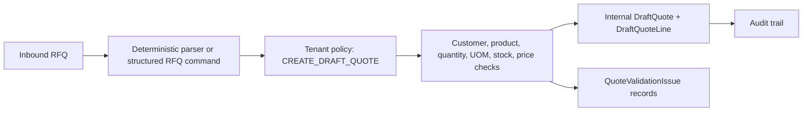

# RFQ To Draft Quote Workflow - Stage 11A

## Objective

Stage 11A adds the first real product workflow in OrderPilot Core:

The output is an internal OrderPilot draft quote only. It is not an ERP quote, not an external system record, and not connector execution.

## Domain Model

Stage 11A extends the existing Stage 6 internal workspace model:

- `DraftQuote`
- `DraftQuoteLine`
- `DraftQuoteRepository`
- `DraftQuoteLineRepository`

It adds:

- `QuoteValidationIssue`
- `QuoteValidationIssueRepository`
- `RfqToDraftQuoteService`
- `DraftQuoteController`
- `Stage11ADtos`

`V15__draft_quote_workflow.sql` adds nullable RFQ/source metadata to draft quote tables and creates `quote_validation_issue`.

## Input Paths

Stage 11A supports:

- Structured RFQ commands with customer hint, raw SKU/product text, quantity, and UOM.
- Minimal deterministic text parsing for demo-style RFQ text such as `Need 2 EA PAD-OE-04465 brake pads for Toyota Camry 2018, wholesale, Almaty`.

The parser is deterministic and local. It does not call AI providers and does not infer product ids from vague text.

## Validation Rules

- Tenant context is required.
- `TenantPolicyService` must allow `CREATE_DRAFT_QUOTE`.
- Source channel message or inbound document ids must belong to the current tenant.
- Customer account is resolved by tenant-scoped account code when possible.
- Product is resolved by exact tenant-scoped SKU or active alias when possible.
- Quantity is required; invalid quantity creates `INVALID_QUANTITY`.
- `pcs`, `pc`, `units`, `unit`, `шт`, and `ea` normalize to `EA`.
- Unknown UOM creates `UOM_UNRECOGNIZED`.
- Missing product match creates `PRODUCT_NOT_RESOLVED`.
- Missing price creates `PRICE_NOT_RESOLVED`.
- Missing inventory creates `STOCK_NOT_EVALUATED`.
- Insufficient inventory creates `INSUFFICIENT_STOCK`.
- Missing margin prerequisites create `MARGIN_NOT_EVALUATED`.

Blocking issues route the draft quote to `NEEDS_REVIEW`. If there are no blocking issues, the quote is `READY_FOR_APPROVAL`. Stage 11A never auto-approves.

## Status Transitions

Stage 11A creates draft quotes as:

- `NEEDS_REVIEW` when blocking validation issues exist.
- `READY_FOR_APPROVAL` when deterministic checks pass without blocking issues.

Existing internal-only statuses remain available for later operator actions:

- `APPROVED_INTERNAL`
- `REJECTED`
- `CANCELLED`

No external executed status is added.

## Policy Checks

The workflow uses `TenantPolicyService` with `CREATE_DRAFT_QUOTE`.

Allowed by current matrix:

- `OWNER_ADMIN`
- `OPERATOR`
- `SALES_QUOTE_MANAGER`

Denied by current matrix:

- `READ_ONLY_VIEWER`
- `AUDITOR`
- `BOT_MANAGER`
- connector/system execution roles unless explicitly added later

## Audit Events

Stage 11A emits:

- `DRAFT_QUOTE_CREATION_REQUESTED`
- `DRAFT_QUOTE_CREATED`
- `DRAFT_QUOTE_VALIDATION_COMPLETED`
- `DRAFT_QUOTE_CREATION_DENIED_BY_POLICY`

Audit payloads exclude secrets and external provider credentials.

## Non-Goals

- No real connector executor.
- No ERP, 1C, accounting, or warehouse writes.
- No external API calls.
- No provider credentials or production secrets.
- No production SSO/OIDC implementation.
- No WhatsApp, Telegram, Meta, or AI provider calls.
- No full substitution engine.
- No full quote approval workflow.
- No PDF/OCR implementation.
- No UI redesign.
- No customer-facing quote portal.
- No payment, invoice, or tax engine.
- No compensation execution.
- No broad refactor.

## Future Stages

- Stage 11B: Product Catalog + SKU/Alias/OEM Matching Hardening.
- Stage 11C: Pricing, margin, and availability hardening.
- Stage 11D: Operator approval workflow and quote lifecycle depth.
